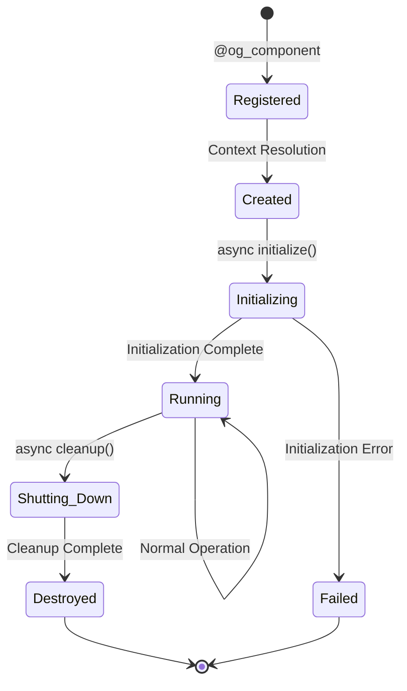

# Async Lifecycle Management

*Jake Morrison explains how to manage component lifecycles in async environments*

---

!!! quote "Jake Morrison - DevOps Engineer"
    *"In banking, we can't afford resource leaks or zombie connections. OpusGenie DI's async lifecycle management ensures every component starts up cleanly and shuts down gracefully, even under high load."*

## Component Lifecycle Stages

Every component in OpusGenie DI goes through a predictable lifecycle:



## Async Initialization

### Basic Lifecycle Hooks

```python title="Basic Component Lifecycle"
from opusgenie_di import og_component, BaseComponent
import asyncio
import logging

@og_component(scope=ComponentScope.SINGLETON)
class DatabaseConnectionPool(BaseComponent):
    """Database connection pool with proper async lifecycle"""
    
    def __init__(self, config: DatabaseConfig) -> None:
        super().__init__()
        self.config = config
        self.pool = None
        self.is_healthy = False
        self.logger = logging.getLogger(__name__)
    
    async def initialize(self) -> None:
        """Called when component starts up"""
        await super().initialize()
        
        self.logger.info(f"🔌 Connecting to database: {self.config.host}")
        
        try:
            # Create connection pool
            self.pool = await asyncpg.create_pool(
                host=self.config.host,
                port=self.config.port,
                database=self.config.database,
                user=self.config.user,
                password=self.config.password,
                min_size=self.config.min_connections,
                max_size=self.config.max_connections,
                command_timeout=30
            )
            
            # Verify connectivity
            async with self.pool.acquire() as conn:
                await conn.execute("SELECT 1")
            
            self.is_healthy = True
            self.logger.info(f"✅ Database pool initialized with {self.config.max_connections} connections")
            
        except Exception as e:
            self.logger.error(f"❌ Database initialization failed: {e}")
            self.is_healthy = False
            raise ComponentInitializationError(f"Database pool initialization failed: {e}")
    
    async def cleanup(self) -> None:
        """Called when component shuts down"""
        if self.pool:
            self.logger.info("🔌 Closing database connections...")
            
            # Close all connections gracefully
            await self.pool.close()
            
            # Wait for connections to close
            await asyncio.sleep(0.1)
            
            self.pool = None
            self.is_healthy = False
            self.logger.info("✅ Database pool cleaned up")
        
        await super().cleanup()
    
    async def health_check(self) -> bool:
        """Check if component is healthy"""
        if not self.pool or not self.is_healthy:
            return False
        
        try:
            async with self.pool.acquire() as conn:
                await conn.execute("SELECT 1")
            return True
        except Exception:
            self.is_healthy = False
            return False
```

### Advanced Initialization Patterns

```python title="Advanced Async Patterns"
@og_component(scope=ComponentScope.SINGLETON)
class VelocityPayGateway(BaseComponent):
    """VelocityPay integration with advanced async patterns"""
    
    def __init__(self, config: VelocityPayConfig) -> None:
        super().__init__()
        self.config = config
        self.client = None
        self.session = None
        self.health_check_task = None
        self.retry_count = 0
        self.max_retries = 3
    
    async def initialize(self) -> None:
        """Initialize with retry logic and background tasks"""
        await super().initialize()
        
        # Initialize with exponential backoff
        await self._initialize_with_retry()
        
        # Start background health monitoring
        self.health_check_task = asyncio.create_task(self._background_health_monitor())
        
        self.logger.info("✅ VelocityPay gateway ready")
    
    async def _initialize_with_retry(self) -> None:
        """Initialize with exponential backoff retry"""
        for attempt in range(self.max_retries):
            try:
                await self._attempt_connection()
                return
            except Exception as e:
                self.retry_count = attempt + 1
                if attempt == self.max_retries - 1:
                    raise ComponentInitializationError(f"VelocityPay connection failed after {self.max_retries} attempts: {e}")
                
                wait_time = 2 ** attempt  # Exponential backoff
                self.logger.warning(f"⚠️ VelocityPay connection attempt {attempt + 1} failed, retrying in {wait_time}s...")
                await asyncio.sleep(wait_time)
    
    async def _attempt_connection(self) -> None:
        """Attempt to connect to VelocityPay"""
        # Create HTTP session
        self.session = aiohttp.ClientSession(
            timeout=aiohttp.ClientTimeout(total=30),
            headers={"Authorization": f"Bearer {self.config.api_key}"}
        )
        
        # Create VelocityPay client
        self.client = VelocityPayClient(
            session=self.session,
            endpoint=self.config.endpoint
        )
        
        # Test connection
        await self.client.ping()
    
    async def _background_health_monitor(self) -> None:
        """Background task to monitor gateway health"""
        while True:
            try:
                await asyncio.sleep(30)  # Check every 30 seconds
                
                if self.client:
                    await self.client.ping()
                    self.logger.debug("💚 VelocityPay health check passed")
                
            except asyncio.CancelledError:
                break
            except Exception as e:
                self.logger.error(f"❌ VelocityPay health check failed: {e}")
                # Could trigger reconnection logic here
    
    async def cleanup(self) -> None:
        """Graceful shutdown with proper cleanup"""
        self.logger.info("🛑 Shutting down VelocityPay gateway...")
        
        # Cancel background tasks
        if self.health_check_task:
            self.health_check_task.cancel()
            try:
                await self.health_check_task
            except asyncio.CancelledError:
                pass
        
        # Close HTTP session
        if self.session:
            await self.session.close()
            # Give time for connections to close
            await asyncio.sleep(0.1)
        
        self.client = None
        self.session = None
        
        await super().cleanup()
        self.logger.info("✅ VelocityPay gateway shutdown complete")
```

## Dependency-Ordered Startup

### Understanding Startup Order

Components start up in dependency order automatically:

```python title="Startup Order Example"
# Infrastructure components start first
@og_component(scope=ComponentScope.SINGLETON)
class DatabasePool(BaseComponent):
    async def initialize(self) -> None:
        await super().initialize()
        print("1. 🗄️ Database pool starting...")
        await asyncio.sleep(0.1)  # Simulate startup time
        print("   ✅ Database pool ready")

@og_component(scope=ComponentScope.SINGLETON) 
class RedisCache(BaseComponent):
    async def initialize(self) -> None:
        await super().initialize()
        print("2. 🔄 Redis cache starting...")
        await asyncio.sleep(0.1)
        print("   ✅ Redis cache ready")

# Business components start after infrastructure
@og_component(scope=ComponentScope.SINGLETON)
class CustomerService(BaseComponent):
    def __init__(self, db: DatabasePool, cache: RedisCache) -> None:
        super().__init__()
        self.db = db
        self.cache = cache
    
    async def initialize(self) -> None:
        await super().initialize()
        print("3. 👥 Customer service starting...")
        # Database and cache are already initialized here
        await asyncio.sleep(0.1)
        print("   ✅ Customer service ready")

@og_component(scope=ComponentScope.SINGLETON)
class PaymentService(BaseComponent):
    def __init__(
        self, 
        customer_service: CustomerService,  # Depends on CustomerService
        db: DatabasePool,
        velocity_pay: VelocityPayGateway
    ) -> None:
        super().__init__()
        self.customer_service = customer_service
        self.db = db
        self.velocity_pay = velocity_pay
    
    async def initialize(self) -> None:
        await super().initialize()
        print("4. 💰 Payment service starting...")
        # All dependencies are ready
        await asyncio.sleep(0.1)
        print("   ✅ Payment service ready")
```

### Parallel Startup for Independent Components

```python title="Parallel Startup Configuration"
from opusgenie_di import ContextModuleBuilder, BuilderConfig

async def fast_parallel_startup():
    """Start independent components in parallel"""
    
    config = BuilderConfig(
        parallel_startup=True,          # Enable parallel startup
        startup_timeout=30.0,           # Timeout for startup
        max_parallel_initializations=5  # Max components starting at once
    )
    
    builder = ContextModuleBuilder(config=config)
    
    contexts = await builder.build_contexts(
        InfrastructureModule,    # DB, Cache, EventBus start in parallel
        CustomerManagementModule,
        AccountManagementModule,
        PaymentProcessingModule
    )
    
    # Startup timeline with parallel initialization:
    # t=0s:   DatabasePool, RedisCache, EventBus start (parallel)
    # t=0.1s: Infrastructure components ready
    # t=0.1s: CustomerService starts
    # t=0.2s: CustomerService ready
    # t=0.2s: AccountService, PaymentService start (parallel - both depend on CustomerService)
    # t=0.3s: All services ready
```

## Error Handling and Recovery

### Startup Error Recovery

```python title="Robust Startup with Recovery"
@og_component(scope=ComponentScope.SINGLETON)
class ResilientPaymentGateway(BaseComponent):
    """Payment gateway with startup error recovery"""
    
    def __init__(self, config: PaymentConfig) -> None:
        super().__init__()
        self.config = config
        self.primary_gateway = None
        self.fallback_gateway = None
        self.recovery_task = None
    
    async def initialize(self) -> None:
        """Initialize with fallback on primary failure"""
        await super().initialize()
        
        try:
            # Try primary gateway first
            await self._initialize_primary_gateway()
            self.logger.info("✅ Primary payment gateway initialized")
            
        except Exception as e:
            self.logger.warning(f"⚠️ Primary gateway failed: {e}")
            
            # Fall back to secondary gateway
            try:
                await self._initialize_fallback_gateway()
                self.logger.info("✅ Fallback payment gateway initialized")
                
                # Start recovery task for primary
                self.recovery_task = asyncio.create_task(self._recover_primary_gateway())
                
            except Exception as fallback_error:
                # Both gateways failed - this is a critical error
                raise ComponentInitializationError(
                    f"Both primary and fallback gateways failed: {e}, {fallback_error}"
                )
    
    async def _recover_primary_gateway(self) -> None:
        """Background task to recover primary gateway"""
        while True:
            try:
                await asyncio.sleep(60)  # Try every minute
                
                if self.primary_gateway is None:
                    await self._initialize_primary_gateway()
                    self.logger.info("🔄 Primary gateway recovered!")
                    return
                    
            except asyncio.CancelledError:
                break
            except Exception as e:
                self.logger.debug(f"Primary gateway recovery failed: {e}")
    
    async def cleanup(self) -> None:
        """Clean up all gateways"""
        if self.recovery_task:
            self.recovery_task.cancel()
            try:
                await self.recovery_task
            except asyncio.CancelledError:
                pass
        
        cleanup_tasks = []
        if self.primary_gateway:
            cleanup_tasks.append(self.primary_gateway.cleanup())
        if self.fallback_gateway:
            cleanup_tasks.append(self.fallback_gateway.cleanup())
        
        if cleanup_tasks:
            await asyncio.gather(*cleanup_tasks, return_exceptions=True)
        
        await super().cleanup()
```

### Graceful Degradation

```python title="Graceful Degradation Patterns"
@og_component(scope=ComponentScope.SINGLETON)
class NotificationService(BaseComponent):
    """Notification service with graceful degradation"""
    
    def __init__(
        self,
        email_provider: EmailProvider,
        sms_provider: Optional[SMSProvider] = None,  # Optional
        push_provider: Optional[PushProvider] = None  # Optional
    ) -> None:
        super().__init__()
        self.email_provider = email_provider  # Required
        self.sms_provider = sms_provider      # Optional
        self.push_provider = push_provider    # Optional
        self.available_channels = set()
    
    async def initialize(self) -> None:
        """Initialize available notification channels"""
        await super().initialize()
        
        # Email is required
        try:
            await self.email_provider.initialize()
            self.available_channels.add("email")
            self.logger.info("✅ Email notifications available")
        except Exception as e:
            # Email failure is critical
            raise ComponentInitializationError(f"Email provider failed: {e}")
        
        # SMS is optional
        if self.sms_provider:
            try:
                await self.sms_provider.initialize()
                self.available_channels.add("sms")
                self.logger.info("✅ SMS notifications available")
            except Exception as e:
                self.logger.warning(f"⚠️ SMS provider failed, continuing without SMS: {e}")
        
        # Push is optional
        if self.push_provider:
            try:
                await self.push_provider.initialize()
                self.available_channels.add("push")
                self.logger.info("✅ Push notifications available")
            except Exception as e:
                self.logger.warning(f"⚠️ Push provider failed, continuing without push: {e}")
        
        self.logger.info(f"📱 Notification service ready with channels: {self.available_channels}")
    
    async def send_notification(
        self,
        customer_id: str,
        message: str,
        preferred_channels: List[str] = None
    ) -> NotificationResult:
        """Send notification with fallback channels"""
        
        if not preferred_channels:
            preferred_channels = ["push", "sms", "email"]
        
        # Try channels in order of preference
        for channel in preferred_channels:
            if channel in self.available_channels:
                try:
                    if channel == "email":
                        result = await self.email_provider.send(customer_id, message)
                    elif channel == "sms":
                        result = await self.sms_provider.send(customer_id, message)
                    elif channel == "push":
                        result = await self.push_provider.send(customer_id, message)
                    
                    if result.success:
                        return NotificationResult(
                            success=True,
                            channel_used=channel,
                            message_id=result.message_id
                        )
                
                except Exception as e:
                    self.logger.warning(f"⚠️ {channel} notification failed: {e}")
                    continue
        
        # All channels failed
        return NotificationResult(
            success=False,
            error="All notification channels failed"
        )
```

## Background Tasks and Cleanup

### Managing Background Tasks

```python title="Background Task Management"
@og_component(scope=ComponentScope.SINGLETON)
class AccountInterestCalculator(BaseComponent):
    """Calculates daily interest with background task"""
    
    def __init__(
        self,
        account_repo: AccountRepository,
        db: DatabaseConnection
    ) -> None:
        super().__init__()
        self.account_repo = account_repo
        self.db = db
        self.calculation_task = None
        self.stop_event = None
    
    async def initialize(self) -> None:
        """Start background interest calculation"""
        await super().initialize()
        
        self.stop_event = asyncio.Event()
        
        # Start daily interest calculation task
        self.calculation_task = asyncio.create_task(
            self._daily_interest_calculator()
        )
        
        self.logger.info("💰 Daily interest calculator started")
    
    async def _daily_interest_calculator(self) -> None:
        """Background task to calculate daily interest"""
        while not self.stop_event.is_set():
            try:
                # Calculate time until next midnight
                now = datetime.now()
                tomorrow = now.replace(hour=0, minute=0, second=0, microsecond=0) + timedelta(days=1)
                seconds_until_midnight = (tomorrow - now).total_seconds()
                
                # Wait until midnight (or stop event)
                try:
                    await asyncio.wait_for(
                        self.stop_event.wait(),
                        timeout=seconds_until_midnight
                    )
                    break  # Stop event was set
                except asyncio.TimeoutError:
                    pass  # Timeout reached - time to calculate interest
                
                # Calculate interest for all accounts
                await self._calculate_daily_interest()
                
            except asyncio.CancelledError:
                break
            except Exception as e:
                self.logger.error(f"❌ Interest calculation error: {e}")
                # Wait before retrying
                await asyncio.sleep(3600)  # Retry in 1 hour
    
    async def _calculate_daily_interest(self) -> None:
        """Calculate interest for all eligible accounts"""
        self.logger.info("💰 Calculating daily interest...")
        
        # Get all savings accounts
        accounts = await self.account_repo.get_interest_bearing_accounts()
        
        total_interest = 0.0
        processed_accounts = 0
        
        for account in accounts:
            try:
                # Calculate daily interest
                daily_rate = account.annual_rate / 365
                interest = account.balance * daily_rate
                
                # Update account balance
                await self.account_repo.add_interest(account.id, interest)
                
                total_interest += interest
                processed_accounts += 1
                
            except Exception as e:
                self.logger.error(f"❌ Failed to calculate interest for account {account.id}: {e}")
        
        self.logger.info(
            f"✅ Interest calculation complete: "
            f"{processed_accounts} accounts, ${total_interest:.2f} total interest"
        )
    
    async def cleanup(self) -> None:
        """Stop background tasks gracefully"""
        self.logger.info("🛑 Stopping interest calculator...")
        
        if self.stop_event:
            self.stop_event.set()
        
        if self.calculation_task:
            # Cancel the task
            self.calculation_task.cancel()
            
            try:
                # Wait for task to finish cancellation
                await asyncio.wait_for(self.calculation_task, timeout=5.0)
            except (asyncio.CancelledError, asyncio.TimeoutError):
                pass
        
        await super().cleanup()
        self.logger.info("✅ Interest calculator stopped")
```

## Lifecycle Events and Hooks

### Component Lifecycle Events

```python title="Lifecycle Event Handling"
from opusgenie_di import ComponentLifecycleHook, LifecycleStage

class BankingSystemMonitor(ComponentLifecycleHook):
    """Monitor component lifecycle events"""
    
    def __init__(self):
        self.startup_times = {}
        self.component_count = 0
        self.failed_components = []
    
    async def on_component_initializing(
        self,
        component: BaseComponent,
        context_name: str
    ) -> None:
        """Called when component starts initializing"""
        self.startup_times[component.__class__.__name__] = time.time()
        self.component_count += 1
        
        print(f"🔄 {component.__class__.__name__} initializing in {context_name}...")
    
    async def on_component_initialized(
        self,
        component: BaseComponent,
        context_name: str
    ) -> None:
        """Called when component finishes initializing"""
        start_time = self.startup_times.get(component.__class__.__name__)
        if start_time:
            duration = time.time() - start_time
            print(f"✅ {component.__class__.__name__} ready ({duration:.2f}s)")
    
    async def on_component_failed(
        self,
        component: BaseComponent,
        context_name: str,
        error: Exception
    ) -> None:
        """Called when component initialization fails"""
        self.failed_components.append({
            'component': component.__class__.__name__,
            'context': context_name,
            'error': str(error)
        })
        
        print(f"❌ {component.__class__.__name__} failed: {error}")
    
    async def on_system_ready(self, contexts: Dict[str, Any]) -> None:
        """Called when entire system is ready"""
        total_time = sum(
            time.time() - start_time 
            for start_time in self.startup_times.values()
        )
        
        print(f"🚀 OgPgy Bank ready!")
        print(f"   Components: {self.component_count}")
        print(f"   Contexts: {len(contexts)}")
        print(f"   Total startup time: {total_time:.2f}s")
        
        if self.failed_components:
            print(f"   Failed components: {len(self.failed_components)}")

# Usage
async def start_monitored_system():
    """Start system with lifecycle monitoring"""
    monitor = BankingSystemMonitor()
    
    builder = ContextModuleBuilder()
    builder.add_lifecycle_hook(monitor)
    
    contexts = await builder.build_contexts(
        InfrastructureModule,
        CustomerManagementModule,
        AccountManagementModule,
        PaymentProcessingModule
    )
    
    return contexts
```

## Testing Async Lifecycles

```python title="Testing Lifecycle Behavior"
import pytest
from unittest.mock import AsyncMock

class TestAsyncLifecycle:
    """Test component lifecycle behavior"""
    
    async def test_initialization_order(self):
        """Test that components initialize in dependency order"""
        initialization_order = []
        
        @og_component(scope=ComponentScope.SINGLETON)
        class MockDatabase(BaseComponent):
            async def initialize(self):
                await super().initialize()
                initialization_order.append("database")
        
        @og_component(scope=ComponentScope.SINGLETON)
        class MockService(BaseComponent):
            def __init__(self, db: MockDatabase):
                super().__init__()
                self.db = db
            
            async def initialize(self):
                await super().initialize()
                initialization_order.append("service")
        
        # Build context
        builder = ContextModuleBuilder()
        contexts = await builder.build_contexts(TestModule)
        
        # Verify order
        assert initialization_order == ["database", "service"]
    
    async def test_cleanup_order(self):
        """Test that components clean up in reverse dependency order"""
        cleanup_order = []
        
        @og_component(scope=ComponentScope.SINGLETON)
        class MockDatabase(BaseComponent):
            async def cleanup(self):
                cleanup_order.append("database")
                await super().cleanup()
        
        @og_component(scope=ComponentScope.SINGLETON)
        class MockService(BaseComponent):
            def __init__(self, db: MockDatabase):
                super().__init__()
                self.db = db
            
            async def cleanup(self):
                cleanup_order.append("service")
                await super().cleanup()
        
        # Build and shutdown context
        builder = ContextModuleBuilder()
        contexts = await builder.build_contexts(TestModule)
        
        context = contexts["test"]
        await context.shutdown()
        
        # Verify reverse order
        assert cleanup_order == ["service", "database"]
    
    async def test_initialization_failure_cleanup(self):
        """Test cleanup when initialization fails"""
        @og_component(scope=ComponentScope.SINGLETON)
        class FailingComponent(BaseComponent):
            async def initialize(self):
                await super().initialize()
                raise RuntimeError("Initialization failed")
        
        builder = ContextModuleBuilder()
        
        with pytest.raises(ComponentInitializationError):
            await builder.build_contexts(FailingTestModule)
        
        # Verify partial cleanup occurred
        # (implementation would check that successfully initialized components were cleaned up)
```

## Best Practices

!!! tip "Async Lifecycle Best Practices"
    
    **Initialization:**
    - Always call `await super().initialize()` first
    - Use exponential backoff for external service connections
    - Implement health checks for critical components
    - Handle initialization failures gracefully
    
    **Background Tasks:**
    - Use `asyncio.create_task()` for long-running background tasks
    - Always store task references for proper cleanup
    - Use `asyncio.Event` for graceful task stopping
    - Handle `asyncio.CancelledError` in background tasks
    
    **Cleanup:**
    - Always call `await super().cleanup()` last
    - Cancel background tasks before closing resources
    - Use timeouts for cleanup operations
    - Log cleanup steps for debugging
    
    **Error Handling:**
    - Implement fallback initialization strategies
    - Use circuit breakers for external dependencies
    - Gracefully degrade when optional components fail
    - Monitor and alert on repeated initialization failures

## Next Steps

<div class="grid cards" markdown>

-   :material-hook:{ .lg .middle } **Hooks & Events**

    ---

    Learn the event system and custom hooks

    [:octicons-arrow-right-24: Hooks & Events](hooks-events.md)

-   :material-test-tube:{ .lg .middle } **Testing**

    ---

    Test async components effectively

    [:octicons-arrow-right-24: Testing](testing.md)

-   :material-speedometer:{ .lg .middle } **Performance**

    ---

    Optimize async performance

    [:octicons-arrow-right-24: Performance](../best-practices/performance.md)

</div>