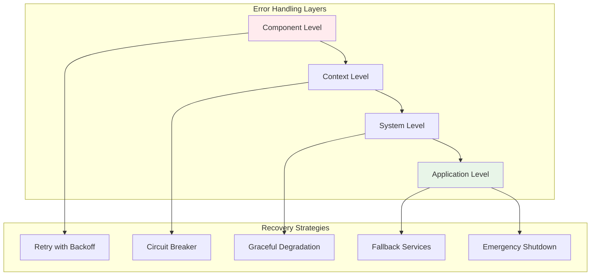

# Error Handling

*Elena Korvas explains robust error handling strategies for banking systems*

---

!!! quote "Elena Korvas - Chief Technology Officer"
    *"In banking, every error is a potential customer impact. Our error handling strategy isn't just about catching exceptions—it's about graceful degradation, clear communication, and rapid recovery."*

## Error Handling Philosophy

OpusGenie DI provides a **comprehensive error handling framework** designed for mission-critical applications:



## Framework Exception Hierarchy

### Core OpusGenie DI Exceptions

```python title="Framework Exception Types"
from opusgenie_di._core.exceptions import (
    OpusGenieDIError,
    ComponentResolutionError,
    CircularDependencyError,
    MissingDependencyError,
    ComponentInitializationError,
    ContextStartupError,
    LifecycleError
)

# Custom banking exceptions
class BankingError(Exception):
    """Base exception for all banking operations"""
    
    def __init__(self, message: str, error_code: str = None, details: dict = None):
        super().__init__(message)
        self.error_code = error_code or "BANKING_ERROR"
        self.details = details or {}
        self.timestamp = datetime.utcnow()

class CustomerError(BankingError):
    """Customer-related errors"""
    pass

class AccountError(BankingError):
    """Account-related errors"""
    pass

class PaymentError(BankingError):
    """Payment-related errors"""
    pass

class ComplianceError(BankingError):
    """Compliance-related errors"""
    pass

# Specific banking exceptions
class CustomerNotFoundError(CustomerError):
    def __init__(self, customer_id: str):
        super().__init__(
            f"Customer {customer_id} not found",
            error_code="CUSTOMER_NOT_FOUND",
            details={"customer_id": customer_id}
        )

class InsufficientFundsError(PaymentError):
    def __init__(self, account_id: str, available: float, requested: float):
        super().__init__(
            f"Insufficient funds: ${available:.2f} available, ${requested:.2f} requested",
            error_code="INSUFFICIENT_FUNDS",
            details={
                "account_id": account_id,
                "available_balance": available,
                "requested_amount": requested
            }
        )

class FraudDetectedError(PaymentError):
    def __init__(self, transaction_id: str, risk_score: float, reasons: List[str]):
        super().__init__(
            f"Fraud detected for transaction {transaction_id}",
            error_code="FRAUD_DETECTED",
            details={
                "transaction_id": transaction_id,
                "risk_score": risk_score,
                "fraud_reasons": reasons
            }
        )

class ComplianceViolationError(ComplianceError):
    def __init__(self, violation_type: str, details: dict):
        super().__init__(
            f"Compliance violation: {violation_type}",
            error_code="COMPLIANCE_VIOLATION",
            details=details
        )
```

## Component-Level Error Handling

### Robust Component Implementation

```python title="Error-Resilient Component Design"
@og_component(scope=ComponentScope.SINGLETON)
class ResilientPaymentService(BaseComponent):
    """Payment service with comprehensive error handling"""
    
    def __init__(
        self,
        account_service: AccountService,
        velocity_pay: VelocityPayGateway,
        fraud_detector: FraudDetectionService,
        payment_repo: PaymentRepository,
        event_bus: EventBus,
        circuit_breaker: CircuitBreaker,
        retry_config: RetryConfig
    ) -> None:
        super().__init__()
        self.account_service = account_service
        self.velocity_pay = velocity_pay
        self.fraud_detector = fraud_detector
        self.payment_repo = payment_repo
        self.event_bus = event_bus
        self.circuit_breaker = circuit_breaker
        self.retry_config = retry_config
        self.logger = logging.getLogger(__name__)
    
    async def process_transfer(
        self,
        from_account_id: str,
        to_account_id: str,
        amount: float,
        reference: str = ""
    ) -> Payment:
        """Process transfer with comprehensive error handling"""
        
        payment_id = generate_payment_id()
        
        try:
            # Create payment record first
            payment = Payment(
                id=payment_id,
                from_account=from_account_id,
                to_account=to_account_id,
                amount=amount,
                reference=reference,
                status="pending",
                created_at=datetime.utcnow()
            )
            
            # Save initial payment record
            await self.payment_repo.save(payment)
            
            # Validate accounts with retry
            await self._validate_accounts_with_retry(from_account_id, to_account_id)
            
            # Check sufficient funds
            await self._check_sufficient_funds(from_account_id, amount)
            
            # Fraud detection with fallback
            await self._perform_fraud_check(payment)
            
            # Process through VelocityPay with circuit breaker
            await self._process_through_velocity_pay(payment)
            
            # Update account balances with compensation
            await self._update_account_balances(payment)
            
            # Mark payment as completed
            payment.status = "completed"
            payment.completed_at = datetime.utcnow()
            await self.payment_repo.save(payment)
            
            # Publish success event
            await self._publish_payment_event(payment, "completed")
            
            self.logger.info(f"✅ Payment {payment_id} processed successfully")
            return payment
            
        except FraudDetectedError as e:
            # Fraud detected - reject but don't retry
            payment.status = "rejected_fraud"
            payment.failure_reason = str(e)
            await self.payment_repo.save(payment)
            await self._publish_payment_event(payment, "rejected")
            
            self.logger.warning(f"🚫 Payment {payment_id} rejected due to fraud: {e}")
            raise
            
        except InsufficientFundsError as e:
            # Insufficient funds - reject but don't retry
            payment.status = "rejected_insufficient_funds"
            payment.failure_reason = str(e)
            await self.payment_repo.save(payment)
            await self._publish_payment_event(payment, "rejected")
            
            self.logger.warning(f"🚫 Payment {payment_id} rejected due to insufficient funds")
            raise
            
        except (VelocityPayTimeoutError, VelocityPayServiceError) as e:
            # External service error - mark as failed and potentially retry
            payment.status = "failed_external_service"
            payment.failure_reason = str(e)
            await self.payment_repo.save(payment)
            
            self.logger.error(f"❌ Payment {payment_id} failed due to external service: {e}")
            
            # Could implement async retry mechanism here
            await self._schedule_payment_retry(payment)
            raise PaymentError(f"Payment processing temporarily unavailable: {e}")
            
        except Exception as e:
            # Unexpected error - mark as failed
            payment.status = "failed_system_error"
            payment.failure_reason = str(e)
            await self.payment_repo.save(payment)
            await self._publish_payment_event(payment, "failed")
            
            self.logger.error(f"❌ Payment {payment_id} failed with unexpected error: {e}")
            
            # Re-raise as PaymentError to avoid exposing internal details
            raise PaymentError(f"Payment processing failed due to system error")
    
    async def _validate_accounts_with_retry(
        self,
        from_account_id: str,
        to_account_id: str
    ) -> None:
        """Validate accounts with retry logic"""
        
        async def validate_accounts():
            from_account = await self.account_service.get_account(from_account_id)
            to_account = await self.account_service.get_account(to_account_id)
            
            if not from_account:
                raise AccountError(f"Source account {from_account_id} not found")
            if not to_account:
                raise AccountError(f"Destination account {to_account_id} not found")
            
            if from_account.status != "active":
                raise AccountError(f"Source account {from_account_id} is not active")
            if to_account.status != "active":
                raise AccountError(f"Destination account {to_account_id} is not active")
        
        # Retry with exponential backoff
        await self._retry_with_backoff(
            validate_accounts,
            max_attempts=3,
            base_delay=0.1,
            exceptions=(ConnectionError, TimeoutError)
        )
    
    async def _check_sufficient_funds(self, account_id: str, amount: float) -> None:
        """Check account has sufficient funds"""
        account = await self.account_service.get_account(account_id)
        
        if account.balance < amount:
            raise InsufficientFundsError(account_id, account.balance, amount)
    
    async def _perform_fraud_check(self, payment: Payment) -> None:
        """Perform fraud detection with fallback"""
        try:
            # Try primary fraud detection
            fraud_result = await self.fraud_detector.check_payment(payment)
            
            if not fraud_result.approved:
                raise FraudDetectedError(
                    payment.id,
                    fraud_result.risk_score,
                    fraud_result.reasons
                )
                
        except FraudDetectionServiceError:
            # Fraud service unavailable - use basic checks
            self.logger.warning("⚠️ Fraud detection service unavailable, using basic checks")
            
            # Basic fraud checks as fallback
            if payment.amount > 100000:  # Very large transaction
                raise FraudDetectedError(
                    payment.id,
                    0.9,
                    ["Large transaction amount", "Fraud service unavailable"]
                )
    
    async def _process_through_velocity_pay(self, payment: Payment) -> None:
        """Process through VelocityPay with circuit breaker"""
        
        async def velocity_pay_call():
            result = await self.velocity_pay.process_transfer(
                payment.from_account,
                payment.to_account,
                payment.amount,
                payment.reference
            )
            
            if not result.success:
                raise VelocityPayServiceError(result.error_message)
            
            payment.velocity_transaction_id = result.transaction_id
        
        # Use circuit breaker to prevent cascading failures
        try:
            await self.circuit_breaker.call(velocity_pay_call)
        except CircuitBreakerOpenError:
            # Circuit breaker is open - VelocityPay is down
            raise VelocityPayServiceError("VelocityPay service is currently unavailable")
    
    async def _update_account_balances(self, payment: Payment) -> None:
        """Update account balances with compensation logic"""
        try:
            # Start transaction-like operation
            await self.account_service.debit_account(payment.from_account, payment.amount)
            
            try:
                await self.account_service.credit_account(payment.to_account, payment.amount)
            except Exception as e:
                # Compensate by crediting back the from account
                self.logger.error(f"❌ Failed to credit destination account, compensating...")
                await self.account_service.credit_account(payment.from_account, payment.amount)
                raise AccountError(f"Failed to update destination account: {e}")
                
        except Exception as e:
            self.logger.error(f"❌ Account balance update failed: {e}")
            raise
    
    async def _retry_with_backoff(
        self,
        func,
        max_attempts: int = 3,
        base_delay: float = 1.0,
        exceptions: tuple = (Exception,)
    ) -> Any:
        """Generic retry with exponential backoff"""
        
        for attempt in range(max_attempts):
            try:
                return await func()
            except exceptions as e:
                if attempt == max_attempts - 1:
                    raise
                
                delay = base_delay * (2 ** attempt)
                self.logger.warning(f"⚠️ Attempt {attempt + 1} failed, retrying in {delay}s: {e}")
                await asyncio.sleep(delay)
    
    async def _schedule_payment_retry(self, payment: Payment) -> None:
        """Schedule payment for retry (could use task queue)"""
        # In production, this might use Celery, RQ, or similar
        self.logger.info(f"📅 Scheduling payment {payment.id} for retry")
        # Implementation would depend on your task queue system
    
    async def _publish_payment_event(self, payment: Payment, event_type: str) -> None:
        """Publish payment event safely"""
        try:
            event = PaymentProcessedEvent(
                payment_id=payment.id,
                from_account=payment.from_account,
                to_account=payment.to_account,
                amount=payment.amount,
                status=payment.status,
                event_type=event_type,
                processed_at=datetime.utcnow()
            )
            
            await self.event_bus.publish(event)
        except Exception as e:
            # Event publishing failure shouldn't fail the payment
            self.logger.error(f"⚠️ Failed to publish payment event: {e}")
```

## Circuit Breaker Pattern

### Circuit Breaker Implementation

```python title="Circuit Breaker for External Services"
from enum import Enum
from typing import Callable, Any
import asyncio
import time

class CircuitBreakerState(Enum):
    CLOSED = "closed"      # Normal operation
    OPEN = "open"         # Failing, rejecting calls
    HALF_OPEN = "half_open"  # Testing if service recovered

class CircuitBreakerOpenError(Exception):
    """Raised when circuit breaker is open"""
    pass

@og_component(scope=ComponentScope.SINGLETON)
class CircuitBreaker(BaseComponent):
    """Circuit breaker for external service calls"""
    
    def __init__(
        self,
        failure_threshold: int = 5,
        recovery_timeout: float = 60.0,
        timeout: float = 30.0
    ) -> None:
        super().__init__()
        self.failure_threshold = failure_threshold
        self.recovery_timeout = recovery_timeout
        self.timeout = timeout
        
        self.failure_count = 0
        self.last_failure_time = None
        self.state = CircuitBreakerState.CLOSED
        self.logger = logging.getLogger(__name__)
    
    async def call(self, func: Callable) -> Any:
        """Execute function with circuit breaker protection"""
        
        if self.state == CircuitBreakerState.OPEN:
            if self._should_attempt_reset():
                self.state = CircuitBreakerState.HALF_OPEN
                self.logger.info("🔄 Circuit breaker moving to HALF_OPEN state")
            else:
                raise CircuitBreakerOpenError("Circuit breaker is OPEN")
        
        try:
            # Execute with timeout
            result = await asyncio.wait_for(func(), timeout=self.timeout)
            
            # Success - reset if we were in HALF_OPEN
            if self.state == CircuitBreakerState.HALF_OPEN:
                self._reset()
            
            return result
            
        except asyncio.TimeoutError:
            self._record_failure("Timeout")
            raise
        except Exception as e:
            self._record_failure(str(e))
            raise
    
    def _should_attempt_reset(self) -> bool:
        """Check if enough time has passed to attempt reset"""
        if self.last_failure_time is None:
            return True
        
        return time.time() - self.last_failure_time >= self.recovery_timeout
    
    def _record_failure(self, error: str) -> None:
        """Record a failure and potentially open the circuit"""
        self.failure_count += 1
        self.last_failure_time = time.time()
        
        self.logger.warning(f"⚠️ Circuit breaker failure {self.failure_count}: {error}")
        
        if self.failure_count >= self.failure_threshold:
            self.state = CircuitBreakerState.OPEN
            self.logger.error(f"🔥 Circuit breaker OPENED after {self.failure_count} failures")
    
    def _reset(self) -> None:
        """Reset circuit breaker to closed state"""
        self.failure_count = 0
        self.last_failure_time = None
        self.state = CircuitBreakerState.CLOSED
        self.logger.info("✅ Circuit breaker CLOSED - service recovered")
    
    def get_status(self) -> dict:
        """Get current circuit breaker status"""
        return {
            "state": self.state.value,
            "failure_count": self.failure_count,
            "last_failure_time": self.last_failure_time,
            "failure_threshold": self.failure_threshold,
            "recovery_timeout": self.recovery_timeout
        }

# Usage with VelocityPay
@og_component(scope=ComponentScope.SINGLETON)
class VelocityPayGateway(BaseComponent):
    """VelocityPay gateway with circuit breaker protection"""
    
    def __init__(self, config: VelocityPayConfig, circuit_breaker: CircuitBreaker):
        super().__init__()
        self.config = config
        self.circuit_breaker = circuit_breaker
        self.client = None
    
    async def process_transfer(
        self,
        from_account: str,
        to_account: str,
        amount: float,
        reference: str
    ) -> VelocityPayResult:
        """Process transfer with circuit breaker protection"""
        
        async def make_api_call():
            if not self.client:
                raise VelocityPayServiceError("Client not initialized")
            
            return await self.client.transfer(
                from_account=from_account,
                to_account=to_account,
                amount=amount,
                reference=reference
            )
        
        try:
            return await self.circuit_breaker.call(make_api_call)
        except CircuitBreakerOpenError:
            raise VelocityPayServiceError("VelocityPay service is currently unavailable")
```

## Graceful Degradation

### Fallback Service Implementation

```python title="Graceful Degradation Patterns"
@og_component(scope=ComponentScope.SINGLETON)
class NotificationService(BaseComponent):
    """Notification service with graceful degradation"""
    
    def __init__(
        self,
        email_provider: EmailProvider,
        sms_provider: Optional[SMSProvider] = None,
        push_provider: Optional[PushProvider] = None
    ) -> None:
        super().__init__()
        self.email_provider = email_provider
        self.sms_provider = sms_provider
        self.push_provider = push_provider
        self.available_channels = set()
        self.logger = logging.getLogger(__name__)
    
    async def initialize(self) -> None:
        """Initialize with graceful degradation"""
        await super().initialize()
        
        # Email is critical - must work
        try:
            await self.email_provider.initialize()
            self.available_channels.add("email")
            self.logger.info("✅ Email notifications available")
        except Exception as e:
            self.logger.critical(f"❌ CRITICAL: Email provider failed: {e}")
            raise ComponentInitializationError("Email provider is required")
        
        # SMS is optional - degrade gracefully if unavailable
        if self.sms_provider:
            try:
                await self.sms_provider.initialize()
                self.available_channels.add("sms")
                self.logger.info("✅ SMS notifications available")
            except Exception as e:
                self.logger.warning(f"⚠️ SMS provider failed, continuing without SMS: {e}")
        
        # Push is optional - degrade gracefully if unavailable
        if self.push_provider:
            try:
                await self.push_provider.initialize()
                self.available_channels.add("push")
                self.logger.info("✅ Push notifications available")
            except Exception as e:
                self.logger.warning(f"⚠️ Push provider failed, continuing without push: {e}")
        
        self.logger.info(f"📱 Notification service ready with channels: {self.available_channels}")
    
    async def send_payment_notification(
        self,
        customer_id: str,
        payment: Payment,
        notification_type: str = "payment_completed"
    ) -> NotificationResult:
        """Send payment notification with fallback channels"""
        
        # Determine preferred channels based on payment amount
        if payment.amount > 10000:
            # High-value transactions - use all available channels
            preferred_channels = ["email", "sms", "push"]
        else:
            # Regular transactions - use push first, then email
            preferred_channels = ["push", "email"]
        
        # Try channels in order of preference
        for channel in preferred_channels:
            if channel in self.available_channels:
                try:
                    result = await self._send_via_channel(
                        channel, customer_id, payment, notification_type
                    )
                    
                    if result.success:
                        self.logger.info(f"✅ Payment notification sent via {channel}")
                        return result
                    
                except Exception as e:
                    self.logger.warning(f"⚠️ {channel} notification failed: {e}")
                    continue
        
        # All channels failed
        self.logger.error(f"❌ All notification channels failed for payment {payment.id}")
        return NotificationResult(
            success=False,
            error="All notification channels unavailable"
        )
    
    async def _send_via_channel(
        self,
        channel: str,
        customer_id: str,
        payment: Payment,
        notification_type: str
    ) -> NotificationResult:
        """Send notification via specific channel"""
        
        message = self._create_message(payment, notification_type)
        
        if channel == "email":
            return await self.email_provider.send_payment_email(customer_id, message)
        elif channel == "sms":
            return await self.sms_provider.send_payment_sms(customer_id, message)
        elif channel == "push":
            return await self.push_provider.send_payment_push(customer_id, message)
        
        raise ValueError(f"Unknown channel: {channel}")

@og_component(scope=ComponentScope.SINGLETON)
class FraudDetectionService(BaseComponent):
    """Fraud detection with fallback to basic rules"""
    
    def __init__(
        self,
        ml_fraud_detector: Optional[MLFraudDetector] = None,
        rule_engine: RuleBasedFraudDetector
    ) -> None:
        super().__init__()
        self.ml_fraud_detector = ml_fraud_detector
        self.rule_engine = rule_engine
        self.ml_available = False
        self.logger = logging.getLogger(__name__)
    
    async def initialize(self) -> None:
        """Initialize with ML fallback to rules"""
        await super().initialize()
        
        # Try to initialize ML fraud detector
        if self.ml_fraud_detector:
            try:
                await self.ml_fraud_detector.initialize()
                self.ml_available = True
                self.logger.info("✅ ML fraud detection available")
            except Exception as e:
                self.logger.warning(f"⚠️ ML fraud detector failed, using rule-based fallback: {e}")
        
        # Rule engine is always available as fallback
        await self.rule_engine.initialize()
        self.logger.info("✅ Rule-based fraud detection ready")
    
    async def check_payment(self, payment: Payment) -> FraudCheckResult:
        """Check payment for fraud with ML/rule fallback"""
        
        # Try ML detection first if available
        if self.ml_available:
            try:
                result = await self.ml_fraud_detector.analyze_payment(payment)
                self.logger.debug(f"🤖 ML fraud check: {result.risk_score}")
                return result
            except Exception as e:
                self.logger.warning(f"⚠️ ML fraud detection failed, falling back to rules: {e}")
                self.ml_available = False
        
        # Fallback to rule-based detection
        result = await self.rule_engine.check_payment(payment)
        self.logger.debug(f"📋 Rule-based fraud check: {result.risk_score}")
        return result
```

## Error Recovery and Compensation

### Compensation Pattern Implementation

```python title="Compensation and Recovery Patterns"
from dataclasses import dataclass
from typing import List, Callable

@dataclass
class CompensationAction:
    """Represents a compensation action to undo a previous operation"""
    action_name: str
    compensation_func: Callable
    args: tuple
    kwargs: dict

class CompensationManager:
    """Manages compensation actions for failed operations"""
    
    def __init__(self):
        self.actions: List[CompensationAction] = []
        self.logger = logging.getLogger(__name__)
    
    def add_compensation(
        self,
        action_name: str,
        compensation_func: Callable,
        *args,
        **kwargs
    ) -> None:
        """Add a compensation action"""
        action = CompensationAction(
            action_name=action_name,
            compensation_func=compensation_func,
            args=args,
            kwargs=kwargs
        )
        self.actions.append(action)
    
    async def compensate_all(self) -> None:
        """Execute all compensation actions in reverse order"""
        self.logger.info(f"🔄 Starting compensation for {len(self.actions)} actions")
        
        # Execute compensations in reverse order
        for action in reversed(self.actions):
            try:
                self.logger.info(f"🔄 Compensating: {action.action_name}")
                await action.compensation_func(*action.args, **action.kwargs)
                self.logger.info(f"✅ Compensated: {action.action_name}")
            except Exception as e:
                self.logger.error(f"❌ Compensation failed for {action.action_name}: {e}")
                # Continue with other compensations
        
        self.actions.clear()

@og_component(scope=ComponentScope.SINGLETON)
class TransactionalPaymentService(BaseComponent):
    """Payment service with compensation-based error recovery"""
    
    def __init__(
        self,
        account_service: AccountService,
        velocity_pay: VelocityPayGateway,
        payment_repo: PaymentRepository,
        event_bus: EventBus
    ) -> None:
        super().__init__()
        self.account_service = account_service
        self.velocity_pay = velocity_pay
        self.payment_repo = payment_repo
        self.event_bus = event_bus
        self.logger = logging.getLogger(__name__)
    
    async def process_transfer_with_compensation(
        self,
        from_account_id: str,
        to_account_id: str,
        amount: float,
        reference: str = ""
    ) -> Payment:
        """Process transfer with compensation on failure"""
        
        compensation_manager = CompensationManager()
        payment_id = generate_payment_id()
        
        try:
            # Step 1: Create payment record
            payment = Payment(
                id=payment_id,
                from_account=from_account_id,
                to_account=to_account_id,
                amount=amount,
                reference=reference,
                status="pending"
            )
            
            await self.payment_repo.save(payment)
            
            # Add compensation: delete payment record
            compensation_manager.add_compensation(
                "delete_payment_record",
                self.payment_repo.delete,
                payment_id
            )
            
            # Step 2: Debit source account
            await self.account_service.debit_account(from_account_id, amount)
            
            # Add compensation: credit back the source account
            compensation_manager.add_compensation(
                "credit_source_account",
                self.account_service.credit_account,
                from_account_id,
                amount
            )
            
            # Step 3: Process through VelocityPay
            velocity_result = await self.velocity_pay.process_transfer(
                from_account_id, to_account_id, amount, reference
            )
            
            if not velocity_result.success:
                raise VelocityPayServiceError(velocity_result.error_message)
            
            payment.velocity_transaction_id = velocity_result.transaction_id
            
            # Add compensation: reverse VelocityPay transaction
            compensation_manager.add_compensation(
                "reverse_velocity_pay",
                self.velocity_pay.reverse_transfer,
                velocity_result.transaction_id
            )
            
            # Step 4: Credit destination account
            await self.account_service.credit_account(to_account_id, amount)
            
            # Step 5: Update payment status
            payment.status = "completed"
            payment.completed_at = datetime.utcnow()
            await self.payment_repo.save(payment)
            
            # Step 6: Publish success event
            await self.event_bus.publish(PaymentCompletedEvent(
                payment_id=payment.id,
                amount=amount,
                from_account=from_account_id,
                to_account=to_account_id
            ))
            
            self.logger.info(f"✅ Payment {payment_id} completed successfully")
            
            # Success - clear compensations (they're no longer needed)
            compensation_manager.actions.clear()
            
            return payment
            
        except Exception as e:
            self.logger.error(f"❌ Payment {payment_id} failed: {e}")
            
            # Execute all compensations
            await compensation_manager.compensate_all()
            
            # Update payment status to failed
            try:
                payment.status = "failed"
                payment.failure_reason = str(e)
                await self.payment_repo.save(payment)
            except Exception as update_error:
                self.logger.error(f"❌ Failed to update payment status: {update_error}")
            
            # Re-raise the original exception
            raise
```

## System-Level Error Handling

### Global Error Handler

```python title="System-Wide Error Management"
@og_component(scope=ComponentScope.SINGLETON)
class SystemErrorHandler(BaseComponent):
    """System-wide error handling and recovery"""
    
    def __init__(
        self,
        alert_service: AlertService,
        metrics_collector: MetricsCollector,
        event_bus: EventBus
    ) -> None:
        super().__init__()
        self.alert_service = alert_service
        self.metrics_collector = metrics_collector
        self.event_bus = event_bus
        self.error_counts = {}
        self.circuit_breakers = {}
        self.logger = logging.getLogger(__name__)
    
    async def handle_component_error(
        self,
        component_name: str,
        error: Exception,
        context: dict = None
    ) -> None:
        """Handle component-level errors"""
        
        error_key = f"{component_name}:{type(error).__name__}"
        self.error_counts[error_key] = self.error_counts.get(error_key, 0) + 1
        
        # Log error with context
        self.logger.error(
            f"❌ Component error in {component_name}: {error}",
            extra={
                "component": component_name,
                "error_type": type(error).__name__,
                "error_count": self.error_counts[error_key],
                "context": context or {}
            }
        )
        
        # Update metrics
        await self.metrics_collector.increment_error_count(
            component=component_name,
            error_type=type(error).__name__
        )
        
        # Check if error rate is too high
        if self.error_counts[error_key] > 10:  # Threshold
            await self._handle_high_error_rate(component_name, error)
        
        # Publish error event
        await self.event_bus.publish(ComponentErrorEvent(
            component_name=component_name,
            error_type=type(error).__name__,
            error_message=str(error),
            timestamp=datetime.utcnow(),
            context=context
        ))
    
    async def _handle_high_error_rate(self, component_name: str, error: Exception) -> None:
        """Handle components with high error rates"""
        
        self.logger.critical(f"🚨 HIGH ERROR RATE in {component_name}: {type(error).__name__}")
        
        # Send alert
        await self.alert_service.send_critical_alert(
            title=f"High Error Rate: {component_name}",
            message=f"Component {component_name} has exceeded error threshold",
            details={
                "component": component_name,
                "error_type": type(error).__name__,
                "error_count": self.error_counts.get(f"{component_name}:{type(error).__name__}", 0)
            }
        )
        
        # Consider circuit breaker activation
        if component_name not in self.circuit_breakers:
            self.circuit_breakers[component_name] = True
            self.logger.warning(f"🔥 Activating circuit breaker for {component_name}")
    
    async def handle_system_emergency(self, reason: str, details: dict = None) -> None:
        """Handle system-wide emergencies"""
        
        self.logger.critical(f"🚨 SYSTEM EMERGENCY: {reason}")
        
        # Send immediate alerts
        await self.alert_service.send_emergency_alert(
            title="SYSTEM EMERGENCY",
            message=reason,
            details=details or {}
        )
        
        # Publish emergency event
        await self.event_bus.publish(SystemEmergencyEvent(
            reason=reason,
            details=details,
            timestamp=datetime.utcnow()
        ))
        
        # Could trigger:
        # - Graceful system shutdown
        # - Failover to backup systems
        # - Emergency procedures
    
    def get_error_statistics(self) -> dict:
        """Get current error statistics"""
        return {
            "error_counts": self.error_counts.copy(),
            "active_circuit_breakers": list(self.circuit_breakers.keys()),
            "timestamp": datetime.utcnow().isoformat()
        }

# Global error handling middleware
class ErrorHandlingMiddleware:
    """Middleware to catch and handle unhandled errors"""
    
    def __init__(self, error_handler: SystemErrorHandler):
        self.error_handler = error_handler
        self.logger = logging.getLogger(__name__)
    
    async def __call__(self, request, call_next):
        """Handle HTTP request errors"""
        try:
            response = await call_next(request)
            return response
        except Exception as e:
            # Log and handle the error
            await self.error_handler.handle_component_error(
                component_name="http_handler",
                error=e,
                context={
                    "method": request.method,
                    "url": str(request.url),
                    "headers": dict(request.headers)
                }
            )
            
            # Return appropriate error response
            if isinstance(e, BankingError):
                return JSONResponse(
                    status_code=400,
                    content={
                        "error": e.error_code,
                        "message": str(e),
                        "details": e.details
                    }
                )
            else:
                # Don't expose internal errors
                return JSONResponse(
                    status_code=500,
                    content={
                        "error": "INTERNAL_SERVER_ERROR",
                        "message": "An internal error occurred"
                    }
                )
```

## Testing Error Scenarios

```python title="Error Scenario Testing"
class TestErrorHandling:
    """Test error handling scenarios"""
    
    async def test_payment_with_insufficient_funds(self):
        """Test payment failure due to insufficient funds"""
        payment_service = await self._create_payment_service()
        
        # Create account with low balance
        from_account = "acc_low_balance"
        await self._setup_account(from_account, balance=100.0)
        
        # Attempt payment that exceeds balance
        with pytest.raises(InsufficientFundsError) as exc_info:
            await payment_service.process_transfer(
                from_account_id=from_account,
                to_account_id="acc_destination",
                amount=200.0
            )
        
        error = exc_info.value
        assert error.error_code == "INSUFFICIENT_FUNDS"
        assert error.details["available_balance"] == 100.0
        assert error.details["requested_amount"] == 200.0
    
    async def test_payment_with_velocity_pay_failure(self):
        """Test payment failure when VelocityPay is down"""
        payment_service = await self._create_payment_service()
        
        # Configure VelocityPay to fail
        velocity_pay_mock = payment_service.velocity_pay
        velocity_pay_mock.configure_failure(True, "Service temporarily unavailable")
        
        with pytest.raises(PaymentError) as exc_info:
            await payment_service.process_transfer(
                from_account_id="acc_source",
                to_account_id="acc_destination", 
                amount=100.0
            )
        
        assert "temporarily unavailable" in str(exc_info.value)
    
    async def test_circuit_breaker_opens_after_failures(self):
        """Test circuit breaker opens after repeated failures"""
        circuit_breaker = CircuitBreaker(failure_threshold=3)
        
        async def failing_function():
            raise Exception("Service failure")
        
        # Fail 3 times to open circuit breaker
        for i in range(3):
            with pytest.raises(Exception):
                await circuit_breaker.call(failing_function)
        
        # Circuit breaker should now be open
        assert circuit_breaker.state == CircuitBreakerState.OPEN
        
        # Next call should raise CircuitBreakerOpenError
        with pytest.raises(CircuitBreakerOpenError):
            await circuit_breaker.call(failing_function)
    
    async def test_compensation_on_payment_failure(self):
        """Test compensation actions are executed on payment failure"""
        payment_service = await self._create_transactional_payment_service()
        
        # Mock account service to fail on credit operation
        account_service_mock = payment_service.account_service
        account_service_mock.credit_account.side_effect = Exception("Database error")
        
        initial_balance = 1000.0
        await self._setup_account("acc_source", balance=initial_balance)
        
        with pytest.raises(Exception):
            await payment_service.process_transfer_with_compensation(
                from_account_id="acc_source",
                to_account_id="acc_destination",
                amount=100.0
            )
        
        # Verify compensation: source account should have original balance
        account = await account_service_mock.get_account("acc_source")
        assert account.balance == initial_balance  # Compensated
```

## Best Practices

!!! tip "Error Handling Best Practices"
    
    **Exception Design:**
    - Create specific exception types for different error conditions
    - Include error codes and structured details in exceptions
    - Don't expose internal implementation details to users
    - Use appropriate exception hierarchy
    
    **Recovery Strategies:**
    - Implement retry with exponential backoff for transient errors
    - Use circuit breakers for external service dependencies
    - Design compensation actions for failed transactions
    - Implement graceful degradation for non-critical features
    
    **Monitoring and Alerting:**
    - Log all errors with appropriate context
    - Track error rates and patterns
    - Set up alerts for critical error thresholds
    - Implement health checks for all components
    
    **Testing:**
    - Test all error scenarios explicitly
    - Verify compensation and recovery mechanisms
    - Test circuit breaker behavior
    - Use chaos engineering for production resilience

## Next Steps

<div class="grid cards" markdown>

-   :material-bank:{ .lg .middle } **Real Examples**

    ---

    See complete banking implementations

    [:octicons-arrow-right-24: Banking Examples](../examples/banking-architecture.md)

-   :material-speedometer:{ .lg .middle } **Performance**

    ---

    Optimize for production workloads

    [:octicons-arrow-right-24: Performance](../best-practices/performance.md)

-   :material-security:{ .lg .middle } **Security**

    ---

    Implement security best practices

    [:octicons-arrow-right-24: Security](../best-practices/security.md)

</div>