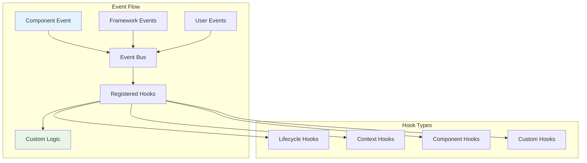

# Hooks & Events

*Sofia Ramos explains how to extend OpusGenie DI with custom hooks and events*

---

!!! quote "Sofia Ramos - Product Manager"
    *"The hooks and events system is what makes OpusGenie DI truly extensible. We've built custom monitoring, logging, and even A/B testing features on top of it without touching the core framework."*

## Event System Overview

OpusGenie DI provides a comprehensive event system that allows you to:

- **Monitor** component lifecycle events
- **Extend** framework behavior with custom hooks
- **Implement** cross-cutting concerns like logging and metrics
- **Build** custom tooling and debugging features



## Lifecycle Hooks

### Component Lifecycle Monitoring

```python title="Component Lifecycle Hook"
from opusgenie_di import ComponentLifecycleHook, LifecycleStage
import time
import logging

class OgPgyBankMonitor(ComponentLifecycleHook):
    """Comprehensive monitoring for OgPgy Bank components"""
    
    def __init__(self):
        self.logger = logging.getLogger("ogpgy.monitor")
        self.startup_times = {}
        self.performance_metrics = {}
        self.health_status = {}
    
    async def on_component_created(
        self,
        component: BaseComponent,
        context_name: str
    ) -> None:
        """Called when component is instantiated"""
        component_name = component.__class__.__name__
        self.startup_times[component_name] = time.time()
        
        self.logger.info(f"🏗️ {component_name} created in {context_name}")
        
        # Track memory usage
        import psutil
        process = psutil.Process()
        memory_mb = process.memory_info().rss / 1024 / 1024
        
        self.performance_metrics[component_name] = {
            'creation_time': time.time(),
            'memory_at_creation': memory_mb,
            'context': context_name
        }
    
    async def on_component_initializing(
        self,
        component: BaseComponent,
        context_name: str
    ) -> None:
        """Called when component starts initialization"""
        component_name = component.__class__.__name__
        self.logger.info(f"🔄 {component_name} initializing...")
        
        # Set health status to initializing
        self.health_status[component_name] = "initializing"
    
    async def on_component_initialized(
        self,
        component: BaseComponent,
        context_name: str
    ) -> None:
        """Called when component completes initialization"""
        component_name = component.__class__.__name__
        
        # Calculate initialization time
        start_time = self.startup_times.get(component_name)
        if start_time:
            init_duration = time.time() - start_time
            self.performance_metrics[component_name]['init_duration'] = init_duration
            
            self.logger.info(f"✅ {component_name} ready ({init_duration:.2f}s)")
        
        # Update health status
        self.health_status[component_name] = "healthy"
        
        # Special handling for critical banking components
        if component_name in ["PaymentService", "AccountService", "ComplianceService"]:
            await self._verify_critical_component_health(component, component_name)
    
    async def _verify_critical_component_health(
        self,
        component: BaseComponent,
        component_name: str
    ) -> None:
        """Verify health of critical banking components"""
        try:
            if hasattr(component, 'health_check'):
                health_result = await component.health_check()
                if not health_result:
                    self.health_status[component_name] = "unhealthy"
                    self.logger.error(f"❌ Critical component {component_name} failed health check!")
                    
                    # Could trigger alerts here
                    await self._alert_critical_component_failure(component_name)
        except Exception as e:
            self.logger.error(f"❌ Health check failed for {component_name}: {e}")
    
    async def on_component_failed(
        self,
        component: BaseComponent,
        context_name: str,
        error: Exception
    ) -> None:
        """Called when component initialization fails"""
        component_name = component.__class__.__name__
        
        self.health_status[component_name] = "failed"
        self.logger.error(f"❌ {component_name} initialization failed: {error}")
        
        # Store failure details
        self.performance_metrics[component_name]['failure_reason'] = str(error)
        self.performance_metrics[component_name]['failed_at'] = time.time()
        
        # Critical component failure handling
        if component_name in ["PaymentService", "DatabaseConnection", "VelocityPayGateway"]:
            await self._handle_critical_failure(component_name, error)
    
    async def _handle_critical_failure(self, component_name: str, error: Exception) -> None:
        """Handle failure of critical banking components"""
        self.logger.critical(f"🚨 CRITICAL: {component_name} failed - {error}")
        
        # Could trigger:
        # - Immediate alerts to on-call engineers
        # - Automated failover procedures
        # - Circuit breaker activation
        # - Emergency shutdown if necessary
    
    async def on_component_cleanup_started(
        self,
        component: BaseComponent,
        context_name: str
    ) -> None:
        """Called when component cleanup begins"""
        component_name = component.__class__.__name__
        self.health_status[component_name] = "shutting_down"
        self.logger.info(f"🛑 {component_name} cleanup started")
    
    async def on_component_cleaned_up(
        self,
        component: BaseComponent,
        context_name: str
    ) -> None:
        """Called when component cleanup completes"""
        component_name = component.__class__.__name__
        self.health_status[component_name] = "stopped"
        self.logger.info(f"✅ {component_name} cleanup complete")
    
    def get_system_health_report(self) -> dict:
        """Generate comprehensive system health report"""
        total_components = len(self.health_status)
        healthy_components = sum(1 for status in self.health_status.values() if status == "healthy")
        failed_components = sum(1 for status in self.health_status.values() if status == "failed")
        
        return {
            "timestamp": time.time(),
            "total_components": total_components,
            "healthy_components": healthy_components,
            "failed_components": failed_components,
            "health_percentage": (healthy_components / total_components * 100) if total_components > 0 else 0,
            "component_status": self.health_status.copy(),
            "performance_metrics": self.performance_metrics.copy()
        }
```

### Context Lifecycle Hooks

```python title="Context Lifecycle Monitoring"
from opusgenie_di import ContextLifecycleHook

class ContextPerformanceMonitor(ContextLifecycleHook):
    """Monitor context-level performance and health"""
    
    def __init__(self):
        self.context_metrics = {}
        self.logger = logging.getLogger("ogpgy.context_monitor")
    
    async def on_context_building(self, context_name: str, module: type) -> None:
        """Called when context starts building"""
        self.context_metrics[context_name] = {
            'build_start': time.time(),
            'module': module.__name__,
            'component_count': 0,
            'import_count': 0,
            'export_count': 0
        }
        
        self.logger.info(f"🏗️ Building context: {context_name}")
    
    async def on_context_built(self, context_name: str, context: Any) -> None:
        """Called when context completes building"""
        metrics = self.context_metrics.get(context_name, {})
        build_duration = time.time() - metrics.get('build_start', 0)
        
        # Get context statistics
        context_summary = context.get_summary()
        metrics.update({
            'build_duration': build_duration,
            'component_count': context_summary.get('component_count', 0),
            'import_count': context_summary.get('import_count', 0),
            'export_count': context_summary.get('export_count', 0),
            'memory_usage': self._get_memory_usage()
        })
        
        self.logger.info(
            f"✅ Context {context_name} built ({build_duration:.2f}s, "
            f"{metrics['component_count']} components)"
        )
    
    async def on_context_startup_failed(
        self,
        context_name: str,
        error: Exception
    ) -> None:
        """Called when context startup fails"""
        self.logger.error(f"❌ Context {context_name} startup failed: {error}")
        
        if context_name in self.context_metrics:
            self.context_metrics[context_name]['startup_failed'] = True
            self.context_metrics[context_name]['failure_reason'] = str(error)
    
    def _get_memory_usage(self) -> float:
        """Get current memory usage in MB"""
        import psutil
        process = psutil.Process()
        return process.memory_info().rss / 1024 / 1024
    
    def get_context_performance_report(self) -> dict:
        """Get performance report for all contexts"""
        return {
            "contexts": self.context_metrics.copy(),
            "total_build_time": sum(
                metrics.get('build_duration', 0)
                for metrics in self.context_metrics.values()
            ),
            "total_components": sum(
                metrics.get('component_count', 0)
                for metrics in self.context_metrics.values()
            )
        }
```

## Custom Event Hooks

### Creating Custom Hook Types

```python title="Custom Banking Event Hooks"
from abc import ABC, abstractmethod
from typing import Any, Dict

class BankingTransactionHook(ABC):
    """Hook for banking transaction events"""
    
    @abstractmethod
    async def on_transaction_started(
        self,
        transaction_id: str,
        transaction_type: str,
        amount: float,
        from_account: str,
        to_account: str
    ) -> None:
        """Called when a banking transaction starts"""
        pass
    
    @abstractmethod
    async def on_transaction_completed(
        self,
        transaction_id: str,
        result: Dict[str, Any]
    ) -> None:
        """Called when a banking transaction completes"""
        pass
    
    @abstractmethod
    async def on_transaction_failed(
        self,
        transaction_id: str,
        error: Exception
    ) -> None:
        """Called when a banking transaction fails"""
        pass

class ComplianceAuditHook(ABC):
    """Hook for compliance audit events"""
    
    @abstractmethod
    async def on_audit_started(
        self,
        audit_id: str,
        audit_type: str,
        target_entity: str
    ) -> None:
        """Called when compliance audit starts"""
        pass
    
    @abstractmethod
    async def on_audit_finding(
        self,
        audit_id: str,
        finding_type: str,
        severity: str,
        details: Dict[str, Any]
    ) -> None:
        """Called when audit finding is discovered"""
        pass
    
    @abstractmethod
    async def on_audit_completed(
        self,
        audit_id: str,
        result: Dict[str, Any]
    ) -> None:
        """Called when audit completes"""
        pass
```

### Implementing Custom Hooks

```python title="Transaction Monitoring Hook"
class TransactionMonitoringHook(BankingTransactionHook):
    """Monitor all banking transactions for OgPgy Bank"""
    
    def __init__(self):
        self.active_transactions = {}
        self.transaction_metrics = {
            'total_transactions': 0,
            'successful_transactions': 0,
            'failed_transactions': 0,
            'total_volume': 0.0,
            'average_amount': 0.0
        }
        self.logger = logging.getLogger("ogpgy.transactions")
    
    async def on_transaction_started(
        self,
        transaction_id: str,
        transaction_type: str,
        amount: float,
        from_account: str,
        to_account: str
    ) -> None:
        """Track transaction start"""
        self.active_transactions[transaction_id] = {
            'type': transaction_type,
            'amount': amount,
            'from_account': from_account,
            'to_account': to_account,
            'started_at': time.time(),
            'status': 'in_progress'
        }
        
        self.transaction_metrics['total_transactions'] += 1
        
        self.logger.info(
            f"💰 Transaction started: {transaction_id} "
            f"({transaction_type}, ${amount:.2f})"
        )
        
        # High-value transaction alerting
        if amount > 50000:  # Large transaction threshold
            await self._alert_large_transaction(
                transaction_id, amount, from_account, to_account
            )
    
    async def on_transaction_completed(
        self,
        transaction_id: str,
        result: Dict[str, Any]
    ) -> None:
        """Track successful transaction completion"""
        if transaction_id in self.active_transactions:
            transaction = self.active_transactions[transaction_id]
            transaction['status'] = 'completed'
            transaction['completed_at'] = time.time()
            transaction['duration'] = transaction['completed_at'] - transaction['started_at']
            
            # Update metrics
            self.transaction_metrics['successful_transactions'] += 1
            self.transaction_metrics['total_volume'] += transaction['amount']
            self.transaction_metrics['average_amount'] = (
                self.transaction_metrics['total_volume'] / 
                self.transaction_metrics['total_transactions']
            )
            
            self.logger.info(
                f"✅ Transaction completed: {transaction_id} "
                f"({transaction['duration']:.2f}s)"
            )
            
            # Remove from active transactions
            del self.active_transactions[transaction_id]
    
    async def on_transaction_failed(
        self,
        transaction_id: str,
        error: Exception
    ) -> None:
        """Track failed transactions"""
        if transaction_id in self.active_transactions:
            transaction = self.active_transactions[transaction_id]
            transaction['status'] = 'failed'
            transaction['failed_at'] = time.time()
            transaction['error'] = str(error)
            
            self.transaction_metrics['failed_transactions'] += 1
            
            self.logger.error(f"❌ Transaction failed: {transaction_id} - {error}")
            
            # Alert on high-value transaction failures
            if transaction['amount'] > 10000:
                await self._alert_transaction_failure(transaction_id, transaction, error)
            
            # Remove from active transactions
            del self.active_transactions[transaction_id]
    
    async def _alert_large_transaction(
        self,
        transaction_id: str,
        amount: float,
        from_account: str,
        to_account: str
    ) -> None:
        """Alert on large transactions"""
        self.logger.warning(
            f"🚨 LARGE TRANSACTION: {transaction_id} - ${amount:.2f} "
            f"from {from_account} to {to_account}"
        )
        # Could trigger:
        # - Email to compliance team
        # - Slack notification
        # - Additional fraud checks
    
    async def _alert_transaction_failure(
        self,
        transaction_id: str,
        transaction: Dict[str, Any],
        error: Exception
    ) -> None:
        """Alert on high-value transaction failures"""
        self.logger.critical(
            f"🚨 HIGH-VALUE TRANSACTION FAILED: {transaction_id} "
            f"(${transaction['amount']:.2f}) - {error}"
        )
    
    def get_transaction_metrics(self) -> Dict[str, Any]:
        """Get current transaction metrics"""
        return {
            **self.transaction_metrics,
            'active_transactions': len(self.active_transactions),
            'failure_rate': (
                self.transaction_metrics['failed_transactions'] / 
                max(self.transaction_metrics['total_transactions'], 1)
            ) * 100
        }

class ComplianceAuditingHook(ComplianceAuditHook):
    """Comprehensive compliance auditing for OgPgy Bank"""
    
    def __init__(self):
        self.active_audits = {}
        self.audit_findings = []
        self.compliance_metrics = {
            'total_audits': 0,
            'findings_count': 0,
            'critical_findings': 0,
            'compliance_score': 100.0
        }
        self.logger = logging.getLogger("ogpgy.compliance")
    
    async def on_audit_started(
        self,
        audit_id: str,
        audit_type: str,
        target_entity: str
    ) -> None:
        """Track audit initiation"""
        self.active_audits[audit_id] = {
            'type': audit_type,
            'target': target_entity,
            'started_at': time.time(),
            'findings': []
        }
        
        self.compliance_metrics['total_audits'] += 1
        
        self.logger.info(f"📋 Audit started: {audit_id} ({audit_type} on {target_entity})")
    
    async def on_audit_finding(
        self,
        audit_id: str,
        finding_type: str,
        severity: str,
        details: Dict[str, Any]
    ) -> None:
        """Record audit findings"""
        finding = {
            'audit_id': audit_id,
            'type': finding_type,
            'severity': severity,
            'details': details,
            'timestamp': time.time()
        }
        
        self.audit_findings.append(finding)
        
        if audit_id in self.active_audits:
            self.active_audits[audit_id]['findings'].append(finding)
        
        self.compliance_metrics['findings_count'] += 1
        
        if severity == 'critical':
            self.compliance_metrics['critical_findings'] += 1
            self.logger.error(f"🚨 CRITICAL FINDING: {audit_id} - {finding_type}")
            await self._alert_critical_finding(audit_id, finding)
        else:
            self.logger.warning(f"⚠️ Audit finding: {audit_id} - {finding_type} ({severity})")
    
    async def on_audit_completed(
        self,
        audit_id: str,
        result: Dict[str, Any]
    ) -> None:
        """Complete audit tracking"""
        if audit_id in self.active_audits:
            audit = self.active_audits[audit_id]
            audit['completed_at'] = time.time()
            audit['duration'] = audit['completed_at'] - audit['started_at']
            audit['result'] = result
            
            findings_count = len(audit['findings'])
            critical_findings = sum(
                1 for f in audit['findings'] 
                if f['severity'] == 'critical'
            )
            
            self.logger.info(
                f"✅ Audit completed: {audit_id} "
                f"({findings_count} findings, {critical_findings} critical)"
            )
            
            # Update compliance score
            self._update_compliance_score()
            
            del self.active_audits[audit_id]
    
    async def _alert_critical_finding(self, audit_id: str, finding: Dict[str, Any]) -> None:
        """Alert Inspector Torres about critical findings"""
        self.logger.critical(
            f"🚨 INSPECTOR TORRES ALERT: Critical compliance finding in {audit_id} - "
            f"{finding['type']}: {finding['details']}"
        )
        # Could trigger:
        # - Immediate notification to compliance officer
        # - Automatic regulatory reporting
        # - Emergency procedures activation
    
    def _update_compliance_score(self) -> None:
        """Update overall compliance score"""
        if self.compliance_metrics['total_audits'] > 0:
            # Simple scoring: reduce score based on findings
            base_score = 100.0
            penalty_per_finding = 2.0
            critical_penalty = 10.0
            
            regular_findings = (
                self.compliance_metrics['findings_count'] - 
                self.compliance_metrics['critical_findings']
            )
            
            penalty = (
                regular_findings * penalty_per_finding +
                self.compliance_metrics['critical_findings'] * critical_penalty
            )
            
            self.compliance_metrics['compliance_score'] = max(0.0, base_score - penalty)
```

## Event Bus and Hook Registration

### Registering Hooks with the System

```python title="Hook Registration and Management"
from opusgenie_di import ContextModuleBuilder, HookManager

async def setup_ogpgy_monitoring():
    """Set up comprehensive monitoring for OgPgy Bank"""
    
    # Create monitoring hooks
    system_monitor = OgPgyBankMonitor()
    context_monitor = ContextPerformanceMonitor()
    transaction_monitor = TransactionMonitoringHook()
    compliance_monitor = ComplianceAuditingHook()
    
    # Create builder with hooks
    builder = ContextModuleBuilder()
    
    # Register lifecycle hooks
    builder.add_lifecycle_hook(system_monitor)
    builder.add_context_hook(context_monitor)
    
    # Register custom hooks
    hook_manager = HookManager()
    hook_manager.register_transaction_hook(transaction_monitor)
    hook_manager.register_compliance_hook(compliance_monitor)
    
    # Build system with monitoring
    contexts = await builder.build_contexts(
        InfrastructureModule,
        CustomerManagementModule,
        AccountManagementModule,
        PaymentProcessingModule,
        ComplianceManagementModule
    )
    
    # Set up periodic reporting
    await setup_periodic_reporting(
        system_monitor,
        context_monitor,
        transaction_monitor,
        compliance_monitor
    )
    
    return contexts, {
        'system_monitor': system_monitor,
        'context_monitor': context_monitor,
        'transaction_monitor': transaction_monitor,
        'compliance_monitor': compliance_monitor
    }

async def setup_periodic_reporting(*monitors) -> None:
    """Set up periodic monitoring reports"""
    async def generate_reports():
        while True:
            await asyncio.sleep(300)  # Every 5 minutes
            
            try:
                # Generate comprehensive report
                report = {
                    'timestamp': time.time(),
                    'system_health': monitors[0].get_system_health_report(),
                    'context_performance': monitors[1].get_context_performance_report(),
                    'transaction_metrics': monitors[2].get_transaction_metrics(),
                    'compliance_status': monitors[3].compliance_metrics
                }
                
                # Log summary
                logging.getLogger("ogpgy.reports").info(
                    f"📊 System Report: "
                    f"{report['system_health']['health_percentage']:.1f}% healthy, "
                    f"{report['transaction_metrics']['total_transactions']} transactions, "
                    f"{report['compliance_status']['compliance_score']:.1f}% compliant"
                )
                
                # Could also:
                # - Send to monitoring dashboard
                # - Store in metrics database
                # - Generate alerts if thresholds exceeded
                
            except Exception as e:
                logging.getLogger("ogpgy.reports").error(f"Report generation failed: {e}")
    
    # Start background reporting task
    asyncio.create_task(generate_reports())
```

### Custom Event Publishing

```python title="Publishing Custom Events"
class EventPublisher:
    """Publish custom events to registered hooks"""
    
    def __init__(self, hook_manager: HookManager):
        self.hook_manager = hook_manager
    
    async def publish_transaction_event(
        self,
        event_type: str,
        transaction_id: str,
        **kwargs
    ) -> None:
        """Publish transaction-related events"""
        
        transaction_hooks = self.hook_manager.get_transaction_hooks()
        
        if event_type == "started":
            for hook in transaction_hooks:
                await hook.on_transaction_started(
                    transaction_id,
                    kwargs.get('transaction_type'),
                    kwargs.get('amount'),
                    kwargs.get('from_account'),
                    kwargs.get('to_account')
                )
        
        elif event_type == "completed":
            for hook in transaction_hooks:
                await hook.on_transaction_completed(
                    transaction_id,
                    kwargs.get('result', {})
                )
        
        elif event_type == "failed":
            for hook in transaction_hooks:
                await hook.on_transaction_failed(
                    transaction_id,
                    kwargs.get('error')
                )

# Usage in PaymentService
@og_component(scope=ComponentScope.SINGLETON)
class PaymentService(BaseComponent):
    def __init__(
        self,
        event_publisher: EventPublisher,
        # ... other dependencies
    ):
        super().__init__()
        self.event_publisher = event_publisher
        # ...
    
    async def process_transfer(
        self,
        from_account_id: str,
        to_account_id: str,
        amount: float
    ) -> Payment:
        """Process transfer with event publishing"""
        
        payment_id = generate_payment_id()
        
        try:
            # Publish transaction started event
            await self.event_publisher.publish_transaction_event(
                "started",
                payment_id,
                transaction_type="transfer",
                amount=amount,
                from_account=from_account_id,
                to_account=to_account_id
            )
            
            # Process the payment
            payment = await self._process_payment_internal(
                payment_id, from_account_id, to_account_id, amount
            )
            
            # Publish success event
            await self.event_publisher.publish_transaction_event(
                "completed",
                payment_id,
                result={
                    'payment_id': payment.id,
                    'status': payment.status,
                    'processed_at': payment.processed_at
                }
            )
            
            return payment
            
        except Exception as e:
            # Publish failure event
            await self.event_publisher.publish_transaction_event(
                "failed",
                payment_id,
                error=e
            )
            raise
```

## Testing with Hooks

```python title="Testing Hook Behavior"
import pytest
from unittest.mock import AsyncMock

class TestBankingHooks:
    """Test custom banking hooks"""
    
    async def test_transaction_monitoring_hook(self):
        """Test transaction monitoring hook behavior"""
        hook = TransactionMonitoringHook()
        
        # Test transaction started
        await hook.on_transaction_started(
            "txn_001",
            "transfer", 
            100.0,
            "acc_123",
            "acc_456"
        )
        
        assert "txn_001" in hook.active_transactions
        assert hook.transaction_metrics['total_transactions'] == 1
        
        # Test transaction completed
        await hook.on_transaction_completed(
            "txn_001",
            {"status": "success"}
        )
        
        assert "txn_001" not in hook.active_transactions
        assert hook.transaction_metrics['successful_transactions'] == 1
    
    async def test_compliance_audit_hook(self):
        """Test compliance audit hook behavior"""
        hook = ComplianceAuditingHook()
        
        # Start audit
        await hook.on_audit_started("audit_001", "aml_check", "customer_123")
        
        assert "audit_001" in hook.active_audits
        assert hook.compliance_metrics['total_audits'] == 1
        
        # Add finding
        await hook.on_audit_finding(
            "audit_001",
            "suspicious_transaction",
            "medium",
            {"amount": 15000, "pattern": "structuring"}
        )
        
        assert len(hook.audit_findings) == 1
        assert hook.compliance_metrics['findings_count'] == 1
        
        # Complete audit
        await hook.on_audit_completed("audit_001", {"compliant": False})
        
        assert "audit_001" not in hook.active_audits
    
    async def test_hook_integration_with_services(self):
        """Test hooks work with actual services"""
        # Create mock hooks
        transaction_hook = AsyncMock(spec=BankingTransactionHook)
        
        # Create service with hook
        event_publisher = EventPublisher(mock_hook_manager)
        payment_service = PaymentService(event_publisher, ...)
        
        # Process payment
        await payment_service.process_transfer("acc_1", "acc_2", 100.0)
        
        # Verify hooks were called
        transaction_hook.on_transaction_started.assert_called_once()
        transaction_hook.on_transaction_completed.assert_called_once()
```

## Best Practices

!!! tip "Hook and Event Best Practices"
    
    **Hook Design:**
    - Keep hooks lightweight and fast
    - Use async/await for all hook methods
    - Handle exceptions gracefully in hooks
    - Don't modify system state in monitoring hooks
    
    **Event Publishing:**
    - Publish events at logical business boundaries
    - Include relevant context in event data
    - Use descriptive event names and types
    - Consider event ordering for dependent operations
    
    **Performance:**
    - Avoid blocking operations in hooks
    - Use background tasks for heavy processing
    - Consider batching events for high-frequency operations
    - Monitor hook execution time
    
    **Testing:**
    - Test hooks in isolation
    - Test hook integration with services
    - Mock hooks for service unit tests
    - Verify event ordering in integration tests

## Next Steps

<div class="grid cards" markdown>

-   :material-test-tube:{ .lg .middle } **Testing**

    ---

    Learn comprehensive testing strategies

    [:octicons-arrow-right-24: Testing](testing.md)

-   :material-alert:{ .lg .middle } **Error Handling**

    ---

    Master error handling patterns

    [:octicons-arrow-right-24: Error Handling](error-handling.md)

-   :material-monitor:{ .lg .middle } **Monitoring**

    ---

    Build production monitoring systems

    [:octicons-arrow-right-24: Best Practices](../best-practices/performance.md)

</div>