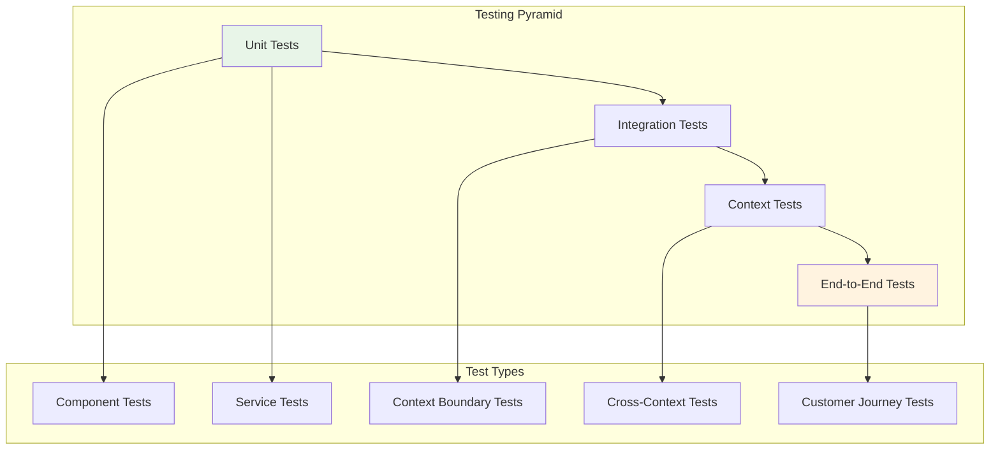

# Testing Multi-Context Applications

*Marcus Chen explains comprehensive testing strategies for OpusGenie DI*

---

!!! quote "Marcus Chen - Business Domain Expert"
    *"Testing banking software isn't just about code coverage—it's about confidence. With OpusGenie DI's testing utilities, we can test everything from individual components to complete customer journeys across all contexts."*

## Testing Philosophy

Testing multi-context applications requires a **layered approach**:



## Unit Testing Components

### Testing Individual Components

```python title="Component Unit Tests"
import pytest
import asyncio
from unittest.mock import AsyncMock, Mock
from opusgenie_di._testing import create_test_context, reset_global_state

class TestAccountService:
    """Unit tests for AccountService component"""
    
    @pytest.fixture
    async def mock_dependencies(self):
        """Create mock dependencies for AccountService"""
        mock_account_repo = AsyncMock(spec=AccountRepository)
        mock_customer_service = AsyncMock(spec=CustomerService)
        mock_interest_engine = Mock(spec=InterestEngine)
        mock_cache = AsyncMock(spec=RedisCache)
        mock_event_bus = AsyncMock(spec=EventBus)
        
        return {
            'account_repo': mock_account_repo,
            'customer_service': mock_customer_service,
            'interest_engine': mock_interest_engine,
            'cache': mock_cache,
            'event_bus': mock_event_bus
        }
    
    async def test_open_account_success(self, mock_dependencies):
        """Test successful account opening"""
        # Arrange
        service = AccountService(**mock_dependencies)
        await service.initialize()
        
        # Mock customer exists and is verified
        mock_customer = Customer(
            id="cust_123",
            name="Maria Santos",
            kyc_status="verified",
            type="individual"
        )
        mock_dependencies['customer_service'].get_customer.return_value = mock_customer
        
        # Mock account creation
        expected_account = PersonalAccount(
            id="acc_456",
            customer_id="cust_123",
            account_type="savings",
            balance=1000.0
        )
        mock_dependencies['account_repo'].save.return_value = expected_account
        
        # Act
        account = await service.open_account("cust_123", "savings", 1000.0)
        
        # Assert
        assert account.customer_id == "cust_123"
        assert account.account_type == "savings"
        assert account.balance == 1000.0
        
        # Verify interactions
        mock_dependencies['customer_service'].get_customer.assert_called_once_with("cust_123")
        mock_dependencies['account_repo'].save.assert_called_once()
        mock_dependencies['cache'].set.assert_called_once()
        mock_dependencies['event_bus'].publish.assert_called_once()
        
        # Verify event published
        published_event = mock_dependencies['event_bus'].publish.call_args[0][0]
        assert isinstance(published_event, AccountOpenedEvent)
        assert published_event.account_id == account.id
    
    async def test_open_account_customer_not_found(self, mock_dependencies):
        """Test account opening when customer doesn't exist"""
        # Arrange
        service = AccountService(**mock_dependencies)
        await service.initialize()
        
        mock_dependencies['customer_service'].get_customer.return_value = None
        
        # Act & Assert
        with pytest.raises(CustomerNotFoundError) as exc_info:
            await service.open_account("nonexistent", "savings", 1000.0)
        
        assert "Customer nonexistent not found" in str(exc_info.value)
        
        # Verify no account was created
        mock_dependencies['account_repo'].save.assert_not_called()
    
    async def test_open_account_customer_not_verified(self, mock_dependencies):
        """Test account opening for unverified customer"""
        # Arrange
        service = AccountService(**mock_dependencies)
        await service.initialize()
        
        unverified_customer = Customer(
            id="cust_123",
            name="John Doe",
            kyc_status="pending",
            type="individual"
        )
        mock_dependencies['customer_service'].get_customer.return_value = unverified_customer
        
        # Act & Assert
        with pytest.raises(CustomerNotVerifiedError):
            await service.open_account("cust_123", "savings", 1000.0)
    
    async def test_business_account_validation(self, mock_dependencies):
        """Test business account type validation"""
        # Arrange
        service = AccountService(**mock_dependencies)
        await service.initialize()
        
        individual_customer = Customer(
            id="cust_123",
            name="Maria Santos", 
            kyc_status="verified",
            type="individual"
        )
        mock_dependencies['customer_service'].get_customer.return_value = individual_customer
        
        # Act & Assert - Individual cannot open business account
        with pytest.raises(InvalidAccountTypeError):
            await service.open_account("cust_123", "business", 10000.0)
    
    async def test_component_lifecycle(self, mock_dependencies):
        """Test component initialization and cleanup"""
        # Arrange
        service = AccountService(**mock_dependencies)
        
        # Test initialization
        await service.initialize()
        assert service.is_initialized
        
        # Test cleanup
        await service.cleanup()
        # Could verify cleanup behavior here
```

### Testing with Real Dependencies

```python title="Integration Testing with Test Context"
class TestAccountServiceIntegration:
    """Integration tests with real dependencies"""
    
    @pytest.fixture
    async def test_context(self):
        """Create test context with real components"""
        await reset_global_state()
        
        # Create test context with real components but test doubles for external services
        context = await create_test_context(
            providers=[
                TestDatabaseConnection,    # In-memory test database
                TestRedisCache,           # In-memory test cache
                TestEventBus,             # Mock event bus
                AccountRepository,        # Real repository
                InterestEngine,          # Real interest engine
                CustomerService,         # Real customer service
                AccountService           # Component under test
            ]
        )
        
        yield context
        
        # Cleanup
        await context.shutdown()
    
    async def test_complete_account_creation_flow(self, test_context):
        """Test complete account creation with real dependencies"""
        # Get services from context
        customer_service = test_context.resolve(CustomerService)
        account_service = test_context.resolve(AccountService)
        account_repo = test_context.resolve(AccountRepository)
        
        # Create customer first
        customer_app = CustomerApplication(
            name="Maria Santos",
            email="maria@example.com",
            phone="+1-555-0123",
            customer_type="individual"
        )
        customer = await customer_service.onboard_customer(customer_app)
        
        # Open account
        account = await account_service.open_account(
            customer.id, "savings", 1000.0
        )
        
        # Verify account exists in repository
        stored_account = await account_repo.get_by_id(account.id)
        assert stored_account is not None
        assert stored_account.customer_id == customer.id
        assert stored_account.balance == 1000.0
    
    async def test_interest_calculation_integration(self, test_context):
        """Test interest calculation with real components"""
        account_service = test_context.resolve(AccountService)
        interest_engine = test_context.resolve(InterestEngine)
        
        # Create account
        account = await account_service.open_account("cust_123", "savings", 10000.0)
        
        # Calculate interest
        daily_interest = interest_engine.calculate_daily_interest(account)
        
        # Verify interest calculation
        expected_daily_interest = 10000.0 * 0.02 / 365  # 2% APY
        assert abs(daily_interest - expected_daily_interest) < 0.01
```

## Context Boundary Testing

### Testing Import/Export Boundaries

```python title="Context Boundary Tests"
class TestContextBoundaries:
    """Test context isolation and import/export boundaries"""
    
    async def test_context_isolation(self):
        """Test that contexts are properly isolated"""
        await reset_global_state()
        
        # Build multiple contexts
        builder = ContextModuleBuilder()
        contexts = await builder.build_contexts(
            CustomerManagementModule,
            AccountManagementModule,
            PaymentProcessingModule
        )
        
        customer_context = contexts["customer_management"]
        account_context = contexts["account_management"]
        payment_context = contexts["payment_processing"]
        
        # Test that each context can resolve its own components
        customer_service = customer_context.resolve(CustomerService)
        account_service = account_context.resolve(AccountService)
        payment_service = payment_context.resolve(PaymentService)
        
        assert customer_service is not None
        assert account_service is not None
        assert payment_service is not None
        
        # Test that contexts cannot resolve components they don't own
        with pytest.raises(ComponentResolutionError):
            customer_context.resolve(PaymentService)
        
        with pytest.raises(ComponentResolutionError):
            payment_context.resolve(CustomerRepository)  # Not exported
    
    async def test_imported_components_are_accessible(self):
        """Test that imported components work correctly"""
        await reset_global_state()
        
        builder = ContextModuleBuilder()
        contexts = await builder.build_contexts(
            CustomerManagementModule,
            AccountManagementModule
        )
        
        account_context = contexts["account_management"]
        
        # AccountService should be able to use imported CustomerService
        account_service = account_context.resolve(AccountService)
        
        # Verify the imported CustomerService is injected
        assert hasattr(account_service, 'customer_service')
        assert account_service.customer_service is not None
        assert isinstance(account_service.customer_service, CustomerService)
    
    async def test_singleton_scope_across_contexts(self):
        """Test singleton components are shared correctly"""
        await reset_global_state()
        
        builder = ContextModuleBuilder()
        contexts = await builder.build_contexts(
            InfrastructureModule,
            CustomerManagementModule,
            AccountManagementModule
        )
        
        customer_context = contexts["customer_management"]
        account_context = contexts["account_management"]
        
        # Both contexts should get the same DatabaseConnection instance
        customer_db = customer_context.resolve(DatabaseConnection)
        account_db = account_context.resolve(DatabaseConnection)
        
        # They should be the same instance (singleton)
        assert customer_db is account_db
    
    async def test_context_startup_order(self):
        """Test that contexts start up in correct dependency order"""
        startup_order = []
        
        # Mock context initialization to track order
        original_init = ContextModuleBuilder._initialize_context
        
        async def track_init(self, context_name, module):
            startup_order.append(context_name)
            return await original_init(self, context_name, module)
        
        ContextModuleBuilder._initialize_context = track_init
        
        try:
            builder = ContextModuleBuilder()
            await builder.build_contexts(
                PaymentProcessingModule,    # Depends on account + infrastructure
                InfrastructureModule,       # No dependencies  
                AccountManagementModule     # Depends on customer + infrastructure
            )
            
            # Verify startup order respects dependencies
            infra_index = startup_order.index("infrastructure")
            account_index = startup_order.index("account_management")
            payment_index = startup_order.index("payment_processing")
            
            assert infra_index < account_index  # Infrastructure before account
            assert account_index < payment_index  # Account before payment
            
        finally:
            # Restore original method
            ContextModuleBuilder._initialize_context = original_init
```

## End-to-End Testing

### Customer Journey Tests

```python title="Complete Customer Journey Tests"
class TestCustomerJourneys:
    """Test complete customer journeys across all contexts"""
    
    @pytest.fixture
    async def banking_system(self):
        """Set up complete banking system for E2E tests"""
        await reset_global_state()
        
        # Build complete system with test doubles for external services
        builder = ContextModuleBuilder()
        contexts = await builder.build_contexts(
            TestInfrastructureModule,    # Test database, cache, etc.
            CustomerManagementModule,
            AccountManagementModule,
            PaymentProcessingModule,
            ComplianceManagementModule
        )
        
        yield contexts
        
        # Cleanup
        for context in contexts.values():
            await context.shutdown()
    
    async def test_new_customer_complete_journey(self, banking_system):
        """Test complete journey: onboarding → account opening → payment → compliance"""
        # Get services
        customer_service = banking_system["customer_management"].resolve(CustomerService)
        account_service = banking_system["account_management"].resolve(AccountService)
        payment_service = banking_system["payment_processing"].resolve(PaymentService)
        compliance_service = banking_system["compliance_management"].resolve(ComplianceService)
        
        # 1. Customer onboarding (Maria Santos)
        maria_app = CustomerApplication(
            name="Maria Santos",
            email="maria@mariasdesigns.com", 
            phone="+1-555-0123",
            customer_type="individual",
            identity_documents=["passport", "utility_bill"]
        )
        
        maria = await customer_service.onboard_customer(maria_app)
        assert maria.id is not None
        assert maria.kyc_status == "verified"
        
        # 2. Account opening
        maria_account = await account_service.open_account(
            maria.id, "savings", initial_deposit=1000.0
        )
        assert maria_account.customer_id == maria.id
        assert maria_account.balance == 1000.0
        
        # 3. Another customer for payment recipient (David Kim)  
        david_app = CustomerApplication(
            name="David Kim",
            email="david@kimrestaurants.com",
            phone="+1-555-0456", 
            customer_type="business",
            identity_documents=["business_license", "tax_id"]
        )
        
        david = await customer_service.onboard_customer(david_app)
        david_account = await account_service.open_account(
            david.id, "business", initial_deposit=50000.0
        )
        
        # 4. Payment processing (David pays Maria for design work)
        payment = await payment_service.process_transfer(
            from_account_id=david_account.id,
            to_account_id=maria_account.id,
            amount=2500.0,
            reference="Restaurant logo design - Invoice #2024-001"
        )
        
        assert payment.status == "completed"
        assert payment.amount == 2500.0
        
        # 5. Verify account balances updated
        updated_maria_account = await account_service.get_account(maria_account.id)
        updated_david_account = await account_service.get_account(david_account.id)
        
        assert updated_maria_account.balance == 3500.0  # 1000 + 2500
        assert updated_david_account.balance == 47500.0  # 50000 - 2500
        
        # 6. Compliance audit
        audit_result = await compliance_service.audit_payment(payment.id)
        assert audit_result.compliant is True  # Payment should be compliant
        assert len(audit_result.issues) == 0
    
    async def test_large_payment_compliance_workflow(self, banking_system):
        """Test large payment triggers compliance workflow"""
        customer_service = banking_system["customer_management"].resolve(CustomerService)
        account_service = banking_system["account_management"].resolve(AccountService)
        payment_service = banking_system["payment_processing"].resolve(PaymentService)
        compliance_service = banking_system["compliance_management"].resolve(ComplianceService)
        
        # Create business customer
        business_app = CustomerApplication(
            name="OgPgy Corp",
            email="finance@ogpgycorp.com",
            customer_type="business",
            identity_documents=["articles_incorporation", "tax_id", "banking_resolution"]
        )
        
        business_customer = await customer_service.onboard_customer(business_app)
        business_account = await account_service.open_account(
            business_customer.id, "business", initial_deposit=1000000.0
        )
        
        # Create recipient account
        recipient_account = await account_service.open_account(
            business_customer.id, "business_escrow", initial_deposit=0.0
        )
        
        # Large payment (should trigger additional compliance checks)
        large_payment = await payment_service.process_transfer(
            from_account_id=business_account.id,
            to_account_id=recipient_account.id,
            amount=75000.0,  # Large amount
            reference="Real estate acquisition - Contract #RE-2024-003"
        )
        
        # Compliance audit should flag for review
        audit_result = await compliance_service.audit_payment(large_payment.id)
        
        # Large payments may have compliance issues to review
        if not audit_result.compliant:
            assert "Large transaction requires additional reporting" in audit_result.issues
        
        # Payment should still succeed but be flagged for review
        assert large_payment.status == "completed"
    
    async def test_fraud_detection_workflow(self, banking_system):
        """Test fraud detection in payment workflow"""
        customer_service = banking_system["customer_management"].resolve(CustomerService)
        account_service = banking_system["account_management"].resolve(AccountService)
        payment_service = banking_system["payment_processing"].resolve(PaymentService)
        
        # Create customer and account
        customer = await customer_service.onboard_customer(
            CustomerApplication(
                name="Test Customer",
                email="test@example.com",
                customer_type="individual"
            )
        )
        account = await account_service.open_account(customer.id, "savings", 10000.0)
        external_account = "external_account_123"
        
        # Simulate rapid successive payments (potential fraud pattern)
        payments = []
        for i in range(5):
            try:
                payment = await payment_service.process_transfer(
                    from_account_id=account.id,
                    to_account_id=external_account,
                    amount=1500.0,
                    reference=f"Payment {i+1}"
                )
                payments.append(payment)
                
            except FraudDetectedError:
                # Fraud detection may block after several rapid payments
                break
        
        # Should have processed some payments but may have blocked others
        successful_payments = [p for p in payments if p.status == "completed"]
        assert len(successful_payments) >= 1  # At least one should succeed
```

## Testing with Mocks and Test Doubles

### Creating Test Doubles

```python title="Test Doubles for External Services"
class MockVelocityPayGateway(BaseComponent):
    """Test double for VelocityPay external service"""
    
    def __init__(self):
        super().__init__()
        self.processed_payments = []
        self.should_fail = False
        self.failure_reason = None
    
    async def initialize(self) -> None:
        await super().initialize()
        # No actual connection needed for tests
    
    async def process_transfer(
        self,
        from_account: str,
        to_account: str,
        amount: float,
        reference: str
    ) -> VelocityPayResult:
        """Mock payment processing"""
        
        if self.should_fail:
            return VelocityPayResult(
                success=False,
                error_message=self.failure_reason or "Mock failure"
            )
        
        # Simulate successful processing
        transaction_id = f"mock_txn_{len(self.processed_payments) + 1}"
        
        self.processed_payments.append({
            'transaction_id': transaction_id,
            'from_account': from_account,
            'to_account': to_account,
            'amount': amount,
            'reference': reference,
            'processed_at': time.time()
        })
        
        return VelocityPayResult(
            success=True,
            transaction_id=transaction_id
        )
    
    def configure_failure(self, should_fail: bool, reason: str = None):
        """Configure mock to simulate failures"""
        self.should_fail = should_fail
        self.failure_reason = reason

class TestDatabaseConnection(BaseComponent):
    """In-memory test database"""
    
    def __init__(self):
        super().__init__()
        self.data = {}  # Simple in-memory storage
        self.query_log = []
    
    async def execute(self, query: str, *args) -> Any:
        """Mock database execution"""
        self.query_log.append({'query': query, 'args': args})
        
        # Simple query simulation
        if query.startswith("INSERT"):
            return {"rows_affected": 1}
        elif query.startswith("SELECT"):
            return []  # Empty result set
        elif query.startswith("UPDATE"):
            return {"rows_affected": 1}
        
        return None
    
    async def fetch_one(self, query: str, *args) -> dict:
        """Mock single row fetch"""
        self.query_log.append({'query': query, 'args': args})
        return None
    
    async def fetch_all(self, query: str, *args) -> List[dict]:
        """Mock multiple row fetch"""
        self.query_log.append({'query': query, 'args': args})
        return []

@og_context(
    name="test_infrastructure",
    exports=[DatabaseConnection, RedisCache, EventBus, VelocityPayGateway],
    providers=[
        TestDatabaseConnection,
        TestRedisCache,
        TestEventBus,
        MockVelocityPayGateway
    ]
)
class TestInfrastructureModule:
    """Test infrastructure with mocks and test doubles"""
    pass
```

### Property-Based Testing

```python title="Property-Based Testing with Hypothesis"
from hypothesis import given, strategies as st
import hypothesis

class TestAccountServiceProperties:
    """Property-based tests for AccountService"""
    
    @given(
        initial_deposit=st.floats(min_value=0.0, max_value=1000000.0),
        account_type=st.sampled_from(["savings", "checking", "business"])
    )
    async def test_account_opening_properties(self, initial_deposit, account_type):
        """Test account opening with various inputs"""
        # Assume valid customer exists
        customer = Customer(id="cust_123", kyc_status="verified", type="individual")
        
        # Mock dependencies
        mock_customer_service = AsyncMock()
        mock_customer_service.get_customer.return_value = customer
        
        mock_account_repo = AsyncMock()
        mock_cache = AsyncMock()
        mock_event_bus = AsyncMock()
        
        service = AccountService(
            account_repo=mock_account_repo,
            customer_service=mock_customer_service,
            interest_engine=InterestEngine(),
            cache=mock_cache,
            event_bus=mock_event_bus
        )
        
        if account_type == "business" and customer.type == "individual":
            # Should fail for individual trying to open business account
            with pytest.raises(InvalidAccountTypeError):
                await service.open_account(customer.id, account_type, initial_deposit)
        else:
            # Should succeed for valid combinations
            account = await service.open_account(customer.id, account_type, initial_deposit)
            
            # Properties that should always hold
            assert account.customer_id == customer.id
            assert account.account_type == account_type
            assert account.balance == initial_deposit
            assert account.id is not None
    
    @given(
        balance=st.floats(min_value=0.0, max_value=1000000.0),
        annual_rate=st.floats(min_value=0.0, max_value=0.1)  # 0% to 10%
    )
    def test_interest_calculation_properties(self, balance, annual_rate):
        """Test interest calculation properties"""
        engine = InterestEngine()
        
        account = Account(
            id="acc_123",
            customer_id="cust_123", 
            balance=balance,
            annual_rate=annual_rate
        )
        
        daily_interest = engine.calculate_daily_interest(account)
        
        # Properties that should always hold
        assert daily_interest >= 0.0  # Interest should never be negative
        assert daily_interest <= balance * annual_rate / 365  # Daily interest bounded
        
        # Interest should be proportional to balance
        if balance > 0:
            assert daily_interest > 0 or annual_rate == 0
```

## Performance Testing

### Load Testing Components

```python title="Performance and Load Testing"
import asyncio
import time
import statistics

class TestPerformance:
    """Performance tests for banking components"""
    
    async def test_payment_service_throughput(self):
        """Test payment service can handle concurrent transactions"""
        # Setup
        payment_service = await self._create_test_payment_service()
        
        # Create test accounts
        accounts = [f"acc_{i}" for i in range(100)]
        
        async def process_payment(i):
            """Process a single payment"""
            start_time = time.time()
            
            try:
                await payment_service.process_transfer(
                    from_account_id=accounts[i % 50],
                    to_account_id=accounts[(i + 50) % 100],
                    amount=100.0,
                    reference=f"Test payment {i}"
                )
                return time.time() - start_time
            except Exception as e:
                return None
        
        # Process payments concurrently
        start_time = time.time()
        
        payment_tasks = [process_payment(i) for i in range(100)]
        results = await asyncio.gather(*payment_tasks, return_exceptions=True)
        
        total_time = time.time() - start_time
        
        # Analyze results
        successful_payments = [r for r in results if isinstance(r, float)]
        failed_payments = [r for r in results if not isinstance(r, float)]
        
        print(f"Processed {len(successful_payments)} payments in {total_time:.2f}s")
        print(f"Throughput: {len(successful_payments) / total_time:.2f} payments/sec")
        print(f"Failed payments: {len(failed_payments)}")
        
        if successful_payments:
            avg_latency = statistics.mean(successful_payments)
            p95_latency = statistics.quantiles(successful_payments, n=20)[18]  # 95th percentile
            
            print(f"Average latency: {avg_latency * 1000:.2f}ms")
            print(f"95th percentile latency: {p95_latency * 1000:.2f}ms")
            
            # Assert performance requirements
            assert len(successful_payments) >= 95  # 95% success rate
            assert avg_latency < 0.1  # Average latency under 100ms
            assert p95_latency < 0.2   # 95th percentile under 200ms
    
    async def test_system_startup_performance(self):
        """Test system startup time is reasonable"""
        start_time = time.time()
        
        builder = ContextModuleBuilder()
        contexts = await builder.build_contexts(
            InfrastructureModule,
            CustomerManagementModule,
            AccountManagementModule,
            PaymentProcessingModule,
            ComplianceManagementModule
        )
        
        startup_time = time.time() - start_time
        
        print(f"System startup time: {startup_time:.2f}s")
        
        # Assert startup time is reasonable
        assert startup_time < 5.0  # Startup should complete within 5 seconds
        
        # Cleanup
        for context in contexts.values():
            await context.shutdown()
```

## Test Organization and Fixtures

### Shared Test Fixtures

```python title="Shared Test Infrastructure"
# conftest.py
import pytest
import asyncio
from opusgenie_di._testing import reset_global_state

@pytest.fixture(scope="session")
def event_loop():
    """Create an instance of the default event loop for the test session."""
    loop = asyncio.get_event_loop_policy().new_event_loop()
    yield loop
    loop.close()

@pytest.fixture(autouse=True)
async def reset_di_state():
    """Reset OpusGenie DI state before each test"""
    await reset_global_state()

@pytest.fixture
async def test_customer():
    """Create a test customer"""
    return Customer(
        id="test_customer_123",
        name="Test Customer",
        email="test@example.com",
        kyc_status="verified",
        type="individual"
    )

@pytest.fixture
async def test_business_customer():
    """Create a test business customer"""
    return Customer(
        id="test_business_123",
        name="Test Business Inc",
        email="admin@testbusiness.com",
        kyc_status="verified",
        type="business"
    )

@pytest.fixture
async def banking_test_system():
    """Create complete banking system for testing"""
    builder = ContextModuleBuilder()
    contexts = await builder.build_contexts(
        TestInfrastructureModule,
        CustomerManagementModule,
        AccountManagementModule,
        PaymentProcessingModule
    )
    
    yield {
        'contexts': contexts,
        'customer_service': contexts["customer_management"].resolve(CustomerService),
        'account_service': contexts["account_management"].resolve(AccountService),
        'payment_service': contexts["payment_processing"].resolve(PaymentService)
    }
    
    # Cleanup
    for context in contexts.values():
        await context.shutdown()
```

## Best Practices

!!! tip "Testing Best Practices"
    
    **Test Organization:**
    - Use clear test class and method names
    - Group related tests in classes
    - Use descriptive fixtures
    - Separate unit, integration, and E2E tests
    
    **Test Isolation:**
    - Reset global state between tests
    - Use test doubles for external dependencies
    - Test components in isolation when possible
    - Use separate test databases/contexts
    
    **Async Testing:**
    - Use proper async/await patterns
    - Test concurrent operations
    - Verify cleanup happens correctly
    - Test timeout scenarios
    
    **Context Testing:**
    - Test import/export boundaries
    - Verify context isolation
    - Test startup/shutdown order
    - Test cross-context integration

## Next Steps

<div class="grid cards" markdown>

-   :material-alert:{ .lg .middle } **Error Handling**

    ---

    Master error handling and recovery

    [:octicons-arrow-right-24: Error Handling](error-handling.md)

-   :material-bank:{ .lg .middle } **Real Examples**

    ---

    See complete banking implementations

    [:octicons-arrow-right-24: Banking Examples](../examples/banking-architecture.md)

-   :material-speedometer:{ .lg .middle } **Performance**

    ---

    Optimize your applications

    [:octicons-arrow-right-24: Performance](../best-practices/performance.md)

</div>