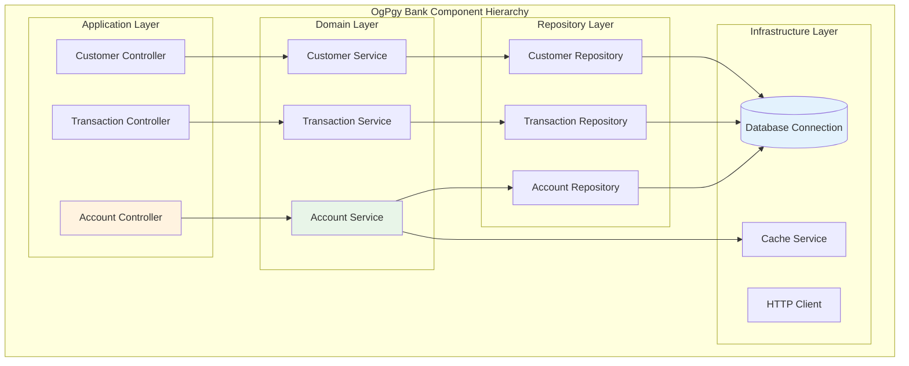
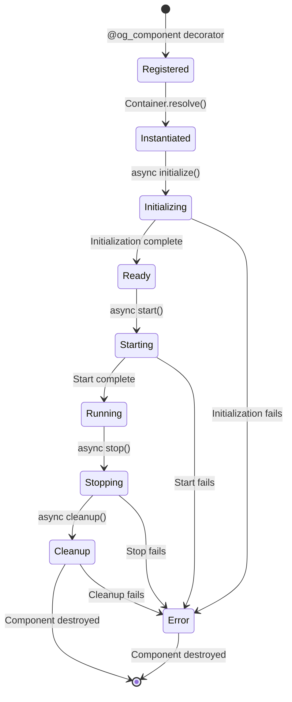

# Understanding Components

*Priya Nakamura explains OpusGenie DI's component system through banking service examples*

---

!!! quote "Priya Nakamura - Lead Software Architect"
    *"In banking, every service is a critical component. When designing OgPgy Bank's architecture, I needed a component system that was both powerful and predictable. OpusGenie DI's components gave us exactly that."*

## What Are Components?

In OpusGenie DI, a **component** is any class that can be managed by the dependency injection container. Components are the building blocks of your application—they represent services, repositories, processors, or any other objects that form your business logic.



## Creating Components

### Basic Component Definition

The foundation of every component is the `@og_component` decorator and `BaseComponent` class:

```python title="Basic Component Example"
from opusgenie_di import og_component, BaseComponent

@og_component()
class CustomerRepository(BaseComponent):
    """Repository for customer data - OgPgy Bank's customer database"""
    
    def __init__(self) -> None:
        super().__init__()  # Always call super().__init__()!
        self._customers = {}
    
    def save_customer(self, customer: Customer) -> None:
        self._customers[customer.id] = customer
    
    def find_by_id(self, customer_id: str) -> Customer | None:
        return self._customers.get(customer_id)
```

### Component with Dependencies

Components can depend on other components, and OpusGenie DI will automatically inject them:

```python title="Component with Dependencies"
@og_component()
class AccountService(BaseComponent):
    """Account business logic - depends on repository and validation"""
    
    def __init__(
        self, 
        customer_repo: CustomerRepository,
        account_repo: AccountRepository,
        validator: AccountValidator
    ) -> None:
        super().__init__()
        self.customer_repo = customer_repo
        self.account_repo = account_repo
        self.validator = validator
    
    def create_account(self, customer_id: str, account_type: str) -> Account:
        # Use injected dependencies
        customer = self.customer_repo.find_by_id(customer_id)
        if not customer:
            raise CustomerNotFoundError(f"Customer {customer_id} not found")
        
        account = Account(customer_id=customer_id, type=account_type)
        if self.validator.validate_account(account):
            self.account_repo.save_account(account)
            return account
        
        raise ValidationError("Account validation failed")
```

## Component Lifecycle

Components in OpusGenie DI follow a well-defined lifecycle that Priya uses to manage OgPgy Bank's banking services:



### Lifecycle Methods

```python title="Full Component Lifecycle"
from opusgenie_di import og_component, BaseComponent
import asyncio
import logging

logger = logging.getLogger(__name__)

@og_component()
class PaymentProcessor(BaseComponent):
    """Payment processing service with full lifecycle management"""
    
    def __init__(self, gateway: PaymentGateway, logger: AuditLogger) -> None:
        super().__init__()
        self.gateway = gateway
        self.audit_logger = logger
        self.is_ready = False
        self.processed_payments = 0
    
    async def initialize(self) -> None:
        """Called once when component is first created"""
        await super().initialize()
        logger.info("🏦 Initializing PaymentProcessor...")
        
        # Setup connections, load configuration, etc.
        await self.gateway.connect()
        await self.audit_logger.setup()
        
        self.is_ready = True
        logger.info("✅ PaymentProcessor initialized successfully")
    
    async def start(self) -> None:
        """Called when component starts processing"""
        await super().start()
        logger.info("🚀 Starting PaymentProcessor...")
        
        # Start background tasks, open queues, etc.
        if not self.is_ready:
            raise RuntimeError("PaymentProcessor not initialized")
        
        logger.info("✅ PaymentProcessor started successfully")
    
    async def stop(self) -> None:
        """Called when component stops processing"""
        logger.info("🛑 Stopping PaymentProcessor...")
        
        # Stop background tasks, finish pending work, etc.
        await self.finish_pending_payments()
        
        logger.info("✅ PaymentProcessor stopped successfully")
        await super().stop()
    
    async def cleanup(self) -> None:
        """Called before component is destroyed"""
        logger.info("🧹 Cleaning up PaymentProcessor...")
        
        # Close connections, free resources, etc.
        await self.gateway.disconnect()
        await self.audit_logger.close()
        
        logger.info(f"📊 Processed {self.processed_payments} payments during lifetime")
        logger.info("✅ PaymentProcessor cleanup completed")
        await super().cleanup()
    
    async def process_payment(self, payment: Payment) -> PaymentResult:
        """Business method - only works when component is running"""
        if not self.is_ready:
            raise RuntimeError("PaymentProcessor not ready")
        
        result = await self.gateway.process(payment)
        await self.audit_logger.log_payment(payment, result)
        self.processed_payments += 1
        
        return result
    
    async def finish_pending_payments(self) -> None:
        """Internal method to finish pending work during shutdown"""
        # Implementation for graceful shutdown
        pass
```

## Component Options

The `@og_component` decorator accepts several options to control component behavior:

### Component Scope

```python title="Different Component Scopes"
from opusgenie_di import ComponentScope

# Singleton - One instance per container (default)
@og_component(scope=ComponentScope.SINGLETON)
class DatabaseConnection(BaseComponent):
    """Shared database connection across the application"""
    pass

# Transient - New instance every time it's resolved
@og_component(scope=ComponentScope.TRANSIENT)
class TransactionLogger(BaseComponent):
    """New logger instance for each transaction"""
    
    def __init__(self) -> None:
        super().__init__()
        self.transaction_id = generate_uuid()

# Scoped - One instance per scope (e.g., per request)
@og_component(scope=ComponentScope.SCOPED)
class UserSession(BaseComponent):
    """One session per user request"""
    pass
```

### Auto-Registration

```python title="Auto-Registration Control"
# Auto-register to global context (default)
@og_component(auto_register=True)
class GlobalService(BaseComponent):
    """Available in global context automatically"""
    pass

# Don't auto-register (for multi-context setups)
@og_component(auto_register=False)
class ContextSpecificService(BaseComponent):
    """Must be manually registered to specific contexts"""
    pass
```

### Component Tags

```python title="Component Metadata with Tags"
@og_component(
    tags={
        "layer": "infrastructure",
        "type": "repository",
        "database": "postgresql",
        "criticality": "high"
    }
)
class CustomerRepository(BaseComponent):
    """Tagged component for better organization and monitoring"""
    pass

@og_component(
    tags={
        "layer": "domain",
        "type": "service", 
        "business_domain": "payments",
        "compliance_level": "pci_dss"
    }
)
class PaymentService(BaseComponent):
    """Payment service with compliance and domain tags"""
    pass
```

## Component Patterns at OgPgy Bank

### 1. Repository Pattern

```python title="Repository Components"
from typing import Protocol

class CustomerRepository(Protocol):
    """Protocol defining repository interface"""
    async def save(self, customer: Customer) -> None: ...
    async def find_by_id(self, customer_id: str) -> Customer | None: ...
    async def find_by_email(self, email: str) -> Customer | None: ...

@og_component(tags={"layer": "infrastructure", "type": "repository"})
class PostgreSQLCustomerRepository(BaseComponent):
    """PostgreSQL implementation of customer repository"""
    
    def __init__(self, db: DatabaseConnection) -> None:
        super().__init__()
        self.db = db
    
    async def save(self, customer: Customer) -> None:
        query = "INSERT INTO customers (id, name, email) VALUES ($1, $2, $3)"
        await self.db.execute(query, customer.id, customer.name, customer.email)
    
    async def find_by_id(self, customer_id: str) -> Customer | None:
        query = "SELECT * FROM customers WHERE id = $1"
        row = await self.db.fetch_one(query, customer_id)
        return Customer.from_row(row) if row else None

@og_component(tags={"layer": "infrastructure", "type": "repository"})
class InMemoryCustomerRepository(BaseComponent):
    """In-memory implementation for testing"""
    
    def __init__(self) -> None:
        super().__init__()
        self._customers: dict[str, Customer] = {}
    
    async def save(self, customer: Customer) -> None:
        self._customers[customer.id] = customer
    
    async def find_by_id(self, customer_id: str) -> Customer | None:
        return self._customers.get(customer_id)
```

### 2. Service Layer Pattern

```python title="Service Layer Components"
@og_component(tags={"layer": "domain", "type": "service"})
class AccountService(BaseComponent):
    """Domain service for account operations"""
    
    def __init__(
        self,
        account_repo: AccountRepository,
        customer_repo: CustomerRepository,
        event_publisher: EventPublisher
    ) -> None:
        super().__init__()
        self.account_repo = account_repo
        self.customer_repo = customer_repo
        self.event_publisher = event_publisher
    
    async def open_account(self, customer_id: str, account_type: str) -> Account:
        """Business logic for opening a new account"""
        # Validate customer exists
        customer = await self.customer_repo.find_by_id(customer_id)
        if not customer:
            raise CustomerNotFoundError(f"Customer {customer_id} not found")
        
        # Create account
        account = Account(
            customer_id=customer_id,
            type=account_type,
            status=AccountStatus.PENDING_ACTIVATION
        )
        
        # Save account
        await self.account_repo.save(account)
        
        # Publish event for other systems
        await self.event_publisher.publish(
            AccountOpenedEvent(account_id=account.id, customer_id=customer_id)
        )
        
        return account
```

### 3. Factory Pattern

```python title="Factory Components"
@og_component(tags={"type": "factory"})
class PaymentProcessorFactory(BaseComponent):
    """Factory for creating payment processors based on gateway type"""
    
    def __init__(self, context: Context) -> None:
        super().__init__()
        self.context = context
    
    def create_processor(self, gateway_type: str) -> PaymentProcessor:
        """Create payment processor for specific gateway"""
        if gateway_type == "velocitypay":
            return self.context.resolve(VelocityPayProcessor)
        elif gateway_type == "stripe":
            return self.context.resolve(StripeProcessor)
        elif gateway_type == "bank_transfer":
            return self.context.resolve(BankTransferProcessor)
        else:
            raise ValueError(f"Unknown gateway type: {gateway_type}")

@og_component(tags={"layer": "infrastructure", "type": "processor"})
class VelocityPayProcessor(BaseComponent):
    """VelocityPay payment processor implementation"""
    
    def __init__(self, config: VelocityPayConfig) -> None:
        super().__init__()
        self.config = config
    
    async def process_payment(self, payment: Payment) -> PaymentResult:
        # VelocityPay specific implementation
        pass
```

### 4. Decorator Pattern

```python title="Decorator Components"
@og_component(tags={"type": "decorator", "feature": "monitoring"})
class MonitoredPaymentService(BaseComponent):
    """Decorator that adds monitoring to payment service"""
    
    def __init__(
        self, 
        payment_service: PaymentService,
        metrics: MetricsCollector
    ) -> None:
        super().__init__()
        self.payment_service = payment_service
        self.metrics = metrics
    
    async def process_payment(self, payment: Payment) -> PaymentResult:
        """Process payment with monitoring"""
        start_time = time.time()
        
        try:
            self.metrics.increment("payments.started")
            result = await self.payment_service.process_payment(payment)
            self.metrics.increment("payments.success")
            return result
        except Exception as e:
            self.metrics.increment("payments.failed")
            self.metrics.increment(f"payments.failed.{type(e).__name__}")
            raise
        finally:
            duration = time.time() - start_time
            self.metrics.histogram("payments.duration", duration)
```

## Component Discovery and Registration

### Automatic Discovery

```python title="Automatic Component Discovery"
# Components are automatically discovered when modules are imported
from ogpgy_bank.accounts import services  # All @og_component classes registered
from ogpgy_bank.payments import processors
from ogpgy_bank.compliance import validators

# Get global context and enable auto-wiring
context = get_global_context()
context.enable_auto_wiring()

# Components are automatically available
account_service = context.resolve(AccountService)
```

### Manual Registration

```python title="Manual Component Registration"
from opusgenie_di import Context

# Create new context
context = Context("banking_context")

# Register components manually
context.register_component(DatabaseConnection)
context.register_component(CustomerRepository)
context.register_component(AccountService)

# Register with specific configuration
context.register_component(
    PaymentProcessor,
    scope=ComponentScope.TRANSIENT,
    tags={"priority": "high"}
)

# Register instance
redis_client = Redis(host="localhost", port=6379)
context.register_instance(redis_client, Redis)
```

## Component Metadata and Introspection

OpusGenie DI provides rich metadata about components that Priya uses for monitoring and debugging:

```python title="Component Introspection"
from opusgenie_di import get_component_metadata, get_component_options

# Get component metadata
metadata = get_component_metadata(AccountService)
print(f"Component: {metadata.component_type.__name__}")
print(f"Dependencies: {[dep.__name__ for dep in metadata.dependencies]}")
print(f"Tags: {metadata.tags}")

# Get component options
options = get_component_options(AccountService)
print(f"Scope: {options.scope}")
print(f"Auto-register: {options.auto_register}")

# Get context summary
context = get_global_context()
summary = context.get_summary()
print(f"Total components: {summary['component_count']}")
print(f"Registered types: {[t.__name__ for t in summary['registered_types']]}")
```

## Error Handling in Components

### Component Registration Errors

```python title="Handling Registration Errors"
try:
    context.register_component(BrokenComponent)
except ComponentRegistrationError as e:
    logger.error(f"Failed to register component: {e}")

try:
    service = context.resolve(MissingService)
except ComponentResolutionError as e:
    logger.error(f"Failed to resolve component: {e}")
```

### Lifecycle Errors

```python title="Lifecycle Error Handling"
@og_component()
class RobustDatabaseService(BaseComponent):
    """Database service with robust error handling"""
    
    async def initialize(self) -> None:
        try:
            await super().initialize()
            await self.connect_to_database()
        except DatabaseConnectionError as e:
            logger.error(f"Database connection failed: {e}")
            # Could implement retry logic here
            raise
        except Exception as e:
            logger.error(f"Unexpected initialization error: {e}")
            raise
    
    async def cleanup(self) -> None:
        try:
            if hasattr(self, 'connection') and self.connection:
                await self.connection.close()
        except Exception as e:
            logger.warning(f"Error during cleanup (non-fatal): {e}")
        finally:
            await super().cleanup()
```

## Testing Components

### Unit Testing Components

```python title="Component Unit Testing"
import pytest
from opusgenie_di import create_test_context, MockComponent

@pytest.fixture
def test_context():
    """Create isolated test context"""
    return create_test_context()

def test_account_service(test_context):
    """Test account service with mocked dependencies"""
    
    # Create mock dependencies
    mock_repo = MockComponent(CustomerRepository)
    mock_repo.find_by_id.return_value = Customer(id="123", name="Test Customer")
    
    # Register mocks in test context
    test_context.register_instance(mock_repo, CustomerRepository)
    test_context.register_component(AccountService)
    
    # Test the service
    service = test_context.resolve(AccountService)
    customer = service.get_customer("123")
    
    assert customer.name == "Test Customer"
    mock_repo.find_by_id.assert_called_once_with("123")
```

### Integration Testing

```python title="Component Integration Testing"
@pytest.mark.asyncio
async def test_payment_flow_integration(test_context):
    """Test complete payment flow with real components"""
    
    # Use real components but with test configuration
    test_context.register_component(InMemoryPaymentRepository)
    test_context.register_component(MockPaymentGateway)
    test_context.register_component(PaymentService)
    
    service = test_context.resolve(PaymentService)
    
    # Test the full flow
    payment = Payment(amount=100.0, from_account="123", to_account="456")
    result = await service.process_payment(payment)
    
    assert result.status == PaymentStatus.SUCCESS
    assert result.transaction_id is not None
```

## Priya's Component Design Tips

!!! tip "Keep Components Focused"
    ```python
    # Good - Single responsibility
    @og_component()
    class EmailNotificationService(BaseComponent):
        def send_notification(self, recipient: str, message: str): pass
    
    # Bad - Multiple responsibilities
    @og_component()
    class NotificationAndLoggingAndValidationService(BaseComponent):
        def send_notification(self): pass
        def log_activity(self): pass
        def validate_data(self): pass
    ```

!!! tip "Use Clear Dependencies"
    ```python
    # Good - Clear interface dependencies
    def __init__(self, repo: CustomerRepository, validator: CustomerValidator):
        pass
    
    # Bad - Unclear dependencies
    def __init__(self, stuff: Any, things: dict):
        pass
    ```

!!! tip "Handle Async Properly"
    ```python
    # Good - Proper async lifecycle
    async def initialize(self) -> None:
        await super().initialize()
        await self.setup_async_resources()
    
    # Bad - Blocking calls in async methods
    async def initialize(self) -> None:
        time.sleep(10)  # ❌ Blocks event loop
    ```

!!! tip "Use Tags for Organization"
    ```python
    @og_component(tags={
        "layer": "infrastructure",
        "criticality": "high",
        "monitoring": "enabled"
    })
    class CriticalDatabaseService(BaseComponent):
        pass
    ```

## Next Steps

Now that you understand components, let's explore how their lifecycles and scopes work:

<div class="grid cards" markdown>

-   :material-timer-outline:{ .lg .middle } **Scopes & Lifecycle**

    ---

    Master component lifecycles and scoping strategies

    [:octicons-arrow-right-24: Scopes & Lifecycle](scopes.md)

-   :material-sitemap:{ .lg .middle } **Contexts**

    ---

    Organize components into isolated contexts

    [:octicons-arrow-right-24: Understanding Contexts](contexts.md)

-   :material-bank:{ .lg .middle } **Real Examples**

    ---

    See components in action at OgPgy Bank

    [:octicons-arrow-right-24: Banking Examples](../examples/banking-architecture.md)

</div>

---

!!! success "Component Mastery"
    
    You now understand how to create, configure, and manage components in OpusGenie DI. Components are the foundation of your application architecture—master them, and you'll build better software!