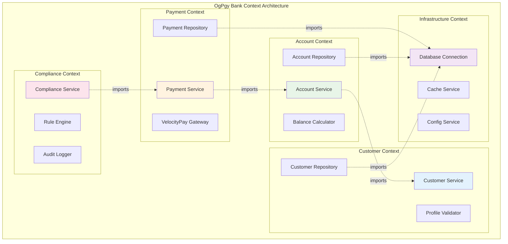
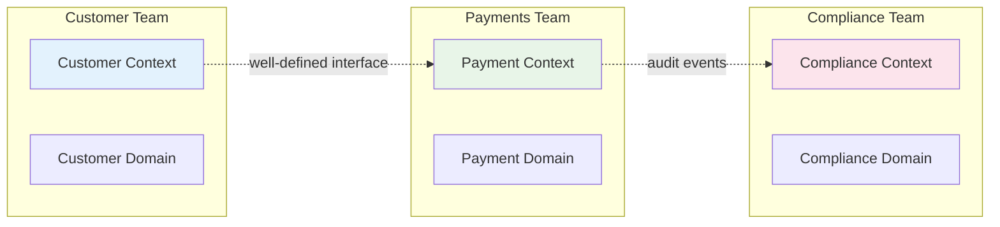
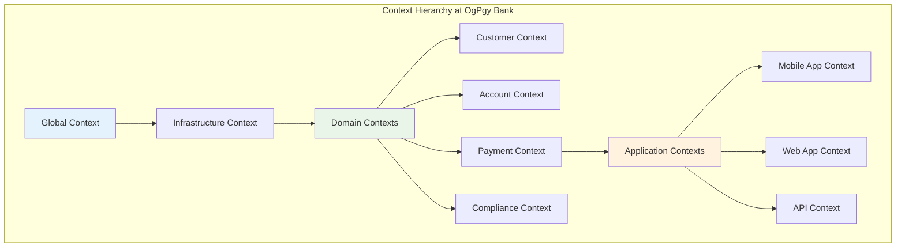

# Understanding Contexts

*Sofia Ramos explains how contexts enable domain-driven design at OgPgy Bank*

---

!!! quote "Sofia Ramos - Product Manager"
    *"As Product Manager, I needed our technical architecture to mirror our business domains. When we started using OpusGenie DI's contexts, our teams could finally work independently while still building a cohesive banking platform."*

## What Are Contexts?

A **context** in OpusGenie DI is an isolated container that manages a specific set of components. Think of contexts as **bounded contexts** from Domain-Driven Design—they provide clear boundaries between different areas of your application while allowing controlled interaction between them.



## Why Use Contexts?

Sofia identified several key benefits when OgPgy Bank adopted context-based architecture:

### 1. Business Domain Alignment

```python title="Contexts Mirror Business Domains"
# Customer Management Domain
@og_context(name="customer_context")
class CustomerModule:
    """Everything related to customer management"""
    pass

# Account Management Domain  
@og_context(name="account_context")
class AccountModule:
    """Everything related to accounts and balances"""
    pass

# Payment Processing Domain
@og_context(name="payment_context")
class PaymentModule:
    """Everything related to payment processing"""
    pass

# Regulatory Compliance Domain
@og_context(name="compliance_context")
class ComplianceModule:
    """Everything related to regulatory compliance"""
    pass
```

### 2. Team Independence



### 3. Isolated Testing and Deployment

Each context can be tested and deployed independently, enabling faster development cycles.

## Creating and Using Contexts

### Basic Context Creation

```python title="Simple Context Example"
from opusgenie_di import Context

# Create a new context for customer management
customer_context = Context("customer_management")

# Register components specific to customer domain
customer_context.register_component(CustomerRepository)
customer_context.register_component(CustomerService)
customer_context.register_component(CustomerValidator)

# Enable dependency resolution
customer_context.enable_auto_wiring()

# Use the context
customer_service = customer_context.resolve(CustomerService)
```

### The Global Context

OpusGenie DI provides a global context for simple applications:

```python title="Using the Global Context"
from opusgenie_di import get_global_context

# Get the singleton global context
context = get_global_context()

# Components with auto_register=True are automatically added
context.enable_auto_wiring()

# Resolve components from global context
service = context.resolve(SomeService)
```

## Context Isolation and Communication

### Isolated Components

Components in different contexts are completely isolated by default:

```python title="Context Isolation Example"
from opusgenie_di import Context

# Create separate contexts
customer_context = Context("customers")
payment_context = Context("payments")

# Register components in different contexts
customer_context.register_component(CustomerService)
payment_context.register_component(PaymentService)

customer_context.enable_auto_wiring()
payment_context.enable_auto_wiring()

# This works - component is in same context
customer_service = customer_context.resolve(CustomerService)

# This fails - component is in different context
try:
    payment_service = customer_context.resolve(PaymentService)
except ComponentResolutionError:
    print("PaymentService not available in customer context")
```

### Cross-Context Communication

Contexts can import specific components from other contexts:

```python title="Cross-Context Imports"
from opusgenie_di import ModuleContextImport, ContextModuleBuilder

# Define what each context provides and imports
@og_context(
    name="infrastructure_context",
    imports=[],  # Base layer - no imports
    exports=[DatabaseConnection, CacheService],
    providers=[DatabaseConnection, CacheService]
)
class InfrastructureModule:
    pass

@og_context(
    name="customer_context", 
    imports=[
        ModuleContextImport(
            component_type=DatabaseConnection,
            from_context="infrastructure_context"
        )
    ],
    exports=[CustomerService],
    providers=[CustomerRepository, CustomerService]
)
class CustomerModule:
    pass

@og_context(
    name="payment_context",
    imports=[
        ModuleContextImport(
            component_type=CustomerService,
            from_context="customer_context"
        ),
        ModuleContextImport(
            component_type=DatabaseConnection,
            from_context="infrastructure_context"
        )
    ],
    exports=[PaymentService],
    providers=[PaymentRepository, PaymentService]
)
class PaymentModule:
    pass
```

## Real-World Example: OgPgy Bank's Context Architecture

Let's see how Sofia designed OgPgy Bank's complete context architecture:

```python title="OgPgy Bank Context Design"
from opusgenie_di import og_context, og_component, ModuleContextImport

# === INFRASTRUCTURE CONTEXT ===
# Shared infrastructure services used across all domains

@og_component(auto_register=False)
class DatabaseConnection(BaseComponent):
    """PostgreSQL connection for all banking data"""
    
    def __init__(self, config: DatabaseConfig) -> None:
        super().__init__()
        self.config = config
        self.pool = None
    
    async def initialize(self) -> None:
        await super().initialize()
        self.pool = await create_connection_pool(self.config.url)

@og_component(auto_register=False)
class RedisCache(BaseComponent):
    """Redis cache for session and temporary data"""
    
    def __init__(self, config: RedisConfig) -> None:
        super().__init__()
        self.config = config
        self.client = None
    
    async def initialize(self) -> None:
        await super().initialize()
        self.client = await create_redis_client(self.config.url)

@og_context(
    name="infrastructure",
    imports=[],
    exports=[DatabaseConnection, RedisCache],
    providers=[DatabaseConnection, RedisCache],
    description="Shared infrastructure services",
    version="1.0.0"
)
class InfrastructureModule:
    """Foundation services used across all business domains"""
    pass

# === CUSTOMER CONTEXT ===
# Customer management domain - Maria Santos and David Kim's data

@og_component(auto_register=False)
class CustomerRepository(BaseComponent):
    def __init__(self, db: DatabaseConnection) -> None:
        super().__init__()
        self.db = db
    
    async def save_customer(self, customer: Customer) -> None:
        # Customer persistence logic
        pass
    
    async def find_by_id(self, customer_id: str) -> Customer | None:
        # Customer retrieval logic
        pass

@og_component(auto_register=False)
class CustomerService(BaseComponent):
    def __init__(
        self, 
        repo: CustomerRepository,
        validator: CustomerValidator
    ) -> None:
        super().__init__()
        self.repo = repo
        self.validator = validator
    
    async def create_customer(self, data: CustomerData) -> Customer:
        """Create new customer like Maria or David"""
        if not self.validator.validate(data):
            raise ValidationError("Invalid customer data")
        
        customer = Customer(
            id=generate_customer_id(),
            name=data.name,
            email=data.email,
            type=data.customer_type  # 'individual' or 'business'
        )
        
        await self.repo.save_customer(customer)
        return customer

@og_context(
    name="customer",
    imports=[
        ModuleContextImport(DatabaseConnection, from_context="infrastructure")
    ],
    exports=[CustomerService],
    providers=[CustomerRepository, CustomerValidator, CustomerService],
    description="Customer management domain",
    version="1.0.0"
)
class CustomerModule:
    """Manages customer data and operations"""
    pass

# === ACCOUNT CONTEXT ===
# Account management - handles Maria's savings and David's business accounts

@og_component(auto_register=False)
class AccountRepository(BaseComponent):
    def __init__(self, db: DatabaseConnection) -> None:
        super().__init__()
        self.db = db
    
    async def save_account(self, account: Account) -> None:
        # Account persistence
        pass
    
    async def find_by_customer(self, customer_id: str) -> list[Account]:
        # Find customer accounts
        pass

@og_component(auto_register=False)
class AccountService(BaseComponent):
    def __init__(
        self,
        account_repo: AccountRepository,
        customer_service: CustomerService,  # Imported from customer context
        cache: RedisCache
    ) -> None:
        super().__init__()
        self.account_repo = account_repo
        self.customer_service = customer_service
        self.cache = cache
    
    async def open_account(
        self, 
        customer_id: str, 
        account_type: str
    ) -> Account:
        """Open new account for existing customer"""
        # Verify customer exists (using imported service)
        customer = await self.customer_service.get_customer(customer_id)
        if not customer:
            raise CustomerNotFoundError(f"Customer {customer_id} not found")
        
        # Create account based on customer type
        if customer.type == "business":
            account = BusinessAccount(customer_id, account_type)
        else:
            account = PersonalAccount(customer_id, account_type)
        
        await self.account_repo.save_account(account)
        
        # Cache for quick access
        await self.cache.set(f"account:{account.id}", account.to_dict())
        
        return account

@og_context(
    name="account",
    imports=[
        ModuleContextImport(DatabaseConnection, from_context="infrastructure"),
        ModuleContextImport(RedisCache, from_context="infrastructure"),
        ModuleContextImport(CustomerService, from_context="customer")
    ],
    exports=[AccountService],
    providers=[AccountRepository, AccountService],
    description="Account management domain",
    version="1.0.0"
)
class AccountModule:
    """Manages customer accounts and balances"""
    pass

# === PAYMENT CONTEXT ===
# Payment processing - handles transfers between Maria and David

@og_component(auto_register=False)
class VelocityPayGateway(BaseComponent):
    """Integration with VelocityPay payment processor"""
    
    def __init__(self, config: VelocityPayConfig) -> None:
        super().__init__()
        self.config = config
        self.client = None
    
    async def initialize(self) -> None:
        await super().initialize()
        self.client = VelocityPayClient(self.config.api_key)
    
    async def process_transfer(
        self, 
        from_account: str, 
        to_account: str, 
        amount: float
    ) -> TransferResult:
        """Process transfer through VelocityPay"""
        return await self.client.transfer(from_account, to_account, amount)

@og_component(auto_register=False)
class PaymentService(BaseComponent):
    def __init__(
        self,
        account_service: AccountService,  # Imported from account context
        velocity_pay: VelocityPayGateway,
        payment_repo: PaymentRepository
    ) -> None:
        super().__init__()
        self.account_service = account_service
        self.velocity_pay = velocity_pay
        self.payment_repo = payment_repo
    
    async def transfer_funds(
        self,
        from_customer: str,
        to_customer: str, 
        amount: float
    ) -> Payment:
        """Transfer funds between customers like Maria and David"""
        
        # Get customer accounts (using imported service)
        from_accounts = await self.account_service.get_customer_accounts(from_customer)
        to_accounts = await self.account_service.get_customer_accounts(to_customer)
        
        if not from_accounts or not to_accounts:
            raise AccountNotFoundError("Customer accounts not found")
        
        # Use primary accounts
        from_account = from_accounts[0]
        to_account = to_accounts[0]
        
        # Process through VelocityPay
        result = await self.velocity_pay.process_transfer(
            from_account.id, 
            to_account.id, 
            amount
        )
        
        # Record payment
        payment = Payment(
            from_account=from_account.id,
            to_account=to_account.id,
            amount=amount,
            status=result.status,
            transaction_id=result.transaction_id
        )
        
        await self.payment_repo.save_payment(payment)
        return payment

@og_context(
    name="payment",
    imports=[
        ModuleContextImport(DatabaseConnection, from_context="infrastructure"),
        ModuleContextImport(AccountService, from_context="account")
    ],
    exports=[PaymentService],
    providers=[VelocityPayGateway, PaymentRepository, PaymentService],
    description="Payment processing domain",
    version="1.0.0"
)
class PaymentModule:
    """Handles all payment operations and VelocityPay integration"""
    pass

# === COMPLIANCE CONTEXT ===
# Regulatory compliance - ensures Inspector Torres' requirements are met

@og_component(auto_register=False)
class GenaiComplianceEngine(BaseComponent):
    """Compliance engine for Genai banking regulations"""
    
    def __init__(self, db: DatabaseConnection) -> None:
        super().__init__()
        self.db = db
        self.rules = {}
    
    async def initialize(self) -> None:
        await super().initialize()
        # Load Genai banking regulations
        self.rules = await self.load_compliance_rules()
    
    async def validate_payment(self, payment: Payment) -> ComplianceResult:
        """Validate payment against Genai regulations"""
        # Check AML requirements
        # Check transaction limits
        # Check customer restrictions
        pass

@og_component(auto_register=False)
class ComplianceService(BaseComponent):
    def __init__(
        self,
        compliance_engine: GenaiComplianceEngine,
        payment_service: PaymentService,  # Imported from payment context
        audit_logger: AuditLogger
    ) -> None:
        super().__init__()
        self.compliance_engine = compliance_engine
        self.payment_service = payment_service
        self.audit_logger = audit_logger
    
    async def audit_payment(self, payment_id: str) -> AuditResult:
        """Audit payment for Inspector Torres' reports"""
        payment = await self.payment_service.get_payment(payment_id)
        if not payment:
            raise PaymentNotFoundError(f"Payment {payment_id} not found")
        
        # Run compliance checks
        compliance_result = await self.compliance_engine.validate_payment(payment)
        
        # Log audit event
        await self.audit_logger.log_audit(
            event_type="payment_audit",
            payment_id=payment_id,
            result=compliance_result,
            inspector="torres"
        )
        
        return AuditResult(
            payment_id=payment_id,
            compliant=compliance_result.is_compliant,
            issues=compliance_result.issues
        )

@og_context(
    name="compliance",
    imports=[
        ModuleContextImport(DatabaseConnection, from_context="infrastructure"),
        ModuleContextImport(PaymentService, from_context="payment")
    ],
    exports=[ComplianceService],
    providers=[GenaiComplianceEngine, AuditLogger, ComplianceService],
    description="Regulatory compliance and auditing",
    version="1.0.0"
)
class ComplianceModule:
    """Ensures all operations comply with Genai banking regulations"""
    pass
```

## Building Contexts with ContextModuleBuilder

Sofia uses the `ContextModuleBuilder` to create all contexts with proper dependency resolution:

```python title="Building OgPgy Bank's Complete System"
from opusgenie_di import ContextModuleBuilder

async def build_ogpgy_bank_system():
    """Build the complete OgPgy Bank system"""
    print("🏗️ Building OgPgy Bank's multi-context architecture...")
    
    # Create the builder
    builder = ContextModuleBuilder()
    
    # Build all contexts with dependency resolution
    contexts = await builder.build_contexts(
        InfrastructureModule,  # Base layer - no dependencies
        CustomerModule,        # Depends on infrastructure
        AccountModule,         # Depends on infrastructure + customer
        PaymentModule,         # Depends on infrastructure + account  
        ComplianceModule       # Depends on infrastructure + payment
    )
    
    print(f"✅ Built {len(contexts)} contexts successfully!")
    
    # Show context summary
    for name, context in contexts.items():
        summary = context.get_summary()
        print(f"📦 {name}: {summary['component_count']} components, "
              f"{summary['import_count']} imports")
    
    return contexts

# Usage
async def main():
    # Build the system
    contexts = await build_ogpgy_bank_system()
    
    # Use the payment service
    payment_context = contexts["payment"]
    payment_service = payment_context.resolve(PaymentService)
    
    # Transfer money from David's restaurant to Maria's design business
    payment = await payment_service.transfer_funds(
        from_customer="david_kim",
        to_customer="maria_santos",
        amount=500.00
    )
    
    print(f"💰 Transfer completed: {payment.transaction_id}")
    
    # Audit the payment for compliance
    compliance_context = contexts["compliance"]
    compliance_service = compliance_context.resolve(ComplianceService)
    
    audit_result = await compliance_service.audit_payment(payment.id)
    print(f"📋 Audit result: {'✅ Compliant' if audit_result.compliant else '❌ Issues found'}")

if __name__ == "__main__":
    asyncio.run(main())
```

## Context Management Patterns

### 1. Hierarchical Contexts



### 2. Feature-Based Contexts

```python title="Feature-Based Context Organization"
# Organize by business features rather than technical layers

@og_context(name="customer_onboarding")
class CustomerOnboardingModule:
    """Everything needed to onboard new customers like Maria"""
    pass

@og_context(name="loan_processing") 
class LoanProcessingModule:
    """Everything needed for David's SME loan application"""
    pass

@og_context(name="fraud_detection")
class FraudDetectionModule:
    """Real-time fraud detection for all transactions"""
    pass

@og_context(name="mobile_banking")
class MobileBankingModule:
    """Mobile-specific services and validation"""
    pass
```

### 3. Environment-Specific Contexts

```python title="Environment-Specific Context Configuration"
# Development environment
@og_context(
    name="development_infrastructure",
    providers=[
        MockDatabaseConnection,    # In-memory database
        MockEmailService,         # Fake email sending
        MockVelocityPayGateway    # Simulated payment processing
    ]
)
class DevelopmentInfrastructureModule:
    pass

# Production environment
@og_context(
    name="production_infrastructure", 
    providers=[
        PostgreSQLConnection,     # Real database
        AWSEmailService,         # Real email via AWS SES
        VelocityPayGateway       # Real payment processing
    ]
)
class ProductionInfrastructureModule:
    pass

# Choose based on environment
if os.getenv("ENVIRONMENT") == "production":
    infrastructure_module = ProductionInfrastructureModule
else:
    infrastructure_module = DevelopmentInfrastructureModule
```

## Context Testing Strategies

### Testing Individual Contexts

```python title="Testing Isolated Contexts"
import pytest
from opusgenie_di import create_test_context

@pytest.fixture
def customer_test_context():
    """Create isolated test context for customer domain"""
    context = create_test_context()
    
    # Register test-specific implementations
    context.register_component(InMemoryCustomerRepository)
    context.register_component(MockEmailService)
    context.register_component(CustomerService)
    
    context.enable_auto_wiring()
    return context

def test_customer_creation(customer_test_context):
    """Test customer creation in isolation"""
    service = customer_test_context.resolve(CustomerService)
    
    customer_data = CustomerData(
        name="Test Customer",
        email="test@example.com",
        type="individual"
    )
    
    customer = await service.create_customer(customer_data)
    
    assert customer.name == "Test Customer"
    assert customer.type == "individual"
```

### Testing Cross-Context Integration

```python title="Integration Testing Across Contexts"
@pytest.mark.asyncio
async def test_payment_flow_integration():
    """Test complete payment flow across multiple contexts"""
    
    # Build test system with real context dependencies
    builder = ContextModuleBuilder()
    contexts = await builder.build_contexts(
        TestInfrastructureModule,
        CustomerModule,
        AccountModule, 
        PaymentModule
    )
    
    # Test data setup
    customer_service = contexts["customer"].resolve(CustomerService)
    account_service = contexts["account"].resolve(AccountService)
    payment_service = contexts["payment"].resolve(PaymentService)
    
    # Create test customers
    maria = await customer_service.create_customer(
        CustomerData(name="Maria Santos", email="maria@example.com")
    )
    david = await customer_service.create_customer(
        CustomerData(name="David Kim", email="david@example.com", type="business")
    )
    
    # Create accounts
    maria_account = await account_service.open_account(maria.id, "savings")
    david_account = await account_service.open_account(david.id, "business")
    
    # Test payment
    payment = await payment_service.transfer_funds(
        david.id, maria.id, 500.0
    )
    
    assert payment.amount == 500.0
    assert payment.status == "completed"
```

## Sofia's Context Design Principles

!!! tip "Align with Business Domains"
    ```python
    # Good - Mirrors business structure
    @og_context(name="customer_management")
    @og_context(name="account_services") 
    @og_context(name="payment_processing")
    
    # Bad - Technical grouping only
    @og_context(name="repositories")
    @og_context(name="services")
    @og_context(name="controllers")
    ```

!!! tip "Minimize Cross-Context Dependencies"
    ```python
    # Good - Clear, minimal dependencies
    imports=[
        ModuleContextImport(CustomerService, from_context="customer")
    ]
    
    # Bad - Too many dependencies
    imports=[
        ModuleContextImport(Service1, from_context="context1"),
        ModuleContextImport(Service2, from_context="context2"),
        ModuleContextImport(Service3, from_context="context3"),
        # ... many more
    ]
    ```

!!! tip "Design for Team Ownership"
    ```python
    # Each context should be owned by a single team
    @og_context(
        name="customer_context",
        description="Owned by Customer Experience Team",
        version="2.1.0"
    )
    class CustomerModule:
        pass
    ```

!!! tip "Use Descriptive Names and Documentation"
    ```python
    @og_context(
        name="payment_processing",
        description="Handles all payment operations including VelocityPay integration, fraud detection, and transaction logging",
        version="1.3.2"
    )
    class PaymentModule:
        """
        Payment processing context for OgPgy Bank.
        
        Responsibilities:
        - Process transfers between accounts
        - Integrate with VelocityPay gateway
        - Handle payment validation and fraud detection
        - Maintain transaction audit trail
        
        Team: Payments Team
        Contact: payments-team@ogpgy.com
        """
        pass
    ```

## Context Monitoring and Observability

```python title="Context Health Monitoring"
def monitor_context_health(contexts: dict[str, Context]) -> None:
    """Monitor health of all contexts"""
    
    for name, context in contexts.items():
        summary = context.get_summary()
        
        # Monitor component count
        metrics.gauge(f'context.{name}.component_count', summary['component_count'])
        
        # Monitor import/export relationships
        metrics.gauge(f'context.{name}.import_count', summary['import_count'])
        
        # Check for circular dependencies
        if summary.get('circular_dependencies'):
            logger.error(f"Circular dependencies detected in {name} context")
            metrics.increment(f'context.{name}.circular_dependencies')
        
        # Monitor resolution time
        start_time = time.time()
        try:
            # Attempt to resolve a known component
            test_component = context.resolve(list(summary['registered_types'])[0])
            resolution_time = time.time() - start_time
            metrics.histogram(f'context.{name}.resolution_time', resolution_time)
        except Exception as e:
            logger.error(f"Failed to resolve component in {name}: {e}")
            metrics.increment(f'context.{name}.resolution_errors')
```

## Next Steps

Now that you understand contexts, let's explore how to build complex multi-context architectures:

<div class="grid cards" markdown>

-   :material-sitemap:{ .lg .middle } **Multi-Context Architecture**

    ---

    Build complex systems with multiple interconnected contexts

    [:octicons-arrow-right-24: Multi-Context Systems](../multi-context/multi-context.md)

-   :material-import:{ .lg .middle } **Imports & Exports**

    ---

    Master cross-context communication patterns

    [:octicons-arrow-right-24: Imports & Exports](../multi-context/imports-exports.md)

-   :material-bank:{ .lg .middle } **Banking Examples**

    ---

    See complete real-world implementations

    [:octicons-arrow-right-24: Banking Architecture](../examples/banking-architecture.md)

</div>

---

!!! success "Context Mastery"
    
    You now understand how to organize your application into well-bounded contexts that align with your business domains. This is the foundation for building scalable, maintainable systems like OgPgy Bank's platform!