# Understanding Dependency Injection

*Marcus Chen explains how dependency injection solved OgPgy Bank's architecture challenges*

---

!!! quote "Marcus Chen - Business Domain Expert"
    *"When I joined OgPgy Bank, our biggest challenge wasn't understanding banking regulations—it was untangling the spaghetti code that made implementing new compliance requirements a nightmare. Dependency injection changed everything."*

## The Problem: Tightly Coupled Banking Systems

Before OpusGenie DI, OgPgy Bank's legacy system looked like this:

```python title="❌ The Old Way - Tightly Coupled"
class AccountService:
    def __init__(self):
        # Hard-coded dependencies - nightmare to test and modify!
        self.database = PostgreSQLDatabase("prod_connection_string")
        self.email_service = SMTPEmailService("smtp.ogpgy.com", 587)
        self.audit_logger = FileAuditLogger("/var/log/banking/audit.log")
        self.compliance_checker = GenaiComplianceChecker("genai_regulations.xml")
    
    def create_account(self, customer_data: dict) -> Account:
        # Business logic mixed with infrastructure concerns
        if not self.compliance_checker.validate_customer(customer_data):
            raise ComplianceError("Customer data invalid")
        
        account = Account(customer_data)
        self.database.save(account)
        self.audit_logger.log(f"Account created: {account.id}")
        self.email_service.send_welcome_email(account.email)
        
        return account
```

**Problems with this approach:**


1. **Hard to Test**: Cannot mock dependencies for unit testing
2. **Cannot Swap Implementations**: Stuck with specific database/email providers
3. **Configuration Nightmare**: Connection strings and settings scattered everywhere
4. **Violates SOLID Principles**: Single Responsibility and Dependency Inversion violated

## The Solution: Dependency Injection

Marcus Chen redesigned the system using OpusGenie DI's dependency injection pattern:

```python title="✅ The New Way - Dependency Injection"
from opusgenie_di import og_component, BaseComponent, ComponentScope
from typing import Protocol

# Define contracts (interfaces) for flexibility
class DatabaseRepository(Protocol):
    def save(self, account: Account) -> None: ...
    def find_by_id(self, account_id: str) -> Account | None: ...

class EmailService(Protocol):
    def send_welcome_email(self, email: str) -> None: ...

class AuditLogger(Protocol):
    def log(self, message: str) -> None: ...

class ComplianceChecker(Protocol):
    def validate_customer(self, data: dict) -> bool: ...

# Implementations
@og_component(scope=ComponentScope.SINGLETON)
class PostgreSQLRepository(BaseComponent):
    def __init__(self, config: DatabaseConfig):
        super().__init__()
        self.config = config
    
    def save(self, account: Account) -> None:
        # Database implementation
        pass

@og_component(scope=ComponentScope.SINGLETON)
class SMTPEmailService(BaseComponent):
    def __init__(self, config: EmailConfig):
        super().__init__()
        self.config = config
    
    def send_welcome_email(self, email: str) -> None:
        # Email implementation
        pass

@og_component(scope=ComponentScope.SINGLETON)
class StructuredAuditLogger(BaseComponent):
    def log(self, message: str) -> None:
        # Structured logging implementation
        pass

@og_component(scope=ComponentScope.SINGLETON)
class GenaiComplianceChecker(BaseComponent):
    def validate_customer(self, data: dict) -> bool:
        # Compliance validation logic
        return True

# Clean, testable service
@og_component(scope=ComponentScope.SINGLETON)
class AccountService(BaseComponent):
    def __init__(
        self,
        repository: PostgreSQLRepository,  # Dependencies injected automatically!
        email_service: SMTPEmailService,
        audit_logger: StructuredAuditLogger,
        compliance_checker: GenaiComplianceChecker
    ):
        super().__init__()
        self.repository = repository
        self.email_service = email_service
        self.audit_logger = audit_logger
        self.compliance_checker = compliance_checker
    
    def create_account(self, customer_data: dict) -> Account:
        # Pure business logic - easy to understand and test
        if not self.compliance_checker.validate_customer(customer_data):
            raise ComplianceError("Customer data invalid")
        
        account = Account(customer_data)
        self.repository.save(account)
        self.audit_logger.log(f"Account created: {account.id}")
        self.email_service.send_welcome_email(account.email)
        
        return account
```

## Benefits of Dependency Injection


### 1. Flexibility & Configuration

```python title="Environment-Specific Configurations"
# Development
@og_component()
class MockEmailService(BaseComponent):
    def send_welcome_email(self, email: str) -> None:
        print(f"📧 [DEV] Would send welcome email to {email}")

# Production
@og_component()
class AWSEmailService(BaseComponent):
    def send_welcome_email(self, email: str) -> None:
        # AWS SES implementation
        pass

# Testing
@og_component()
class FakeEmailService(BaseComponent):
    def __init__(self):
        super().__init__()
        self.emails_sent = []
    
    def send_welcome_email(self, email: str) -> None:
        self.emails_sent.append(email)
```

### 2. Testability

```python title="Easy Unit Testing"
import pytest
from opusgenie_di import create_test_context

def test_account_creation():
    # Create isolated test context
    test_context = create_test_context()
    
    # Register mock dependencies
    mock_repo = MockRepository()
    mock_email = MockEmailService()
    mock_logger = MockLogger()
    mock_compliance = MockComplianceChecker()
    
    test_context.register_instance(mock_repo, PostgreSQLRepository)
    test_context.register_instance(mock_email, SMTPEmailService)
    test_context.register_instance(mock_logger, StructuredAuditLogger)
    test_context.register_instance(mock_compliance, GenaiComplianceChecker)
    
    # Test the service
    service = test_context.resolve(AccountService)
    account = service.create_account({"name": "Maria Santos", "email": "maria@example.com"})
    
    assert account.name == "Maria Santos"
    assert mock_repo.save_called
    assert mock_email.email_sent_to == "maria@example.com"
```

### 3. SOLID Principles Compliance


## Dependency Injection Patterns

### 1. Constructor Injection (Recommended)

```python
@og_component()
class PaymentProcessor(BaseComponent):
    def __init__(
        self, 
        gateway: PaymentGateway, 
        validator: PaymentValidator,
        logger: AuditLogger
    ):
        super().__init__()
        self.gateway = gateway      # Required dependency
        self.validator = validator  # Required dependency
        self.logger = logger       # Required dependency
```

### 2. Property Injection

```python
@og_component()
class PaymentProcessor(BaseComponent):
    gateway: PaymentGateway       # Injected after construction
    validator: PaymentValidator   # Injected after construction
    logger: AuditLogger          # Injected after construction
```

### 3. Method Injection

```python
@og_component()
class PaymentProcessor(BaseComponent):
    def process_payment(
        self, 
        payment: Payment,
        gateway: PaymentGateway  # Injected per method call
    ) -> PaymentResult:
        return gateway.process(payment)
```

## Real-World Example: OgPgy Bank's Payment System

Let's see how Marcus Chen applies these concepts to OgPgy Bank's payment processing:

```mermaid
sequenceDiagram
    participant Customer
    participant PaymentController
    participant PaymentService
    participant FraudDetector
    participant VelocityPayGateway
    participant ComplianceChecker
    participant AuditLogger
    
    Customer->>PaymentController: Transfer $500 to Maria
    PaymentController->>PaymentService: process_transfer()
    PaymentService->>FraudDetector: check_for_fraud()
    FraudDetector-->>PaymentService: ✅ Clean
    PaymentService->>ComplianceChecker: validate_transfer()
    ComplianceChecker-->>PaymentService: ✅ Compliant
    PaymentService->>VelocityPayGateway: execute_transfer()
    VelocityPayGateway-->>PaymentService: ✅ Success
    PaymentService->>AuditLogger: log_transaction()
    PaymentService-->>PaymentController: Transfer complete
    PaymentController-->>Customer: ✅ Transfer successful
```



```python title="Payment System with DI"
@og_component()
class PaymentService(BaseComponent):
    def __init__(
        self,
        gateway: VelocityPayGateway,
        fraud_detector: FraudDetector,
        compliance_checker: ComplianceChecker,
        audit_logger: AuditLogger
    ):
        super().__init__()
        self.gateway = gateway
        self.fraud_detector = fraud_detector
        self.compliance_checker = compliance_checker
        self.audit_logger = audit_logger
    
    async def process_transfer(
        self, 
        from_account: str, 
        to_account: str, 
        amount: float
    ) -> TransferResult:
        # 1. Fraud detection
        if not await self.fraud_detector.check_transfer(from_account, to_account, amount):
            raise FraudDetectedError("Suspicious transfer pattern")
        
        # 2. Compliance validation
        if not await self.compliance_checker.validate_transfer(from_account, to_account, amount):
            raise ComplianceError("Transfer violates regulations")
        
        # 3. Execute transfer
        result = await self.gateway.transfer(from_account, to_account, amount)
        
        # 4. Audit logging
        await self.audit_logger.log_transfer(from_account, to_account, amount, result)
        
        return result
```

## Dependency Injection vs Other Patterns

### Service Locator Pattern (❌ Anti-pattern)

```python title="❌ Don't Use Service Locator"
class PaymentService:
    def process_payment(self, payment: Payment):
        # Service locator - hides dependencies!
        gateway = ServiceLocator.get("PaymentGateway")
        validator = ServiceLocator.get("PaymentValidator")
        
        # Business logic
        if validator.validate(payment):
            return gateway.process(payment)
```

**Problems:**
- Hidden dependencies (hard to understand what the class needs)
- Difficult to test (global state)
- Runtime failures (dependencies might not be registered)

### Factory Pattern (✅ Good, but DI is better)

```python title="✅ Factory Pattern - Good but verbose"
class PaymentServiceFactory:
    def create_payment_service(self) -> PaymentService:
        gateway = PaymentGatewayFactory.create()
        validator = PaymentValidatorFactory.create()
        return PaymentService(gateway, validator)

# Usage
factory = PaymentServiceFactory()
service = factory.create_payment_service()
```

**DI is better because:**
- Less boilerplate code
- Automatic dependency resolution
- Configuration in one place
- Better testing support

## Marcus Chen's DI Best Practices

!!! tip "Define Clear Interfaces"
    ```python
    # Always use protocols for dependencies
    from typing import Protocol
    
    class PaymentGateway(Protocol):
        async def process(self, payment: Payment) -> PaymentResult: ...
    ```

!!! tip "Keep Constructors Simple"
    ```python
    # Good - just assign dependencies
    def __init__(self, repo: AccountRepository, logger: Logger):
        super().__init__()
        self.repo = repo
        self.logger = logger
    
    # Bad - complex logic in constructor
    def __init__(self, repo: AccountRepository):
        super().__init__()
        self.repo = repo
        self.setup_complex_state()  # ❌ Don't do this
        self.load_configuration()   # ❌ Move to initialize()
    ```

!!! tip "Use Component Scopes Appropriately"
    ```python
    # Singleton for stateless services
    @og_component(scope=ComponentScope.SINGLETON)
    class ComplianceChecker: pass
    
    # Transient for stateful/request-specific components
    @og_component(scope=ComponentScope.TRANSIENT)
    class TransactionContext: pass
    ```

!!! tip "Validate Dependencies Early"
    ```python
    @og_component()
    class PaymentService(BaseComponent):
        def __init__(self, gateway: PaymentGateway):
            super().__init__()
            if not gateway:
                raise ValueError("PaymentGateway is required")
            self.gateway = gateway
    ```

## Common Misconceptions

### "DI Makes Code More Complex"

**Reality**: DI makes dependencies explicit and code more modular. The initial setup cost pays off quickly.

### "DI Is Only for Large Applications"

**Reality**: Even small applications benefit from testable, configurable code.

### "DI Violates Python's Simplicity"

**Reality**: Python's duck typing and protocols make DI natural and Pythonic.

## Next Steps

Now that you understand dependency injection principles, let's explore how OpusGenie DI implements these concepts:

<div class="grid cards" markdown>

-   :material-cube-outline:{ .lg .middle } **Components**

    ---

    Learn about OpusGenie DI's component system

    [:octicons-arrow-right-24: Understanding Components](components.md)

-   :material-timer-outline:{ .lg .middle } **Scopes & Lifecycle**

    ---

    Master component lifecycles and scoping

    [:octicons-arrow-right-24: Scopes & Lifecycle](scopes.md)

-   :material-sitemap:{ .lg .middle } **Contexts**

    ---

    Build isolated contexts for different domains

    [:octicons-arrow-right-24: Understanding Contexts](contexts.md)

</div>

---

!!! success "Key Takeaways"
    
    - **Dependency Injection** makes your code more flexible, testable, and maintainable
    - **Define clear interfaces** using Python protocols
    - **Inject dependencies** through constructors for explicit, testable code
    - **Use DI frameworks** like OpusGenie DI to handle the complexity automatically
    - **Start simple** - even small applications benefit from DI principles