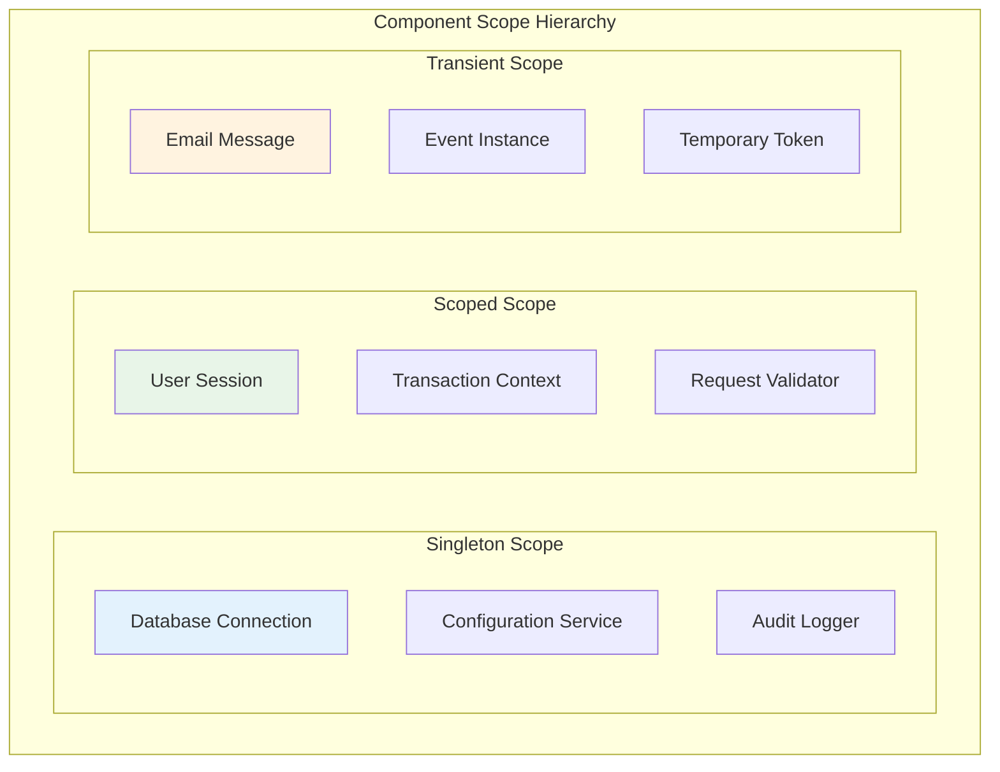
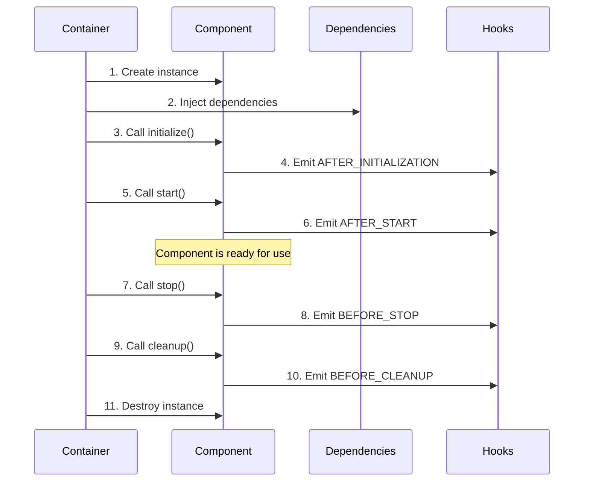

# Component Scopes & Lifecycle

*Jake Morrison explains how to manage component lifecycles for high-performance banking operations*

---

!!! quote "Jake Morrison - DevOps Engineer"
    *"At OgPgy Bank, we process millions of transactions daily. Understanding component scopes and lifecycles isn't just academic—it's the difference between a system that scales and one that crashes under load."*

## Understanding Component Scopes

Component scope determines **when** and **how many** instances of a component are created. OpusGenie DI provides three scopes that Jake uses to optimize OgPgy Bank's performance:



### Singleton Scope (Default)

**One instance per container** - The most commonly used scope for stateless services.

```python title="Singleton Components at OgPgy Bank"
from opusgenie_di import og_component, ComponentScope, BaseComponent

@og_component(scope=ComponentScope.SINGLETON)
class DatabaseConnection(BaseComponent):
    """Shared database connection - expensive to create, shared across app"""
    
    def __init__(self, config: DatabaseConfig) -> None:
        super().__init__()
        self.config = config
        self.connection_pool = None
        self.total_queries = 0
    
    async def initialize(self) -> None:
        await super().initialize()
        # Expensive operation - only happens once!
        self.connection_pool = await create_connection_pool(
            self.config.url,
            min_size=10,
            max_size=100
        )
        logger.info("🔌 Database connection pool created")
    
    async def execute_query(self, query: str) -> list[dict]:
        self.total_queries += 1
        return await self.connection_pool.fetch(query)

@og_component(scope=ComponentScope.SINGLETON)
class ComplianceChecker(BaseComponent):
    """Compliance rules - loaded once, used everywhere"""
    
    def __init__(self) -> None:
        super().__init__()
        self.rules = {}
        self.checks_performed = 0
    
    async def initialize(self) -> None:
        await super().initialize()
        # Load compliance rules from external system
        self.rules = await self.load_genai_banking_regulations()
        logger.info(f"📋 Loaded {len(self.rules)} compliance rules")
    
    def validate_transaction(self, transaction: Transaction) -> bool:
        self.checks_performed += 1
        # Validation logic using loaded rules
        return self.apply_rules(transaction, self.rules)
```

**When to use Singleton:**
- Database connections and connection pools
- Configuration services
- Caching services
- Stateless business services
- External API clients

### Transient Scope

**New instance every time** - Creates a fresh instance for each resolution.

```python title="Transient Components for Unique Operations"
@og_component(scope=ComponentScope.TRANSIENT)
class TransactionLogger(BaseComponent):
    """New logger for each transaction - maintains transaction-specific state"""
    
    def __init__(self, audit_service: AuditService) -> None:
        super().__init__()
        self.audit_service = audit_service
        self.transaction_id = generate_uuid()
        self.start_time = datetime.utcnow()
        self.events = []
    
    def log_event(self, event: str, data: dict) -> None:
        """Log event specific to this transaction"""
        self.events.append({
            'transaction_id': self.transaction_id,
            'timestamp': datetime.utcnow(),
            'event': event,
            'data': data
        })
    
    async def finalize(self) -> None:
        """Send all events to audit service"""
        duration = datetime.utcnow() - self.start_time
        await self.audit_service.log_transaction(
            self.transaction_id, 
            self.events, 
            duration
        )

@og_component(scope=ComponentScope.TRANSIENT)
class EmailNotification(BaseComponent):
    """Each email is a separate instance with unique content"""
    
    def __init__(self, email_service: EmailService) -> None:
        super().__init__()
        self.email_service = email_service
        self.message_id = generate_uuid()
        self.created_at = datetime.utcnow()
        self.recipients = []
        self.content = ""
    
    def add_recipient(self, email: str) -> None:
        self.recipients.append(email)
    
    def set_content(self, subject: str, body: str) -> None:
        self.content = f"Subject: {subject}\n\n{body}"
    
    async def send(self) -> bool:
        return await self.email_service.send_email(
            self.message_id,
            self.recipients,
            self.content
        )
```

**When to use Transient:**
- Components with unique state per operation
- Event objects
- Command objects
- Temporary data holders
- Thread-unsafe components

### Scoped Scope

**One instance per scope** - Typically used for request-scoped or session-scoped components.

```python title="Scoped Components for Request Context"
@og_component(scope=ComponentScope.SCOPED)
class UserSession(BaseComponent):
    """One session per user request - maintains user context"""
    
    def __init__(self, session_store: SessionStore) -> None:
        super().__init__()
        self.session_store = session_store
        self.user_id = None
        self.permissions = set()
        self.start_time = datetime.utcnow()
        self.activities = []
    
    async def authenticate(self, token: str) -> bool:
        """Authenticate user for this session"""
        user_info = await self.session_store.validate_token(token)
        if user_info:
            self.user_id = user_info['user_id']
            self.permissions = set(user_info['permissions'])
            return True
        return False
    
    def log_activity(self, activity: str) -> None:
        """Log activity for this session"""
        self.activities.append({
            'timestamp': datetime.utcnow(),
            'activity': activity
        })
    
    def has_permission(self, permission: str) -> bool:
        return permission in self.permissions

@og_component(scope=ComponentScope.SCOPED)
class RequestContext(BaseComponent):
    """Context for a single API request"""
    
    def __init__(self) -> None:
        super().__init__()
        self.request_id = generate_uuid()
        self.start_time = time.time()
        self.metrics = {}
        self.errors = []
    
    def record_metric(self, name: str, value: float) -> None:
        self.metrics[name] = value
    
    def record_error(self, error: Exception) -> None:
        self.errors.append({
            'type': type(error).__name__,
            'message': str(error),
            'timestamp': time.time()
        })
    
    def get_duration(self) -> float:
        return time.time() - self.start_time
```

**When to use Scoped:**
- User sessions
- Request contexts
- Transaction boundaries
- Temporary caches
- Context-specific configurations

## Component Lifecycle Management

Jake has implemented comprehensive lifecycle management for OgPgy Bank's critical systems:



### Banking Service with Full Lifecycle

```python title="Production-Ready Banking Service"
import asyncio
import logging
from datetime import datetime
from opusgenie_di import og_component, BaseComponent, ComponentScope

logger = logging.getLogger(__name__)

@og_component(scope=ComponentScope.SINGLETON)
class PaymentProcessingService(BaseComponent):
    """Critical payment service with comprehensive lifecycle management"""
    
    def __init__(
        self, 
        database: DatabaseConnection,
        velocity_pay: VelocityPayGateway,
        fraud_detector: FraudDetectionService,
        metrics: MetricsCollector
    ) -> None:
        super().__init__()
        self.database = database
        self.velocity_pay = velocity_pay
        self.fraud_detector = fraud_detector
        self.metrics = metrics
        
        # Service state
        self.is_healthy = False
        self.processed_count = 0
        self.error_count = 0
        self.start_time = None
        
        # Background tasks
        self.health_check_task = None
        self.metrics_task = None
    
    async def initialize(self) -> None:
        """Initialize the payment service"""
        await super().initialize()
        logger.info("💳 Initializing PaymentProcessingService...")
        
        try:
            # Verify all dependencies are healthy
            await self._verify_dependencies()
            
            # Load configuration
            await self._load_configuration()
            
            # Setup internal state
            self.start_time = datetime.utcnow()
            self.is_healthy = True
            
            logger.info("✅ PaymentProcessingService initialized successfully")
            
        except Exception as e:
            logger.error(f"❌ PaymentProcessingService initialization failed: {e}")
            self.is_healthy = False
            raise
    
    async def start(self) -> None:
        """Start background tasks and begin processing"""
        await super().start()
        logger.info("🚀 Starting PaymentProcessingService...")
        
        if not self.is_healthy:
            raise RuntimeError("Service not healthy - cannot start")
        
        try:
            # Start background health checking
            self.health_check_task = asyncio.create_task(self._health_check_loop())
            
            # Start metrics collection
            self.metrics_task = asyncio.create_task(self._metrics_loop())
            
            logger.info("✅ PaymentProcessingService started successfully")
            
        except Exception as e:
            logger.error(f"❌ PaymentProcessingService start failed: {e}")
            await self._cleanup_tasks()
            raise
    
    async def stop(self) -> None:
        """Stop processing and background tasks"""
        logger.info("🛑 Stopping PaymentProcessingService...")
        
        try:
            # Stop accepting new payments
            self.is_healthy = False
            
            # Wait for current payments to complete
            await self._finish_pending_payments()
            
            # Stop background tasks
            await self._cleanup_tasks()
            
            logger.info("✅ PaymentProcessingService stopped successfully")
            
        except Exception as e:
            logger.error(f"❌ Error during PaymentProcessingService stop: {e}")
        finally:
            await super().stop()
    
    async def cleanup(self) -> None:
        """Final cleanup before destruction"""
        logger.info("🧹 Cleaning up PaymentProcessingService...")
        
        try:
            # Log final statistics
            uptime = datetime.utcnow() - self.start_time if self.start_time else "unknown"
            logger.info(f"📊 Final stats - Processed: {self.processed_count}, "
                       f"Errors: {self.error_count}, Uptime: {uptime}")
            
            # Close any remaining connections
            await self._close_connections()
            
            logger.info("✅ PaymentProcessingService cleanup completed")
            
        except Exception as e:
            logger.error(f"❌ Error during PaymentProcessingService cleanup: {e}")
        finally:
            await super().cleanup()
    
    async def process_payment(self, payment: Payment) -> PaymentResult:
        """Main business method - process a payment"""
        if not self.is_healthy:
            raise ServiceUnavailableError("Payment service not available")
        
        try:
            # 1. Fraud detection
            if not await self.fraud_detector.check_payment(payment):
                self.error_count += 1
                raise FraudDetectedError("Payment failed fraud check")
            
            # 2. Process through VelocityPay
            result = await self.velocity_pay.process_payment(payment)
            
            # 3. Record in database
            await self.database.record_payment(payment, result)
            
            # 4. Update metrics
            self.processed_count += 1
            self.metrics.increment('payments.processed')
            
            return result
            
        except Exception as e:
            self.error_count += 1
            self.metrics.increment('payments.failed')
            logger.error(f"Payment processing failed: {e}")
            raise
    
    # Private lifecycle methods
    async def _verify_dependencies(self) -> None:
        """Verify all dependencies are working"""
        await self.database.health_check()
        await self.velocity_pay.health_check()
        await self.fraud_detector.health_check()
    
    async def _load_configuration(self) -> None:
        """Load service configuration"""
        # Load payment processing rules, limits, etc.
        pass
    
    async def _health_check_loop(self) -> None:
        """Background task to monitor service health"""
        while self.is_healthy:
            try:
                await self._verify_dependencies()
                self.metrics.gauge('service.health', 1)
                await asyncio.sleep(30)  # Check every 30 seconds
            except Exception as e:
                logger.warning(f"Health check failed: {e}")
                self.metrics.gauge('service.health', 0)
                await asyncio.sleep(5)  # Check more frequently when unhealthy
    
    async def _metrics_loop(self) -> None:
        """Background task to emit metrics"""
        while self.is_healthy:
            try:
                self.metrics.gauge('payments.processed.total', self.processed_count)
                self.metrics.gauge('payments.errors.total', self.error_count)
                await asyncio.sleep(60)  # Emit every minute
            except Exception as e:
                logger.warning(f"Metrics emission failed: {e}")
                await asyncio.sleep(60)
    
    async def _finish_pending_payments(self) -> None:
        """Wait for pending payments to complete"""
        # Implementation would track and wait for in-flight payments
        pass
    
    async def _cleanup_tasks(self) -> None:
        """Cancel background tasks"""
        if self.health_check_task:
            self.health_check_task.cancel()
            try:
                await self.health_check_task
            except asyncio.CancelledError:
                pass
        
        if self.metrics_task:
            self.metrics_task.cancel()
            try:
                await self.metrics_task
            except asyncio.CancelledError:
                pass
    
    async def _close_connections(self) -> None:
        """Close any remaining connections"""
        # Close connection pools, websockets, etc.
        pass
```

## Scope Behavior Examples

Let's see how different scopes behave in practice:

```python title="Scope Behavior Demonstration"
from opusgenie_di import get_global_context, ComponentScope

# Setup context
context = get_global_context()
context.enable_auto_wiring()

# Demonstrate Singleton behavior
print("=== Singleton Scope ===")
db1 = context.resolve(DatabaseConnection)
db2 = context.resolve(DatabaseConnection)
print(f"Same instance? {db1 is db2}")  # True
print(f"DB1 queries: {db1.total_queries}")
print(f"DB2 queries: {db2.total_queries}")  # Same counter

# Demonstrate Transient behavior
print("\n=== Transient Scope ===")
logger1 = context.resolve(TransactionLogger)
logger2 = context.resolve(TransactionLogger)
print(f"Same instance? {logger1 is logger2}")  # False
print(f"Logger1 ID: {logger1.transaction_id}")
print(f"Logger2 ID: {logger2.transaction_id}")  # Different IDs

# Demonstrate Scoped behavior (within same scope)
print("\n=== Scoped Scope (same request) ===")
with context.create_scope("request_123"):
    session1 = context.resolve(UserSession)
    session2 = context.resolve(UserSession)
    print(f"Same instance within scope? {session1 is session2}")  # True
    print(f"Session1 ID: {session1.session_id}")
    print(f"Session2 ID: {session2.session_id}")  # Same ID

# Different scope = different instance
print("\n=== Scoped Scope (different request) ===")
with context.create_scope("request_456"):
    session3 = context.resolve(UserSession)
    print(f"Different from previous? {session1 is not session3}")  # True
    print(f"Session3 ID: {session3.session_id}")  # Different ID
```

## Performance Considerations

Jake's performance optimization strategies for different scopes:

### Singleton Optimization

```python title="Optimized Singleton Services"
@og_component(scope=ComponentScope.SINGLETON)
class OptimizedCacheService(BaseComponent):
    """High-performance singleton cache service"""
    
    def __init__(self, redis_client: RedisClient) -> None:
        super().__init__()
        self.redis = redis_client
        
        # Pre-allocate data structures for better performance
        self._local_cache = {}
        self._hit_count = 0
        self._miss_count = 0
        
        # Connection pool for concurrent access
        self._connection_pool = None
    
    async def initialize(self) -> None:
        await super().initialize()
        
        # Create optimized connection pool
        self._connection_pool = await self.redis.create_pool(
            min_size=50,   # High minimum for banking load
            max_size=200,  # Scale up under load
            retry_on_timeout=True
        )
        
        # Pre-warm cache with frequently accessed data
        await self._preload_hot_data()
    
    async def get(self, key: str) -> Any:
        """Optimized cache retrieval with local + Redis fallback"""
        # Level 1: In-memory cache (fastest)
        if key in self._local_cache:
            self._hit_count += 1
            return self._local_cache[key]
        
        # Level 2: Redis cache
        value = await self.redis.get(key)
        if value:
            # Store in local cache for next time
            self._local_cache[key] = value
            self._hit_count += 1
            return value
        
        self._miss_count += 1
        return None
    
    async def _preload_hot_data(self) -> None:
        """Pre-load frequently accessed banking data"""
        hot_keys = [
            "exchange_rates",
            "compliance_rules", 
            "service_limits",
            "fraud_patterns"
        ]
        
        for key in hot_keys:
            value = await self.redis.get(key)
            if value:
                self._local_cache[key] = value
```

### Transient Optimization

```python title="Efficient Transient Components"
@og_component(scope=ComponentScope.TRANSIENT)
class LightweightTransactionLogger(BaseComponent):
    """Optimized transient logger with minimal overhead"""
    
    # Class-level pool to reuse expensive resources
    _formatter_pool = None
    _connection_pool = None
    
    def __init__(self, audit_service: AuditService) -> None:
        super().__init__()
        self.audit_service = audit_service
        
        # Minimal instance state
        self.transaction_id = self._generate_id()
        self.events = []  # Use list instead of dict for speed
    
    @classmethod
    async def initialize_class_resources(cls) -> None:
        """Initialize shared resources once for all instances"""
        if not cls._formatter_pool:
            cls._formatter_pool = FormatterPool(size=10)
            cls._connection_pool = await create_connection_pool()
    
    def log_event(self, event_type: int, data: bytes) -> None:
        """Ultra-fast logging with minimal allocations"""
        # Use integers and bytes for performance
        self.events.append((
            time.time_ns(),  # Nanosecond precision, single integer
            event_type,      # Integer enum, not string
            data            # Pre-serialized bytes
        ))
    
    async def finalize(self) -> None:
        """Batch write all events efficiently"""
        if self.events:
            # Use shared formatter from pool
            formatter = self._formatter_pool.acquire()
            try:
                formatted_events = formatter.format_batch(self.events)
                await self.audit_service.write_batch(
                    self.transaction_id, 
                    formatted_events
                )
            finally:
                self._formatter_pool.release(formatter)
    
    @staticmethod
    def _generate_id() -> int:
        """Fast ID generation using timestamp + counter"""
        return int(time.time_ns()) & 0xFFFFFFFFFFFFFFFF
```

### Scoped Optimization

```python title="Efficient Scoped Components"
@og_component(scope=ComponentScope.SCOPED)
class RequestOptimizedContext(BaseComponent):
    """Request-scoped context optimized for banking APIs"""
    
    def __init__(self, metrics: MetricsCollector) -> None:
        super().__init__()
        self.metrics = metrics
        
        # Pre-allocate structures based on typical request patterns
        self.activities = []
        self.activities.reserve(50)  # Pre-allocate for typical request
        
        # Use slots for memory efficiency
        __slots__ = ('request_id', 'start_time', 'activities', 'metrics')
        
        self.request_id = generate_compact_id()
        self.start_time = time.perf_counter()
    
    def log_activity(self, activity_code: int, data: bytes = b'') -> None:
        """Fast activity logging with minimal overhead"""
        # Use tuples instead of dicts for memory efficiency
        self.activities.append((
            time.perf_counter() - self.start_time,  # Relative time
            activity_code,                          # Integer code
            data                                   # Optional binary data
        ))
    
    def finalize_request(self) -> dict[str, Any]:
        """Generate final request summary efficiently"""
        duration = time.perf_counter() - self.start_time
        
        return {
            'request_id': self.request_id,
            'duration_ms': duration * 1000,
            'activity_count': len(self.activities),
            'activities': self.activities  # Reference, not copy
        }
```

## Monitoring and Debugging Scopes

Jake uses comprehensive monitoring to track component behavior:

```python title="Component Monitoring"
from opusgenie_di import register_lifecycle_hook, LifecycleHook

# Monitor component creation and destruction
@register_lifecycle_hook(LifecycleHook.AFTER_INITIALIZATION)
def monitor_component_creation(component: Any, event_data: dict) -> None:
    """Track component creation for capacity planning"""
    component_type = type(component).__name__
    scope = getattr(component, '_og_scope', 'unknown')
    
    metrics.increment(f'components.created.{scope}.{component_type}')
    logger.info(f"Created {scope} component: {component_type}")

@register_lifecycle_hook(LifecycleHook.BEFORE_CLEANUP)  
def monitor_component_destruction(component: Any, event_data: dict) -> None:
    """Track component destruction for leak detection"""
    component_type = type(component).__name__
    scope = getattr(component, '_og_scope', 'unknown')
    
    metrics.increment(f'components.destroyed.{scope}.{component_type}')
    
    # Check for potential memory leaks
    if hasattr(component, '_creation_time'):
        lifetime = time.time() - component._creation_time
        if lifetime > 3600:  # Component lived > 1 hour
            logger.warning(f"Long-lived {scope} component: {component_type} "
                         f"lived {lifetime:.1f} seconds")

# Monitor scope usage
def monitor_scope_usage():
    """Monitor scope statistics for optimization"""
    context = get_global_context()
    summary = context.get_summary()
    
    for component_type in summary['registered_types']:
        metadata = get_component_metadata(component_type)
        scope = metadata.scope
        
        # Track scope distribution
        metrics.gauge(f'components.scope.{scope}', 1)
```

## Jake's Scope Selection Guide

!!! tip "Choose Singleton For:"
    - Database connections and pools
    - Configuration services  
    - Caching layers
    - Stateless business services
    - External API clients
    - Shared resources

!!! tip "Choose Transient For:"
    - Event objects
    - Command objects with state
    - Temporary data processors
    - Components with user-specific state
    - Thread-unsafe components
    - Short-lived operations

!!! tip "Choose Scoped For:"
    - User sessions
    - Request contexts
    - Transaction boundaries
    - Workflow instances
    - Temporary caches
    - Context-specific configurations

!!! warning "Performance Anti-Patterns"
    - **Heavy Transients**: Don't use transient scope for expensive-to-create objects
    - **Stateful Singletons**: Don't store request-specific state in singletons
    - **Scope Leaks**: Don't hold references to scoped components outside their scope
    - **Sync in Async**: Don't use blocking operations in async lifecycle methods

## Scope Testing Strategies

```python title="Testing Different Scopes"
import pytest
from opusgenie_di import create_test_context

def test_singleton_behavior():
    """Test that singleton components share state"""
    context = create_test_context()
    context.register_component(DatabaseConnection, scope=ComponentScope.SINGLETON)
    
    # Get two instances
    db1 = context.resolve(DatabaseConnection)
    db2 = context.resolve(DatabaseConnection)
    
    # Should be same instance
    assert db1 is db2
    
    # State should be shared
    db1.total_queries = 100
    assert db2.total_queries == 100

def test_transient_behavior():
    """Test that transient components have separate state"""
    context = create_test_context()
    context.register_component(TransactionLogger, scope=ComponentScope.TRANSIENT)
    
    # Get two instances
    logger1 = context.resolve(TransactionLogger)
    logger2 = context.resolve(TransactionLogger)
    
    # Should be different instances
    assert logger1 is not logger2
    
    # State should be separate
    logger1.log_event("test", {})
    assert len(logger1.events) == 1
    assert len(logger2.events) == 0

@pytest.mark.asyncio
async def test_component_lifecycle():
    """Test full component lifecycle"""
    context = create_test_context()
    context.register_component(PaymentProcessingService)
    
    service = context.resolve(PaymentProcessingService)
    
    # Test initialization
    await service.initialize()
    assert service.is_healthy
    
    # Test start
    await service.start()
    assert service.health_check_task is not None
    
    # Test business operation
    payment = Payment(amount=100.0)
    result = await service.process_payment(payment)
    assert result.status == PaymentStatus.SUCCESS
    
    # Test stop
    await service.stop()
    assert not service.is_healthy
    
    # Test cleanup
    await service.cleanup()
    assert service.health_check_task.cancelled()
```

## Next Steps

Now that you understand scopes and lifecycles, let's explore how to organize components into contexts:

<div class="grid cards" markdown>

-   :material-sitemap:{ .lg .middle } **Contexts**

    ---

    Learn about organizing components into isolated contexts

    [:octicons-arrow-right-24: Understanding Contexts](contexts.md)

-   :material-network:{ .lg .middle } **Multi-Context Architecture**

    ---

    Build complex systems with multiple contexts

    [:octicons-arrow-right-24: Multi-Context Systems](../multi-context/multi-context.md)

-   :material-speedometer:{ .lg .middle } **Performance Tips**

    ---

    Advanced performance optimization techniques

    [:octicons-arrow-right-24: Performance Best Practices](../best-practices/performance.md)

</div>

---

!!! success "Scope Mastery"
    
    You now understand how to choose the right scope for your components and manage their lifecycles effectively. These concepts are crucial for building high-performance, reliable applications like OgPgy Bank's banking system!