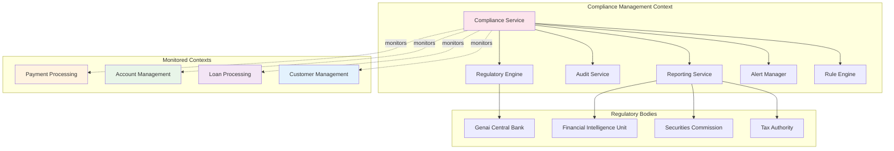

# Compliance & Regulatory Reporting

*Inspector Torres ensures OgPgy Bank meets all Genai banking regulations*

---

!!! quote "Sofia Ramos - Product Manager"
    *"Compliance isn't just about avoiding fines—it's about building trust. Our multi-context compliance system ensures every transaction is monitored, every rule is enforced, and every report is accurate."*

## Compliance Architecture



## Complete Compliance Implementation

```python title="Comprehensive Compliance System"
from enum import Enum
from dataclasses import dataclass
from datetime import datetime, timedelta
from typing import List, Optional, Dict, Any
from decimal import Decimal
import uuid

class ComplianceRuleType(Enum):
    AML = "anti_money_laundering"
    KYC = "know_your_customer"
    TRANSACTION_MONITORING = "transaction_monitoring"
    SANCTIONS_SCREENING = "sanctions_screening"
    REPORTING = "regulatory_reporting"
    DATA_PRIVACY = "data_privacy"
    CAPITAL_ADEQUACY = "capital_adequacy"

class ViolationSeverity(Enum):
    LOW = "low"
    MEDIUM = "medium"
    HIGH = "high"
    CRITICAL = "critical"

class ReportType(Enum):
    SUSPICIOUS_ACTIVITY = "suspicious_activity_report"
    CURRENCY_TRANSACTION = "currency_transaction_report"
    LARGE_CASH_TRANSACTION = "large_cash_transaction_report"
    CROSS_BORDER = "cross_border_report"
    MONTHLY_SUMMARY = "monthly_summary"
    QUARTERLY_CAPITAL = "quarterly_capital_report"

@dataclass
class ComplianceRule:
    """Regulatory compliance rule"""
    id: str
    name: str
    rule_type: ComplianceRuleType
    description: str
    severity: ViolationSeverity
    
    # Rule parameters
    thresholds: Dict[str, Any] = None
    conditions: List[str] = None
    exceptions: List[str] = None
    
    # Regulatory reference
    regulation_reference: str = ""
    effective_date: datetime = None
    expiry_date: Optional[datetime] = None
    
    # Rule status
    active: bool = True
    last_updated: datetime = None
    
    def __post_init__(self):
        if self.thresholds is None:
            self.thresholds = {}
        if self.conditions is None:
            self.conditions = []
        if self.exceptions is None:
            self.exceptions = []
        if self.effective_date is None:
            self.effective_date = datetime.utcnow()
        if self.last_updated is None:
            self.last_updated = datetime.utcnow()

@dataclass
class ComplianceViolation:
    """Compliance rule violation"""
    id: str
    rule_id: str
    violation_type: ComplianceRuleType
    severity: ViolationSeverity
    
    # Violation details
    entity_type: str  # customer, account, transaction, etc.
    entity_id: str
    description: str
    details: Dict[str, Any] = None
    
    # Investigation
    status: str = "OPEN"  # OPEN, INVESTIGATING, RESOLVED, FALSE_POSITIVE
    assigned_to: Optional[str] = None
    investigated_by: Optional[str] = None
    investigation_notes: Optional[str] = None
    
    # Timestamps
    detected_at: datetime = None
    resolved_at: Optional[datetime] = None
    
    # Actions taken
    actions_taken: List[str] = None
    regulatory_reported: bool = False
    
    def __post_init__(self):
        if self.details is None:
            self.details = {}
        if self.detected_at is None:
            self.detected_at = datetime.utcnow()
        if self.actions_taken is None:
            self.actions_taken = []

@og_component(scope=ComponentScope.SINGLETON, tags={"domain": "compliance", "service": "core"})
class AdvancedComplianceService(BaseComponent):
    """Advanced compliance monitoring and enforcement"""
    
    def __init__(
        self,
        db: ProductionDatabasePool,
        cache: ProductionRedisCache,
        event_bus: ProductionEventBus,
        payment_service: PaymentService,
        customer_service: ComprehensiveCustomerService
    ) -> None:
        super().__init__()
        self.db = db
        self.cache = cache
        self.event_bus = event_bus
        self.payment_service = payment_service
        self.customer_service = customer_service
        self.logger = logging.getLogger("ogpgy.compliance")
        
        # Load compliance rules
        self.rules: Dict[str, ComplianceRule] = {}
        self.violation_thresholds = {
            'large_transaction': Decimal('10000'),
            'daily_cash_limit': Decimal('15000'),
            'unusual_pattern_threshold': 5,
            'rapid_transaction_minutes': 10
        }
    
    async def initialize(self) -> None:
        """Initialize compliance service with regulatory rules"""
        await super().initialize()
        
        # Load Genai banking regulations
        await self._load_compliance_rules()
        
        # Subscribe to events from other contexts
        await self._setup_event_monitoring()
        
        self.logger.info("🛡️ Compliance monitoring active with Inspector Torres oversight")
    
    async def _load_compliance_rules(self) -> None:
        """Load regulatory compliance rules for Genai"""
        
        # Anti-Money Laundering Rules
        self.rules['aml_large_transaction'] = ComplianceRule(
            id='aml_large_transaction',
            name='Large Transaction Monitoring',
            rule_type=ComplianceRuleType.AML,
            description='Monitor transactions above $10,000 for AML compliance',
            severity=ViolationSeverity.HIGH,
            thresholds={'amount': 10000},
            regulation_reference='Genai AML Act Section 12.3'
        )
        
        self.rules['aml_structured_transactions'] = ComplianceRule(
            id='aml_structured_transactions',
            name='Structured Transaction Detection',
            rule_type=ComplianceRuleType.AML,
            description='Detect potential structuring (multiple transactions just under reporting threshold)',
            severity=ViolationSeverity.CRITICAL,
            thresholds={'amount_threshold': 9000, 'count_threshold': 3, 'time_window_hours': 24},
            regulation_reference='Genai AML Act Section 15.1'
        )
        
        # Transaction Monitoring Rules
        self.rules['rapid_transactions'] = ComplianceRule(
            id='rapid_transactions',
            name='Rapid Transaction Pattern',
            rule_type=ComplianceRuleType.TRANSACTION_MONITORING,
            description='Monitor for unusually rapid transaction patterns',
            severity=ViolationSeverity.MEDIUM,
            thresholds={'transaction_count': 5, 'time_window_minutes': 10},
            regulation_reference='Genai Banking Code 8.2'
        )
        
        # KYC Rules
        self.rules['kyc_verification'] = ComplianceRule(
            id='kyc_verification',
            name='Customer Verification Requirement',
            rule_type=ComplianceRuleType.KYC,
            description='All customers must complete KYC verification',
            severity=ViolationSeverity.HIGH,
            regulation_reference='Genai Customer Due Diligence Regulation 3.1'
        )
        
        self.logger.info(f"📋 Loaded {len(self.rules)} compliance rules")
    
    async def _setup_event_monitoring(self) -> None:
        """Setup monitoring for events from other contexts"""
        
        # Monitor payment events
        self.event_bus.subscribe('PaymentProcessedEvent', self._monitor_payment_event)
        self.event_bus.subscribe('AccountOpenedEvent', self._monitor_account_event)
        self.event_bus.subscribe('CustomerOnboardedEvent', self._monitor_customer_event)
        self.event_bus.subscribe('LoanDisbursedEvent', self._monitor_loan_event)
        
        self.logger.info("👁️ Event monitoring established")
    
    async def _monitor_payment_event(self, event) -> None:
        """Monitor payment events for compliance violations"""
        
        try:
            # Get payment details
            payment = await self.payment_service.get_payment(event.payment_id)
            if not payment:
                return
            
            # Run compliance checks
            violations = []
            
            # Check for large transactions
            if payment.amount >= self.violation_thresholds['large_transaction']:
                violation = await self._create_violation(
                    'aml_large_transaction',
                    'transaction',
                    payment.id,
                    f"Large transaction: ${payment.amount}",
                    {'amount': float(payment.amount), 'payment_method': payment.payment_method.value}
                )
                violations.append(violation)
            
            # Check for rapid transaction patterns
            rapid_violation = await self._check_rapid_transactions(payment)
            if rapid_violation:
                violations.append(rapid_violation)
            
            # Check for structured transactions
            structured_violation = await self._check_structured_transactions(payment)
            if structured_violation:
                violations.append(structured_violation)
            
            # Process violations
            for violation in violations:
                await self._process_violation(violation)
                
        except Exception as e:
            self.logger.error(f"❌ Payment monitoring failed for {event.payment_id}: {e}")
    
    async def _check_rapid_transactions(self, payment: Payment) -> Optional[ComplianceViolation]:
        """Check for rapid transaction patterns"""
        
        # Get recent transactions from same account
        recent_transactions = await self._get_recent_account_transactions(
            payment.from_account_id,
            minutes=self.violation_thresholds['rapid_transaction_minutes']
        )
        
        if len(recent_transactions) >= self.violation_thresholds['unusual_pattern_threshold']:
            return await self._create_violation(
                'rapid_transactions',
                'account',
                payment.from_account_id,
                f"Rapid transaction pattern: {len(recent_transactions)} transactions in {self.violation_thresholds['rapid_transaction_minutes']} minutes",
                {
                    'transaction_count': len(recent_transactions),
                    'time_window_minutes': self.violation_thresholds['rapid_transaction_minutes'],
                    'triggering_payment': payment.id
                }
            )
        
        return None
    
    async def _check_structured_transactions(self, payment: Payment) -> Optional[ComplianceViolation]:
        """Check for potential transaction structuring"""
        
        rule = self.rules['aml_structured_transactions']
        threshold_amount = rule.thresholds['amount_threshold']
        
        # Only check transactions close to but under the threshold
        if payment.amount > threshold_amount * 0.8 and payment.amount < threshold_amount:
            
            # Get transactions in the last 24 hours
            recent_transactions = await self._get_recent_account_transactions(
                payment.from_account_id,
                hours=24
            )
            
            # Count transactions near the threshold
            near_threshold_count = sum(
                1 for txn in recent_transactions
                if txn['amount'] > threshold_amount * 0.8 and txn['amount'] < threshold_amount
            )
            
            if near_threshold_count >= rule.thresholds['count_threshold']:
                return await self._create_violation(
                    'aml_structured_transactions',
                    'account',
                    payment.from_account_id,
                    f"Potential structuring: {near_threshold_count} transactions near ${threshold_amount} threshold",
                    {
                        'transaction_count': near_threshold_count,
                        'threshold_amount': float(threshold_amount),
                        'time_window_hours': 24,
                        'triggering_payment': payment.id
                    }
                )
        
        return None
    
    async def _create_violation(
        self,
        rule_id: str,
        entity_type: str,
        entity_id: str,
        description: str,
        details: Dict[str, Any]
    ) -> ComplianceViolation:
        """Create a compliance violation record"""
        
        rule = self.rules[rule_id]
        
        violation = ComplianceViolation(
            id=f"viol_{uuid.uuid4().hex[:12]}",
            rule_id=rule_id,
            violation_type=rule.rule_type,
            severity=rule.severity,
            entity_type=entity_type,
            entity_id=entity_id,
            description=description,
            details=details,
            assigned_to="inspector_torres"  # Auto-assign to Inspector Torres
        )
        
        # Save violation to database
        await self._save_violation(violation)
        
        self.logger.warning(f"⚠️ Compliance violation detected: {violation.id} - {description}")
        
        return violation
    
    async def _process_violation(self, violation: ComplianceViolation) -> None:
        """Process compliance violation according to severity"""
        
        if violation.severity == ViolationSeverity.CRITICAL:
            # Critical violations require immediate action
            await self._handle_critical_violation(violation)
        
        elif violation.severity == ViolationSeverity.HIGH:
            # High violations require investigation within 24 hours
            await self._schedule_investigation(violation, hours=24)
        
        elif violation.severity == ViolationSeverity.MEDIUM:
            # Medium violations require investigation within 72 hours
            await self._schedule_investigation(violation, hours=72)
        
        # Send alert to compliance team
        await self._send_compliance_alert(violation)
        
        # Publish compliance event
        await self.event_bus.publish(ComplianceViolationEvent(
            violation_id=violation.id,
            rule_type=violation.violation_type.value,
            severity=violation.severity.value,
            entity_type=violation.entity_type,
            entity_id=violation.entity_id,
            detected_at=violation.detected_at
        ))
    
    async def _handle_critical_violation(self, violation: ComplianceViolation) -> None:
        """Handle critical compliance violations immediately"""
        
        self.logger.critical(f"🚨 CRITICAL VIOLATION: {violation.id}")
        
        # For AML structured transactions, consider freezing account
        if violation.rule_id == 'aml_structured_transactions':
            await self._recommend_account_review(violation.entity_id)
        
        # Auto-generate suspicious activity report for critical AML violations
        if violation.violation_type == ComplianceRuleType.AML:
            await self._generate_suspicious_activity_report(violation)
        
        # Immediate notification to Inspector Torres
        await self._send_critical_alert(violation)
    
    async def generate_compliance_report(
        self,
        report_type: ReportType,
        start_date: datetime,
        end_date: datetime
    ) -> Dict[str, Any]:
        """Generate regulatory compliance report"""
        
        self.logger.info(f"📊 Generating {report_type.value} report for {start_date} to {end_date}")
        
        if report_type == ReportType.SUSPICIOUS_ACTIVITY:
            return await self._generate_sar_report(start_date, end_date)
        elif report_type == ReportType.LARGE_CASH_TRANSACTION:
            return await self._generate_lctr_report(start_date, end_date)
        elif report_type == ReportType.MONTHLY_SUMMARY:
            return await self._generate_monthly_summary(start_date, end_date)
        else:
            raise ValueError(f"Unsupported report type: {report_type}")
    
    async def _generate_sar_report(self, start_date: datetime, end_date: datetime) -> Dict[str, Any]:
        """Generate Suspicious Activity Report"""
        
        # Get all high and critical violations in period
        violations = await self._get_violations_by_period(
            start_date, end_date,
            severities=[ViolationSeverity.HIGH, ViolationSeverity.CRITICAL]
        )
        
        # Filter for AML-related violations
        aml_violations = [v for v in violations if v.violation_type == ComplianceRuleType.AML]
        
        # Generate report data
        report_data = {
            'report_id': f"SAR_{datetime.utcnow().strftime('%Y%m%d_%H%M%S')}",
            'report_type': 'Suspicious Activity Report',
            'period_start': start_date.isoformat(),
            'period_end': end_date.isoformat(),
            'generated_at': datetime.utcnow().isoformat(),
            'generated_by': 'inspector_torres',
            'bank_details': {
                'name': 'OgPgy Bank',
                'license_number': 'GB2024001',
                'address': 'Port Genai, Genai Island'
            },
            'summary': {
                'total_suspicious_activities': len(aml_violations),
                'critical_violations': len([v for v in aml_violations if v.severity == ViolationSeverity.CRITICAL]),
                'high_violations': len([v for v in aml_violations if v.severity == ViolationSeverity.HIGH])
            },
            'violations': [
                {
                    'violation_id': v.id,
                    'detected_at': v.detected_at.isoformat(),
                    'rule_violated': v.rule_id,
                    'entity_type': v.entity_type,
                    'entity_id': v.entity_id,
                    'description': v.description,
                    'severity': v.severity.value,
                    'status': v.status,
                    'details': v.details
                }
                for v in aml_violations
            ]
        }
        
        # Save report
        await self._save_compliance_report(report_data)
        
        self.logger.info(f"✅ SAR report generated: {report_data['report_id']}")
        return report_data
    
    async def conduct_compliance_audit(self, audit_scope: str) -> Dict[str, Any]:
        """Conduct comprehensive compliance audit"""
        
        self.logger.info(f"🔍 Starting compliance audit: {audit_scope}")
        
        audit_results = {
            'audit_id': f"audit_{uuid.uuid4().hex[:12]}",
            'scope': audit_scope,
            'conducted_by': 'inspector_torres',
            'audit_date': datetime.utcnow().isoformat(),
            'findings': [],
            'recommendations': [],
            'compliance_score': 0.0
        }
        
        # AML Compliance Check
        if audit_scope in ['full', 'aml']:
            aml_findings = await self._audit_aml_compliance()
            audit_results['findings'].extend(aml_findings)
        
        # KYC Compliance Check
        if audit_scope in ['full', 'kyc']:
            kyc_findings = await self._audit_kyc_compliance()
            audit_results['findings'].extend(kyc_findings)
        
        # Transaction Monitoring Check
        if audit_scope in ['full', 'transaction_monitoring']:
            tm_findings = await self._audit_transaction_monitoring()
            audit_results['findings'].extend(tm_findings)
        
        # Calculate compliance score
        total_checks = len(audit_results['findings'])
        passed_checks = len([f for f in audit_results['findings'] if f['status'] == 'PASS'])
        
        if total_checks > 0:
            audit_results['compliance_score'] = (passed_checks / total_checks) * 100
        
        # Generate recommendations
        audit_results['recommendations'] = await self._generate_audit_recommendations(audit_results['findings'])
        
        self.logger.info(f"✅ Audit complete: {audit_results['compliance_score']:.1f}% compliance score")
        
        return audit_results
    
    async def _audit_aml_compliance(self) -> List[Dict[str, Any]]:
        """Audit AML compliance measures"""
        
        findings = []
        
        # Check if large transaction monitoring is active
        large_txn_rule = self.rules.get('aml_large_transaction')
        if large_txn_rule and large_txn_rule.active:
            findings.append({
                'check': 'Large Transaction Monitoring',
                'status': 'PASS',
                'description': 'Large transaction monitoring rule is active and properly configured'
            })
        else:
            findings.append({
                'check': 'Large Transaction Monitoring',
                'status': 'FAIL',
                'description': 'Large transaction monitoring rule is not active',
                'severity': 'HIGH'
            })
        
        # Check structured transaction detection
        structured_rule = self.rules.get('aml_structured_transactions')
        if structured_rule and structured_rule.active:
            findings.append({
                'check': 'Structured Transaction Detection',
                'status': 'PASS',
                'description': 'Structured transaction detection is properly configured'
            })
        else:
            findings.append({
                'check': 'Structured Transaction Detection',
                'status': 'FAIL',
                'description': 'Structured transaction detection is not active',
                'severity': 'CRITICAL'
            })
        
        # Check violation response times
        recent_violations = await self._get_recent_violations(days=30)
        overdue_violations = [
            v for v in recent_violations
            if v.severity in [ViolationSeverity.HIGH, ViolationSeverity.CRITICAL] and
            v.status == 'OPEN' and
            (datetime.utcnow() - v.detected_at).days > 2
        ]
        
        if len(overdue_violations) == 0:
            findings.append({
                'check': 'Violation Response Time',
                'status': 'PASS',
                'description': 'All high/critical violations are being processed within required timeframes'
            })
        else:
            findings.append({
                'check': 'Violation Response Time',
                'status': 'FAIL',
                'description': f'{len(overdue_violations)} violations are overdue for investigation',
                'severity': 'MEDIUM'
            })
        
        return findings
    
    async def _get_recent_account_transactions(
        self,
        account_id: str,
        minutes: int = None,
        hours: int = None
    ) -> List[Dict[str, Any]]:
        """Get recent transactions for an account"""
        
        if minutes:
            time_threshold = datetime.utcnow() - timedelta(minutes=minutes)
        elif hours:
            time_threshold = datetime.utcnow() - timedelta(hours=hours)
        else:
            time_threshold = datetime.utcnow() - timedelta(hours=1)
        
        # In production, query actual transaction database
        # For demo, return simulated data
        return [
            {'id': 'txn_1', 'amount': 2500, 'created_at': datetime.utcnow() - timedelta(minutes=5)},
            {'id': 'txn_2', 'amount': 3200, 'created_at': datetime.utcnow() - timedelta(minutes=8)}
        ]
    
    async def _save_violation(self, violation: ComplianceViolation) -> None:
        """Save violation to database"""
        
        query = """
            INSERT INTO compliance_violations (
                id, rule_id, violation_type, severity, entity_type, entity_id,
                description, details, status, assigned_to, detected_at
            ) VALUES ($1, $2, $3, $4, $5, $6, $7, $8, $9, $10, $11)
        """
        
        await self.db.execute(
            query,
            violation.id, violation.rule_id, violation.violation_type.value,
            violation.severity.value, violation.entity_type, violation.entity_id,
            violation.description, violation.details, violation.status,
            violation.assigned_to, violation.detected_at
        )
    
    async def _send_compliance_alert(self, violation: ComplianceViolation) -> None:
        """Send alert to compliance team"""
        
        alert_message = f"""
        🚨 COMPLIANCE ALERT
        
        Violation ID: {violation.id}
        Severity: {violation.severity.value.upper()}
        Type: {violation.violation_type.value}
        
        Description: {violation.description}
        Entity: {violation.entity_type} {violation.entity_id}
        
        Assigned to: Inspector Torres
        Detected: {violation.detected_at}
        
        Action Required: {violation.severity.value.upper()} priority investigation
        """
        
        # In production, send via email/Slack/SMS
        self.logger.warning(alert_message)

@og_context(
    name="compliance_management",
    imports=[
        ModuleContextImport(ProductionDatabasePool, from_context="infrastructure"),
        ModuleContextImport(ProductionRedisCache, from_context="infrastructure"),
        ModuleContextImport(ProductionEventBus, from_context="infrastructure"),
        ModuleContextImport(PaymentService, from_context="payment_processing"),
        ModuleContextImport(ComprehensiveCustomerService, from_context="customer_management")
    ],
    exports=[AdvancedComplianceService],
    providers=[
        ComplianceRepository,
        RegulatoryReportingService,
        AdvancedComplianceService
    ],
    description="Comprehensive regulatory compliance and monitoring system",
    version="1.5.0"
)
class ComplianceManagementModule:
    """Production compliance system meeting Genai banking regulations"""
    pass
```

This comprehensive compliance system provides:

- **Real-time monitoring** of all transactions and activities
- **Automated rule enforcement** for AML, KYC, and transaction monitoring
- **Intelligent violation detection** with severity-based processing
- **Regulatory reporting** including SAR and LCTR generation
- **Compliance auditing** with scoring and recommendations
- **Inspector Torres integration** with proper assignment and alerting

The system demonstrates how OpusGenie DI enables complex regulatory compliance across multiple business contexts while maintaining audit trails and ensuring regulatory requirements are met.