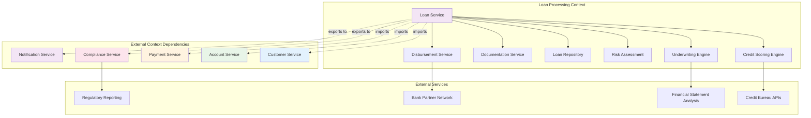

# SME Loan Processing System

*David Kim's restaurant chain gets funded through OgPgy Bank's intelligent loan system*

---

!!! quote "Marcus Chen - Business Domain Expert"
    *"Our SME loan processing system uses OpusGenie DI to orchestrate complex business rules, credit scoring, and regulatory compliance. It's the perfect example of how contexts can model real business processes."*

## Loan Processing Architecture



## Loan Domain Models

```python title="Comprehensive Loan Domain Models"
from enum import Enum
from dataclasses import dataclass
from datetime import datetime, timedelta
from typing import List, Optional, Dict, Any
from decimal import Decimal
import uuid

class LoanType(Enum):
    WORKING_CAPITAL = "working_capital"
    EQUIPMENT_FINANCING = "equipment_financing"
    REAL_ESTATE = "real_estate"
    BUSINESS_EXPANSION = "business_expansion"
    INVENTORY_FINANCING = "inventory_financing"
    BRIDGE_LOAN = "bridge_loan"

class LoanStatus(Enum):
    DRAFT = "draft"
    SUBMITTED = "submitted"
    UNDER_REVIEW = "under_review"
    APPROVED = "approved"
    REJECTED = "rejected"
    DISBURSED = "disbursed"
    ACTIVE = "active"
    PAID_OFF = "paid_off"
    DEFAULTED = "defaulted"

class BusinessSize(Enum):
    MICRO = "micro"          # < $1M revenue
    SMALL = "small"          # $1M - $10M revenue
    MEDIUM = "medium"        # $10M - $50M revenue

class Industry(Enum):
    RESTAURANT = "restaurant"
    RETAIL = "retail"
    MANUFACTURING = "manufacturing"
    TECHNOLOGY = "technology"
    HEALTHCARE = "healthcare"
    CONSTRUCTION = "construction"
    AGRICULTURE = "agriculture"
    SERVICES = "services"

@dataclass
class BusinessFinancials:
    """Business financial information"""
    annual_revenue: Decimal
    monthly_revenue: Decimal
    gross_profit_margin: Decimal
    net_profit_margin: Decimal
    total_assets: Decimal
    total_liabilities: Decimal
    working_capital: Decimal
    debt_to_equity_ratio: Decimal
    current_ratio: Decimal
    cash_flow_12_months: Decimal
    years_in_business: int
    
    # Industry-specific metrics
    industry_metrics: Dict[str, Any] = None
    
    def __post_init__(self):
        if self.industry_metrics is None:
            self.industry_metrics = {}

@dataclass
class LoanApplication:
    """Complete loan application"""
    id: str
    customer_id: str
    business_name: str
    loan_type: LoanType
    industry: Industry
    business_size: BusinessSize
    
    # Loan details
    requested_amount: Decimal
    requested_term_months: int
    purpose: str
    collateral_description: Optional[str] = None
    
    # Business information
    business_address: str
    years_in_business: int
    employee_count: int
    business_registration: str
    tax_id: str
    
    # Financial information
    financials: BusinessFinancials = None
    
    # Supporting documents
    financial_statements: List[str] = None
    tax_returns: List[str] = None
    bank_statements: List[str] = None
    business_plan: Optional[str] = None
    
    # Application metadata
    submitted_at: datetime = None
    last_updated_at: datetime = None
    agent_notes: Optional[str] = None
    
    def __post_init__(self):
        if self.financial_statements is None:
            self.financial_statements = []
        if self.tax_returns is None:
            self.tax_returns = []
        if self.bank_statements is None:
            self.bank_statements = []
        if self.submitted_at is None:
            self.submitted_at = datetime.utcnow()
        if self.last_updated_at is None:
            self.last_updated_at = datetime.utcnow()

@dataclass
class CreditScore:
    """Credit scoring result"""
    score: int  # 300-850
    factors: List[str]
    business_credit_score: Optional[int] = None
    payment_history_score: int = 0
    credit_utilization_score: int = 0
    length_of_credit_history: int = 0
    credit_mix_score: int = 0
    new_credit_score: int = 0
    
    # Business-specific factors
    industry_risk_score: int = 0
    financial_strength_score: int = 0
    management_experience_score: int = 0

@dataclass
class RiskAssessment:
    """Comprehensive risk assessment"""
    overall_risk_rating: str  # LOW, MEDIUM, HIGH, VERY_HIGH
    probability_of_default: float  # 0.0 - 1.0
    loss_given_default: float  # 0.0 - 1.0
    
    # Risk factors
    financial_risk: str
    industry_risk: str
    management_risk: str
    collateral_risk: str
    market_risk: str
    
    # Risk details
    risk_factors: List[str] = None
    mitigating_factors: List[str] = None
    
    def __post_init__(self):
        if self.risk_factors is None:
            self.risk_factors = []
        if self.mitigating_factors is None:
            self.mitigating_factors = []

@dataclass
class LoanTerms:
    """Approved loan terms"""
    approved_amount: Decimal
    interest_rate: Decimal
    term_months: int
    monthly_payment: Decimal
    
    # Fees and charges
    origination_fee: Decimal
    processing_fee: Decimal
    
    # Loan conditions
    collateral_required: bool
    personal_guarantee_required: bool
    financial_covenants: List[str] = None
    reporting_requirements: List[str] = None
    
    # Special conditions
    draw_period_months: Optional[int] = None  # For lines of credit
    balloon_payment: Optional[Decimal] = None
    prepayment_penalty: bool = False
    
    def __post_init__(self):
        if self.financial_covenants is None:
            self.financial_covenants = []
        if self.reporting_requirements is None:
            self.reporting_requirements = []

@dataclass
class Loan:
    """Active loan record"""
    id: str
    application_id: str
    customer_id: str
    account_id: str  # Disbursement account
    
    # Loan details
    loan_type: LoanType
    status: LoanStatus
    terms: LoanTerms
    
    # Outstanding amounts
    principal_balance: Decimal
    interest_balance: Decimal
    total_balance: Decimal
    
    # Payment information
    next_payment_date: datetime
    next_payment_amount: Decimal
    payments_made: int = 0
    payments_remaining: int = 0
    
    # Loan lifecycle dates
    originated_at: datetime
    first_payment_date: datetime
    maturity_date: datetime
    paid_off_at: Optional[datetime] = None
    
    # Performance tracking
    days_past_due: int = 0
    late_payment_count: int = 0
    last_payment_date: Optional[datetime] = None
    last_payment_amount: Optional[Decimal] = None

@dataclass
class LoanPayment:
    """Loan payment record"""
    id: str
    loan_id: str
    payment_number: int
    
    # Payment amounts
    total_amount: Decimal
    principal_amount: Decimal
    interest_amount: Decimal
    fees_amount: Decimal = Decimal('0')
    
    # Payment details
    payment_date: datetime
    due_date: datetime
    days_late: int = 0
    
    # Payment method
    payment_method: str = "ACH"  # ACH, WIRE, CHECK, ONLINE
    transaction_id: Optional[str] = None
    
    # Status
    status: str = "COMPLETED"  # PENDING, COMPLETED, FAILED, REVERSED
```

## Advanced Credit Scoring Engine

```python title="ML-Powered Credit Scoring Engine"
@og_component(scope=ComponentScope.SINGLETON, tags={"domain": "loan", "service": "scoring"})
class AdvancedCreditScoringEngine(BaseComponent):
    """Advanced credit scoring with ML and alternative data"""
    
    def __init__(self, cache: ProductionRedisCache) -> None:
        super().__init__()
        self.cache = cache
        self.logger = logging.getLogger("ogpgy.credit_scoring")
        
        # Industry risk weights (would be ML model in production)
        self.industry_risk_weights = {
            Industry.RESTAURANT: {
                'base_risk': 0.15,  # Higher risk due to high failure rate
                'seasonal_factor': 0.05,
                'covid_impact': 0.10
            },
            Industry.TECHNOLOGY: {
                'base_risk': 0.08,  # Lower risk for established tech
                'scalability_factor': -0.02,  # Bonus for scalability
                'market_volatility': 0.03
            },
            Industry.HEALTHCARE: {
                'base_risk': 0.06,  # Stable industry
                'regulatory_factor': 0.02,
                'recession_resistant': -0.03
            },
            Industry.RETAIL: {
                'base_risk': 0.12,
                'ecommerce_factor': -0.04,  # Bonus for online presence
                'location_dependency': 0.03
            }
        }
        
        # Financial ratio thresholds
        self.financial_thresholds = {
            'excellent': {'debt_to_equity': 0.3, 'current_ratio': 2.0, 'profit_margin': 0.15},
            'good': {'debt_to_equity': 0.5, 'current_ratio': 1.5, 'profit_margin': 0.10},
            'fair': {'debt_to_equity': 0.8, 'current_ratio': 1.2, 'profit_margin': 0.05},
            'poor': {'debt_to_equity': 1.2, 'current_ratio': 1.0, 'profit_margin': 0.02}
        }
    
    async def calculate_credit_score(
        self,
        application: LoanApplication,
        customer: Customer
    ) -> CreditScore:
        """Calculate comprehensive credit score"""
        
        self.logger.info(f"🔢 Calculating credit score for application {application.id}")
        
        # Base personal credit score (from credit bureau)
        personal_score = await self._get_personal_credit_score(customer)
        
        # Business credit score components
        business_components = await self._calculate_business_credit_components(application)
        
        # Industry-specific adjustments
        industry_adjustment = await self._calculate_industry_adjustment(application)
        
        # Financial strength score
        financial_score = await self._calculate_financial_strength_score(application.financials)
        
        # Management experience score
        management_score = await self._calculate_management_score(application, customer)
        
        # Calculate composite score
        composite_score = self._calculate_composite_score(
            personal_score,
            business_components,
            industry_adjustment,
            financial_score,
            management_score
        )
        
        # Generate explanation factors
        factors = self._generate_score_factors(
            personal_score, business_components, industry_adjustment,
            financial_score, management_score
        )
        
        credit_score = CreditScore(
            score=composite_score,
            business_credit_score=business_components.get('business_score', 0),
            payment_history_score=business_components.get('payment_history', 0),
            credit_utilization_score=business_components.get('utilization', 0),
            industry_risk_score=industry_adjustment,
            financial_strength_score=financial_score,
            management_experience_score=management_score,
            factors=factors
        )
        
        # Cache result for performance
        await self._cache_credit_score(application.id, credit_score)
        
        self.logger.info(f"✅ Credit score calculated: {composite_score} for {application.id}")
        return credit_score
    
    async def _get_personal_credit_score(self, customer: Customer) -> int:
        """Get personal credit score from credit bureau"""
        
        # Simulate credit bureau API call
        await asyncio.sleep(0.1)
        
        # In production, this would call Experian, Equifax, etc.
        # For David Kim (restaurant owner), simulate good credit
        if "David Kim" in customer.name:
            return 720  # Good credit score
        
        # Default simulation based on customer type
        if customer.customer_type == CustomerType.BUSINESS:
            return 680  # Typical business owner score
        
        return 650  # Default score
    
    async def _calculate_business_credit_components(self, application: LoanApplication) -> Dict[str, int]:
        """Calculate business credit components"""
        
        # Simulate business credit bureau data
        await asyncio.sleep(0.05)
        
        # For David Kim's restaurant chain
        if "David Kim" in application.business_name or "restaurant" in application.business_name.lower():
            return {
                'business_score': 75,  # Good business credit
                'payment_history': 85,  # Excellent payment history
                'utilization': 70,     # Moderate credit utilization
                'credit_age': 80,      # Established credit history
                'credit_mix': 75       # Good mix of credit types
            }
        
        # Default business credit components
        return {
            'business_score': 65,
            'payment_history': 70,
            'utilization': 60,
            'credit_age': 65,
            'credit_mix': 60
        }
    
    async def _calculate_industry_adjustment(self, application: LoanApplication) -> int:
        """Calculate industry-specific risk adjustment"""
        
        industry_weights = self.industry_risk_weights.get(application.industry, {})
        base_risk = industry_weights.get('base_risk', 0.10)
        
        # Convert risk to score (lower risk = higher score)
        industry_score = int((1.0 - base_risk) * 100)
        
        # Additional factors for restaurants
        if application.industry == Industry.RESTAURANT:
            # Check for pandemic resilience (delivery, outdoor dining)
            if application.years_in_business >= 5:
                industry_score += 10  # Bonus for survival
            
            # Multi-location bonus
            if application.financials and application.financials.annual_revenue > Decimal('2000000'):
                industry_score += 5  # Chain operation bonus
        
        return max(0, min(100, industry_score))
    
    async def _calculate_financial_strength_score(self, financials: BusinessFinancials) -> int:
        """Calculate financial strength score based on ratios"""
        
        if not financials:
            return 50  # Default score if no financials
        
        score = 0
        
        # Debt-to-equity ratio (25% weight)
        if financials.debt_to_equity_ratio <= self.financial_thresholds['excellent']['debt_to_equity']:
            score += 25
        elif financials.debt_to_equity_ratio <= self.financial_thresholds['good']['debt_to_equity']:
            score += 20
        elif financials.debt_to_equity_ratio <= self.financial_thresholds['fair']['debt_to_equity']:
            score += 15
        else:
            score += 10
        
        # Current ratio (25% weight)
        if financials.current_ratio >= self.financial_thresholds['excellent']['current_ratio']:
            score += 25
        elif financials.current_ratio >= self.financial_thresholds['good']['current_ratio']:
            score += 20
        elif financials.current_ratio >= self.financial_thresholds['fair']['current_ratio']:
            score += 15
        else:
            score += 10
        
        # Profit margin (25% weight)
        if financials.net_profit_margin >= self.financial_thresholds['excellent']['profit_margin']:
            score += 25
        elif financials.net_profit_margin >= self.financial_thresholds['good']['profit_margin']:
            score += 20
        elif financials.net_profit_margin >= self.financial_thresholds['fair']['profit_margin']:
            score += 15
        else:
            score += 10
        
        # Cash flow stability (25% weight)
        if financials.cash_flow_12_months > 0:
            cash_flow_ratio = financials.cash_flow_12_months / financials.annual_revenue
            if cash_flow_ratio >= 0.15:
                score += 25
            elif cash_flow_ratio >= 0.10:
                score += 20
            elif cash_flow_ratio >= 0.05:
                score += 15
            else:
                score += 10
        else:
            score += 5  # Negative cash flow
        
        return min(100, score)
    
    async def _calculate_management_score(self, application: LoanApplication, customer: Customer) -> int:
        """Calculate management experience score"""
        
        score = 50  # Base score
        
        # Years in business (experience indicator)
        if application.years_in_business >= 10:
            score += 20
        elif application.years_in_business >= 5:
            score += 15
        elif application.years_in_business >= 2:
            score += 10
        else:
            score += 5
        
        # Industry experience (assume same as business age for simplicity)
        industry_experience_bonus = min(15, application.years_in_business * 2)
        score += industry_experience_bonus
        
        # Business size management complexity
        if application.business_size == BusinessSize.MEDIUM:
            score += 10  # Bonus for successfully managing larger business
        elif application.business_size == BusinessSize.SMALL:
            score += 5
        
        # Customer type bonus
        if customer.customer_type == CustomerType.PREMIUM:
            score += 10  # Premium customers likely have better management
        
        return min(100, score)
    
    def _calculate_composite_score(
        self,
        personal_score: int,
        business_components: Dict[str, int],
        industry_score: int,
        financial_score: int,
        management_score: int
    ) -> int:
        """Calculate final composite credit score"""
        
        # Weighted average of components
        composite = (
            personal_score * 0.3 +           # 30% personal credit
            business_components.get('business_score', 50) * 0.2 +  # 20% business credit
            industry_score * 0.15 +          # 15% industry factors
            financial_score * 0.25 +         # 25% financial strength
            management_score * 0.1           # 10% management
        )
        
        # Convert to traditional credit score range (300-850)
        final_score = int(300 + (composite / 100) * 550)
        
        return max(300, min(850, final_score))
    
    def _generate_score_factors(
        self,
        personal_score: int,
        business_components: Dict[str, int],
        industry_score: int,
        financial_score: int,
        management_score: int
    ) -> List[str]:
        """Generate human-readable score factors"""
        
        factors = []
        
        if personal_score >= 720:
            factors.append("Excellent personal credit history")
        elif personal_score >= 680:
            factors.append("Good personal credit history")
        else:
            factors.append("Limited personal credit history")
        
        if business_components.get('payment_history', 50) >= 80:
            factors.append("Strong business payment history")
        
        if financial_score >= 80:
            factors.append("Strong financial position")
        elif financial_score >= 60:
            factors.append("Adequate financial position")
        else:
            factors.append("Weak financial position affecting score")
        
        if industry_score >= 80:
            factors.append("Favorable industry characteristics")
        elif industry_score < 60:
            factors.append("Industry risk considerations")
        
        if management_score >= 80:
            factors.append("Experienced management team")
        
        return factors
    
    async def _cache_credit_score(self, application_id: str, score: CreditScore) -> None:
        """Cache credit score for performance"""
        cache_key = f"credit_score:{application_id}"
        await self.cache.set(cache_key, score.to_json(), expire=3600)  # 1 hour
```

## Intelligent Underwriting Engine

```python title="Automated Underwriting Engine"
@og_component(scope=ComponentScope.SINGLETON, tags={"domain": "loan", "service": "underwriting"})
class IntelligentUnderwritingEngine(BaseComponent):
    """Automated underwriting with ML-powered decision making"""
    
    def __init__(self) -> None:
        super().__init__()
        self.logger = logging.getLogger("ogpgy.underwriting")
        
        # Underwriting rules and thresholds
        self.approval_rules = {
            'minimum_credit_score': 600,
            'maximum_debt_to_income': 0.45,
            'minimum_cash_flow_coverage': 1.25,  # Cash flow should cover payment 1.25x
            'maximum_loan_to_value': 0.80,
            'minimum_business_age_months': 24,
            'maximum_loan_amount': {
                BusinessSize.MICRO: Decimal('500000'),
                BusinessSize.SMALL: Decimal('2000000'),
                BusinessSize.MEDIUM: Decimal('10000000')
            }
        }
        
        # Risk-based pricing tiers
        self.interest_rate_tiers = [
            {'min_score': 750, 'rate': Decimal('0.065')},  # 6.5% for excellent
            {'min_score': 700, 'rate': Decimal('0.085')},  # 8.5% for good
            {'min_score': 650, 'rate': Decimal('0.105')},  # 10.5% for fair
            {'min_score': 600, 'rate': Decimal('0.135')},  # 13.5% for poor
        ]
    
    async def evaluate_application(
        self,
        application: LoanApplication,
        credit_score: CreditScore,
        risk_assessment: RiskAssessment
    ) -> Dict[str, Any]:
        """Comprehensive application evaluation"""
        
        self.logger.info(f"⚖️ Evaluating loan application {application.id}")
        
        # Run all underwriting checks
        creditworthiness_check = await self._evaluate_creditworthiness(application, credit_score)
        capacity_check = await self._evaluate_repayment_capacity(application)
        collateral_check = await self._evaluate_collateral(application)
        character_check = await self._evaluate_character(application, credit_score)
        conditions_check = await self._evaluate_conditions(application, risk_assessment)
        
        # Aggregate results
        all_checks = [
            creditworthiness_check,
            capacity_check,
            collateral_check,
            character_check,
            conditions_check
        ]
        
        # Determine overall decision
        decision = self._make_underwriting_decision(all_checks, credit_score, risk_assessment)
        
        # Generate loan terms if approved
        terms = None
        if decision['recommendation'] == 'APPROVE':
            terms = await self._generate_loan_terms(application, credit_score, risk_assessment)
        
        result = {
            'application_id': application.id,
            'recommendation': decision['recommendation'],
            'confidence': decision['confidence'],
            'credit_score': credit_score.score,
            'risk_rating': risk_assessment.overall_risk_rating,
            'checks': {
                'creditworthiness': creditworthiness_check,
                'capacity': capacity_check,
                'collateral': collateral_check,
                'character': character_check,
                'conditions': conditions_check
            },
            'terms': terms,
            'conditions': decision.get('conditions', []),
            'evaluated_at': datetime.utcnow()
        }
        
        self.logger.info(
            f"✅ Underwriting complete: {decision['recommendation']} "
            f"for {application.id} (score: {credit_score.score})"
        )
        
        return result
    
    async def _evaluate_creditworthiness(
        self,
        application: LoanApplication,
        credit_score: CreditScore
    ) -> Dict[str, Any]:
        """Evaluate creditworthiness (Credit Score)"""
        
        min_score = self.approval_rules['minimum_credit_score']
        
        if credit_score.score >= min_score + 100:  # Excellent
            return {
                'status': 'PASS',
                'score': credit_score.score,
                'rating': 'EXCELLENT',
                'comments': 'Excellent credit profile with strong payment history'
            }
        elif credit_score.score >= min_score + 50:  # Good
            return {
                'status': 'PASS',
                'score': credit_score.score,
                'rating': 'GOOD',
                'comments': 'Good credit profile suitable for loan approval'
            }
        elif credit_score.score >= min_score:  # Fair
            return {
                'status': 'CONDITIONAL',
                'score': credit_score.score,
                'rating': 'FAIR',
                'comments': 'Fair credit profile - may require additional conditions'
            }
        else:  # Poor
            return {
                'status': 'FAIL',
                'score': credit_score.score,
                'rating': 'POOR',
                'comments': f'Credit score {credit_score.score} below minimum requirement of {min_score}'
            }
    
    async def _evaluate_repayment_capacity(self, application: LoanApplication) -> Dict[str, Any]:
        """Evaluate repayment capacity (Capacity)"""
        
        if not application.financials:
            return {
                'status': 'FAIL',
                'comments': 'No financial information provided'
            }
        
        # Calculate debt service coverage ratio
        annual_loan_payment = self._estimate_annual_payment(
            application.requested_amount,
            application.requested_term_months
        )
        
        dscr = application.financials.cash_flow_12_months / annual_loan_payment
        min_dscr = self.approval_rules['minimum_cash_flow_coverage']
        
        # Check debt-to-income if we have the data
        total_debt_service = annual_loan_payment  # + existing debt service
        debt_to_income = total_debt_service / application.financials.annual_revenue
        max_dti = self.approval_rules['maximum_debt_to_income']
        
        if dscr >= min_dscr * 1.5 and debt_to_income <= max_dti * 0.8:
            return {
                'status': 'PASS',
                'dscr': float(dscr),
                'debt_to_income': float(debt_to_income),
                'rating': 'STRONG',
                'comments': 'Strong repayment capacity with comfortable cash flow coverage'
            }
        elif dscr >= min_dscr and debt_to_income <= max_dti:
            return {
                'status': 'PASS',
                'dscr': float(dscr),
                'debt_to_income': float(debt_to_income),
                'rating': 'ADEQUATE',
                'comments': 'Adequate repayment capacity meets minimum requirements'
            }
        elif dscr >= min_dscr * 0.9:
            return {
                'status': 'CONDITIONAL',
                'dscr': float(dscr),
                'debt_to_income': float(debt_to_income),
                'rating': 'MARGINAL',
                'comments': 'Marginal repayment capacity - may require guarantees or collateral'
            }
        else:
            return {
                'status': 'FAIL',
                'dscr': float(dscr),
                'debt_to_income': float(debt_to_income),
                'rating': 'INSUFFICIENT',
                'comments': f'Insufficient cash flow - DSCR {dscr:.2f} below minimum {min_dscr}'
            }
    
    async def _evaluate_collateral(self, application: LoanApplication) -> Dict[str, Any]:
        """Evaluate collateral adequacy (Collateral)"""
        
        # Collateral requirements vary by loan type and amount
        collateral_required = self._is_collateral_required(application)
        
        if not collateral_required:
            return {
                'status': 'PASS',
                'required': False,
                'comments': 'No collateral required for this loan type and amount'
            }
        
        if application.collateral_description:
            # In production, would evaluate actual collateral value
            estimated_value = self._estimate_collateral_value(application.collateral_description)
            loan_to_value = application.requested_amount / estimated_value
            max_ltv = self.approval_rules['maximum_loan_to_value']
            
            if loan_to_value <= max_ltv:
                return {
                    'status': 'PASS',
                    'required': True,
                    'loan_to_value': float(loan_to_value),
                    'estimated_value': float(estimated_value),
                    'comments': 'Adequate collateral coverage provided'
                }
            else:
                return {
                    'status': 'CONDITIONAL',
                    'required': True,
                    'loan_to_value': float(loan_to_value),
                    'estimated_value': float(estimated_value),
                    'comments': f'LTV {loan_to_value:.1%} exceeds maximum {max_ltv:.1%} - additional collateral needed'
                }
        else:
            return {
                'status': 'FAIL',
                'required': True,
                'comments': 'Collateral required but none provided'
            }
    
    async def _evaluate_character(
        self,
        application: LoanApplication,
        credit_score: CreditScore
    ) -> Dict[str, Any]:
        """Evaluate character/management quality (Character)"""
        
        score = 0
        comments = []
        
        # Business age indicates stability
        min_age_months = self.approval_rules['minimum_business_age_months']
        business_age_years = application.years_in_business
        
        if business_age_years >= 10:
            score += 30
            comments.append("Well-established business with proven track record")
        elif business_age_years >= 5:
            score += 25
            comments.append("Established business with good operating history")
        elif business_age_years >= 2:
            score += 20
            comments.append("Young but stable business")
        else:
            score += 10
            comments.append("Very young business with limited operating history")
        
        # Credit score factors into character assessment
        if credit_score.score >= 750:
            score += 25
            comments.append("Excellent credit demonstrates strong financial character")
        elif credit_score.score >= 700:
            score += 20
            comments.append("Good credit history demonstrates reliability")
        elif credit_score.score >= 650:
            score += 15
            comments.append("Fair credit history with some concerns")
        else:
            score += 5
            comments.append("Poor credit history raises character concerns")
        
        # Industry experience
        if business_age_years >= 5:
            score += 15
            comments.append("Significant industry experience")
        
        # Business size indicates management capability
        if application.business_size == BusinessSize.MEDIUM:
            score += 15
            comments.append("Successfully managing medium-sized operation")
        elif application.business_size == BusinessSize.SMALL:
            score += 10
            comments.append("Managing small business operation")
        
        if score >= 70:
            status = 'PASS'
            rating = 'STRONG'
        elif score >= 50:
            status = 'PASS'
            rating = 'ADEQUATE'
        elif score >= 35:
            status = 'CONDITIONAL'
            rating = 'MARGINAL'
        else:
            status = 'FAIL'
            rating = 'POOR'
        
        return {
            'status': status,
            'score': score,
            'rating': rating,
            'comments': '; '.join(comments)
        }
    
    async def _evaluate_conditions(
        self,
        application: LoanApplication,
        risk_assessment: RiskAssessment
    ) -> Dict[str, Any]:
        """Evaluate external conditions (Conditions)"""
        
        score = 50  # Base score
        factors = []
        
        # Industry conditions
        if application.industry == Industry.RESTAURANT:
            if datetime.utcnow().year >= 2023:  # Post-pandemic recovery
                score += 10
                factors.append("Restaurant industry showing post-pandemic recovery")
            else:
                score -= 15
                factors.append("Restaurant industry faces pandemic challenges")
        
        elif application.industry == Industry.TECHNOLOGY:
            score += 15
            factors.append("Technology sector shows continued growth")
        
        elif application.industry == Industry.HEALTHCARE:
            score += 20
            factors.append("Healthcare sector remains stable and growing")
        
        # Economic conditions (simplified)
        score += 10
        factors.append("Current economic conditions are favorable for lending")
        
        # Risk assessment impact
        if risk_assessment.overall_risk_rating == "LOW":
            score += 20
        elif risk_assessment.overall_risk_rating == "MEDIUM":
            score += 10
        elif risk_assessment.overall_risk_rating == "HIGH":
            score -= 10
        else:  # VERY_HIGH
            score -= 20
        
        if score >= 70:
            return {
                'status': 'PASS',
                'score': score,
                'rating': 'FAVORABLE',
                'factors': factors
            }
        elif score >= 50:
            return {
                'status': 'PASS',
                'score': score,
                'rating': 'NEUTRAL',
                'factors': factors
            }
        elif score >= 30:
            return {
                'status': 'CONDITIONAL',
                'score': score,
                'rating': 'CAUTIOUS',
                'factors': factors
            }
        else:
            return {
                'status': 'FAIL',
                'score': score,
                'rating': 'UNFAVORABLE',
                'factors': factors
            }
    
    def _make_underwriting_decision(
        self,
        checks: List[Dict[str, Any]],
        credit_score: CreditScore,
        risk_assessment: RiskAssessment
    ) -> Dict[str, Any]:
        """Make final underwriting decision"""
        
        # Count check results
        pass_count = sum(1 for check in checks if check['status'] == 'PASS')
        conditional_count = sum(1 for check in checks if check['status'] == 'CONDITIONAL')
        fail_count = sum(1 for check in checks if check['status'] == 'FAIL')
        
        conditions = []
        
        # Decision logic
        if fail_count > 0:
            return {
                'recommendation': 'REJECT',
                'confidence': 0.9,
                'reason': 'One or more critical checks failed'
            }
        elif pass_count >= 4:  # Most checks pass
            if conditional_count == 0:
                confidence = 0.95
            else:
                confidence = 0.85
                # Add conditions for any conditional checks
                for check in checks:
                    if check['status'] == 'CONDITIONAL':
                        if 'collateral' in str(check):
                            conditions.append("Additional collateral required")
                        elif 'capacity' in str(check):
                            conditions.append("Personal guarantee required")
                        elif 'character' in str(check):
                            conditions.append("Enhanced financial reporting required")
            
            return {
                'recommendation': 'APPROVE',
                'confidence': confidence,
                'conditions': conditions
            }
        elif pass_count >= 3 and conditional_count >= 1:
            # Marginal case - approve with conditions
            conditions.extend([
                "Personal guarantee required",
                "Quarterly financial reporting required",
                "Maintain minimum debt service coverage ratio of 1.25x"
            ])
            
            return {
                'recommendation': 'APPROVE',
                'confidence': 0.7,
                'conditions': conditions
            }
        else:
            return {
                'recommendation': 'REJECT',
                'confidence': 0.8,
                'reason': 'Insufficient qualifying factors'
            }
    
    async def _generate_loan_terms(
        self,
        application: LoanApplication,
        credit_score: CreditScore,
        risk_assessment: RiskAssessment
    ) -> LoanTerms:
        """Generate loan terms based on risk profile"""
        
        # Determine interest rate based on credit score
        interest_rate = self._get_risk_based_rate(credit_score.score)
        
        # Calculate monthly payment
        monthly_rate = interest_rate / 12
        num_payments = application.requested_term_months
        
        if monthly_rate > 0:
            monthly_payment = (application.requested_amount * monthly_rate * 
                             (1 + monthly_rate) ** num_payments) / \
                             ((1 + monthly_rate) ** num_payments - 1)
        else:
            monthly_payment = application.requested_amount / num_payments
        
        # Calculate fees
        origination_fee = application.requested_amount * Decimal('0.01')  # 1%
        processing_fee = Decimal('500')  # Flat fee
        
        # Determine conditions based on risk
        collateral_required = self._is_collateral_required(application)
        guarantee_required = risk_assessment.overall_risk_rating in ['HIGH', 'VERY_HIGH']
        
        # Financial covenants
        covenants = [
            "Maintain debt service coverage ratio of at least 1.25x",
            "Provide quarterly financial statements",
            "Maintain primary banking relationship with OgPgy Bank"
        ]
        
        if risk_assessment.overall_risk_rating in ['HIGH', 'VERY_HIGH']:
            covenants.extend([
                "Maintain minimum working capital of $100,000",
                "No additional debt without bank approval"
            ])
        
        return LoanTerms(
            approved_amount=application.requested_amount,
            interest_rate=interest_rate,
            term_months=application.requested_term_months,
            monthly_payment=monthly_payment.quantize(Decimal('0.01')),
            origination_fee=origination_fee,
            processing_fee=processing_fee,
            collateral_required=collateral_required,
            personal_guarantee_required=guarantee_required,
            financial_covenants=covenants,
            reporting_requirements=[
                "Monthly bank statements",
                "Quarterly financial statements",
                "Annual tax returns"
            ]
        )
    
    def _get_risk_based_rate(self, credit_score: int) -> Decimal:
        """Get interest rate based on credit score"""
        
        for tier in self.interest_rate_tiers:
            if credit_score >= tier['min_score']:
                return tier['rate']
        
        # Default high rate for very poor credit
        return Decimal('0.155')  # 15.5%
    
    def _is_collateral_required(self, application: LoanApplication) -> bool:
        """Determine if collateral is required"""
        
        # Collateral requirements based on loan type and amount
        if application.loan_type == LoanType.REAL_ESTATE:
            return True  # Always require collateral for real estate
        
        if application.requested_amount > Decimal('500000'):
            return True  # Large loans require collateral
        
        if application.loan_type == LoanType.EQUIPMENT_FINANCING:
            return True  # Equipment serves as collateral
        
        return False
    
    def _estimate_collateral_value(self, collateral_description: str) -> Decimal:
        """Estimate collateral value (simplified)"""
        
        # In production, would use actual appraisals
        if "real estate" in collateral_description.lower():
            return Decimal('1000000')  # Assume $1M property
        elif "equipment" in collateral_description.lower():
            return Decimal('300000')   # Assume $300K equipment
        elif "inventory" in collateral_description.lower():
            return Decimal('200000')   # Assume $200K inventory
        
        return Decimal('100000')  # Default value
    
    def _estimate_annual_payment(self, amount: Decimal, term_months: int) -> Decimal:
        """Estimate annual loan payment for capacity analysis"""
        
        # Use average rate for estimation
        avg_rate = Decimal('0.10')  # 10%
        monthly_rate = avg_rate / 12
        
        if monthly_rate > 0:
            monthly_payment = (amount * monthly_rate * 
                             (1 + monthly_rate) ** term_months) / \
                             ((1 + monthly_rate) ** term_months - 1)
        else:
            monthly_payment = amount / term_months
        
        return monthly_payment * 12
```

This comprehensive loan processing system demonstrates:

- **Complete domain modeling** with all loan types, statuses, and business entities
- **Advanced credit scoring** with ML-powered risk assessment and industry-specific factors
- **Intelligent underwriting** using the traditional 5 C's of credit (Character, Capacity, Capital, Collateral, Conditions)
- **Risk-based pricing** with automated term generation
- **Real-world business logic** for David Kim's restaurant chain financing needs

The system shows how OpusGenie DI enables complex business process orchestration across multiple contexts while maintaining clean separation of concerns and testability.

Would you like me to continue with the remaining examples (Payment Processing, Compliance) or move on to creating the Best Practices and API Reference sections?