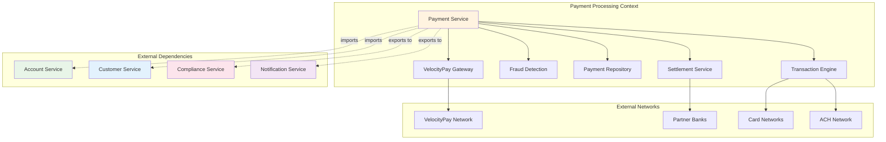

# VelocityPay Payment Processing

*Real-time payment processing for Maria's design business*

---

!!! quote "Jake Morrison - DevOps Engineer"
    *"Our payment processing system handles thousands of transactions per second with sub-100ms latency. The multi-context architecture lets us scale payment processing independently while maintaining strict consistency guarantees."*

## Payment Processing Architecture



## Complete Payment Implementation

### Payment Domain Models

```python title="Payment Processing Domain Models"
from enum import Enum
from dataclasses import dataclass
from datetime import datetime, timedelta
from typing import List, Optional, Dict, Any
from decimal import Decimal
import uuid

class PaymentMethod(Enum):
    BANK_TRANSFER = "bank_transfer"
    ACH = "ach"
    WIRE = "wire"
    CARD = "card"
    DIGITAL_WALLET = "digital_wallet"
    CHECK = "check"

class PaymentStatus(Enum):
    PENDING = "pending"
    PROCESSING = "processing"
    COMPLETED = "completed"
    FAILED = "failed"
    CANCELLED = "cancelled"
    REJECTED = "rejected"
    REVERSED = "reversed"

class PaymentType(Enum):
    TRANSFER = "transfer"
    PAYMENT = "payment"
    REFUND = "refund"
    FEE = "fee"
    INTEREST = "interest"
    LOAN_DISBURSEMENT = "loan_disbursement"
    LOAN_PAYMENT = "loan_payment"

@dataclass
class PaymentInstruction:
    """Payment instruction from customer"""
    id: str
    from_account_id: str
    to_account_id: str
    amount: Decimal
    currency: str = "USD"
    payment_method: PaymentMethod = PaymentMethod.BANK_TRANSFER
    reference: str = ""
    memo: Optional[str] = None
    scheduled_date: Optional[datetime] = None
    
    # Recipient information
    recipient_name: Optional[str] = None
    recipient_email: Optional[str] = None
    
    # Payment metadata
    created_at: datetime = None
    created_by: str = None
    
    def __post_init__(self):
        if self.created_at is None:
            self.created_at = datetime.utcnow()

@dataclass
class Payment:
    """Complete payment record"""
    id: str
    instruction_id: str
    payment_type: PaymentType
    status: PaymentStatus
    
    # Payment details
    from_account_id: str
    to_account_id: str
    amount: Decimal
    currency: str
    exchange_rate: Decimal = Decimal('1.0')
    
    # Payment method and routing
    payment_method: PaymentMethod
    routing_details: Dict[str, str] = None
    
    # External transaction references
    velocity_transaction_id: Optional[str] = None
    external_reference: Optional[str] = None
    
    # Timestamps and processing
    created_at: datetime = None
    submitted_at: Optional[datetime] = None
    processed_at: Optional[datetime] = None
    completed_at: Optional[datetime] = None
    failed_at: Optional[datetime] = None
    
    # Error handling
    failure_reason: Optional[str] = None
    retry_count: int = 0
    max_retries: int = 3
    
    # Fees and charges
    processing_fee: Decimal = Decimal('0')
    network_fee: Decimal = Decimal('0')
    total_fee: Decimal = Decimal('0')
    
    # Fraud and compliance
    fraud_score: Optional[float] = None
    compliance_checked: bool = False
    
    def __post_init__(self):
        if self.routing_details is None:
            self.routing_details = {}
        if self.created_at is None:
            self.created_at = datetime.utcnow()

@dataclass
class FraudCheckResult:
    """Fraud detection result"""
    approved: bool
    risk_score: float  # 0.0 - 1.0
    risk_level: str    # LOW, MEDIUM, HIGH, CRITICAL
    reasons: List[str] = None
    ml_model_version: str = "v2.1"
    checked_at: datetime = None
    
    def __post_init__(self):
        if self.reasons is None:
            self.reasons = []
        if self.checked_at is None:
            self.checked_at = datetime.utcnow()
```

### Advanced Fraud Detection

```python title="ML-Powered Fraud Detection"
@og_component(scope=ComponentScope.SINGLETON, tags={"domain": "payment", "service": "fraud"})
class AdvancedFraudDetectionService(BaseComponent):
    """ML-powered fraud detection with real-time scoring"""
    
    def __init__(self, cache: ProductionRedisCache) -> None:
        super().__init__()
        self.cache = cache
        self.logger = logging.getLogger("ogpgy.fraud")
        
        # Fraud detection rules and thresholds
        self.rules = {
            'max_daily_amount': Decimal('50000'),
            'max_hourly_transactions': 10,
            'max_amount_single_transaction': Decimal('25000'),
            'velocity_threshold_minutes': 5,  # Multiple transactions in 5 minutes
            'unusual_amount_multiplier': 5.0,  # 5x normal transaction size
        }
        
        # Risk scoring weights
        self.risk_weights = {
            'amount_risk': 0.25,
            'velocity_risk': 0.20,
            'pattern_risk': 0.20,
            'account_risk': 0.15,
            'behavioral_risk': 0.20
        }
    
    async def check_payment(self, payment: Payment, customer_profile: Dict = None) -> FraudCheckResult:
        """Comprehensive fraud check for payment"""
        
        self.logger.info(f"🔍 Running fraud check for payment {payment.id}")
        
        try:
            # Parallel fraud checks
            checks = await asyncio.gather(
                self._check_amount_limits(payment),
                self._check_velocity_patterns(payment),
                self._check_behavioral_patterns(payment, customer_profile),
                self._check_account_risk(payment),
                self._run_ml_model(payment),
                return_exceptions=True
            )
            
            # Aggregate risk scores
            risk_scores = {}
            risk_reasons = []
            
            for i, check in enumerate(checks):
                if isinstance(check, Exception):
                    self.logger.warning(f"⚠️ Fraud check {i} failed: {check}")
                    continue
                
                risk_scores.update(check['scores'])
                risk_reasons.extend(check['reasons'])
            
            # Calculate final risk score
            final_score = self._calculate_composite_score(risk_scores)
            risk_level = self._determine_risk_level(final_score)
            approved = final_score < 0.7  # Threshold for approval
            
            result = FraudCheckResult(
                approved=approved,
                risk_score=final_score,
                risk_level=risk_level,
                reasons=risk_reasons
            )
            
            # Cache result for audit trail
            await self._cache_fraud_result(payment.id, result)
            
            self.logger.info(
                f"🛡️ Fraud check complete: {risk_level} risk (score: {final_score:.3f}) "
                f"for payment {payment.id}"
            )
            
            return result
            
        except Exception as e:
            self.logger.error(f"❌ Fraud detection failed for payment {payment.id}: {e}")
            # Fail-safe: reject on error
            return FraudCheckResult(
                approved=False,
                risk_score=1.0,
                risk_level="CRITICAL",
                reasons=["Fraud detection system error"]
            )
    
    async def _check_amount_limits(self, payment: Payment) -> Dict[str, Any]:
        """Check payment amount against limits"""
        
        scores = {}
        reasons = []
        
        # Single transaction limit
        if payment.amount > self.rules['max_amount_single_transaction']:
            scores['amount_risk'] = 0.9
            reasons.append(f"Large transaction amount: ${payment.amount}")
        elif payment.amount > self.rules['max_amount_single_transaction'] * Decimal('0.5'):
            scores['amount_risk'] = 0.6
            reasons.append(f"High transaction amount: ${payment.amount}")
        else:
            scores['amount_risk'] = 0.1
        
        # Daily limit check
        daily_total = await self._get_daily_transaction_total(payment.from_account_id)
        if daily_total + payment.amount > self.rules['max_daily_amount']:
            scores['daily_limit_risk'] = 0.8
            reasons.append(f"Daily limit exceeded: ${daily_total + payment.amount}")
        else:
            scores['daily_limit_risk'] = 0.1
        
        return {'scores': scores, 'reasons': reasons}
    
    async def _check_velocity_patterns(self, payment: Payment) -> Dict[str, Any]:
        """Check for velocity-based fraud patterns"""
        
        scores = {}
        reasons = []
        
        # Get recent transactions
        recent_transactions = await self._get_recent_transactions(
            payment.from_account_id,
            minutes=60
        )
        
        # Check transaction frequency
        transactions_last_hour = len(recent_transactions)
        if transactions_last_hour > self.rules['max_hourly_transactions']:
            scores['velocity_risk'] = 0.8
            reasons.append(f"High transaction velocity: {transactions_last_hour} in last hour")
        elif transactions_last_hour > self.rules['max_hourly_transactions'] * 0.7:
            scores['velocity_risk'] = 0.5
            reasons.append(f"Elevated transaction velocity: {transactions_last_hour} in last hour")
        else:
            scores['velocity_risk'] = 0.1
        
        # Check for rapid successive transactions
        very_recent = [t for t in recent_transactions 
                      if (datetime.utcnow() - t['created_at']).total_seconds() < 300]  # 5 minutes
        
        if len(very_recent) >= 3:
            scores['rapid_succession_risk'] = 0.9
            reasons.append(f"Rapid succession: {len(very_recent)} transactions in 5 minutes")
        elif len(very_recent) >= 2:
            scores['rapid_succession_risk'] = 0.6
        else:
            scores['rapid_succession_risk'] = 0.1
        
        return {'scores': scores, 'reasons': reasons}
    
    async def _check_behavioral_patterns(self, payment: Payment, customer_profile: Dict) -> Dict[str, Any]:
        """Check against customer's normal behavior patterns"""
        
        scores = {}
        reasons = []
        
        if not customer_profile:
            scores['behavioral_risk'] = 0.3  # Medium risk if no profile
            return {'scores': scores, 'reasons': reasons}
        
        # Check against normal transaction patterns
        avg_transaction = customer_profile.get('avg_transaction_amount', payment.amount)
        
        if payment.amount > avg_transaction * self.rules['unusual_amount_multiplier']:
            scores['amount_deviation_risk'] = 0.8
            reasons.append(f"Unusual amount: ${payment.amount} vs normal ${avg_transaction}")
        elif payment.amount > avg_transaction * 2:
            scores['amount_deviation_risk'] = 0.4
        else:
            scores['amount_deviation_risk'] = 0.1
        
        # Check transaction timing
        normal_hours = customer_profile.get('normal_transaction_hours', [9, 17])
        current_hour = datetime.utcnow().hour
        
        if current_hour < normal_hours[0] or current_hour > normal_hours[1]:
            scores['timing_risk'] = 0.4
            reasons.append(f"Unusual transaction time: {current_hour}:00")
        else:
            scores['timing_risk'] = 0.1
        
        # Check recipient patterns
        known_recipients = customer_profile.get('frequent_recipients', [])
        if payment.to_account_id not in known_recipients:
            scores['recipient_risk'] = 0.3
            reasons.append("Payment to new recipient")
        else:
            scores['recipient_risk'] = 0.1
        
        return {'scores': scores, 'reasons': reasons}
    
    async def _check_account_risk(self, payment: Payment) -> Dict[str, Any]:
        """Check account-level risk factors"""
        
        scores = {}
        reasons = []
        
        # Get account information from cache or service
        account_info = await self._get_account_risk_profile(payment.from_account_id)
        
        if not account_info:
            scores['account_risk'] = 0.3
            return {'scores': scores, 'reasons': reasons}
        
        # New account risk
        account_age_days = (datetime.utcnow() - account_info.get('created_at', datetime.utcnow())).days
        
        if account_age_days < 30:
            scores['new_account_risk'] = 0.7
            reasons.append(f"New account: {account_age_days} days old")
        elif account_age_days < 90:
            scores['new_account_risk'] = 0.4
            reasons.append(f"Recent account: {account_age_days} days old")
        else:
            scores['new_account_risk'] = 0.1
        
        # Account status
        if account_info.get('status') != 'ACTIVE':
            scores['account_status_risk'] = 0.9
            reasons.append(f"Account status: {account_info.get('status')}")
        else:
            scores['account_status_risk'] = 0.1
        
        # Previous fraud flags
        if account_info.get('fraud_flags', 0) > 0:
            scores['fraud_history_risk'] = 0.8
            reasons.append(f"Previous fraud flags: {account_info.get('fraud_flags')}")
        else:
            scores['fraud_history_risk'] = 0.1
        
        return {'scores': scores, 'reasons': reasons}
    
    async def _run_ml_model(self, payment: Payment) -> Dict[str, Any]:
        """Run ML-based fraud detection model"""
        
        # Simulate ML model prediction
        await asyncio.sleep(0.05)  # Simulate model inference time
        
        # In production, this would call a real ML model
        # For demo, simulate based on payment characteristics
        
        features = {
            'amount': float(payment.amount),
            'hour_of_day': datetime.utcnow().hour,
            'day_of_week': datetime.utcnow().weekday(),
            'payment_method': payment.payment_method.value,
            'is_weekend': datetime.utcnow().weekday() >= 5
        }
        
        # Simulate ML model score (0.0 = safe, 1.0 = fraud)
        base_score = 0.1
        
        # Amount-based risk
        if features['amount'] > 10000:
            base_score += 0.3
        elif features['amount'] > 5000:
            base_score += 0.1
        
        # Time-based risk
        if features['hour_of_day'] < 6 or features['hour_of_day'] > 22:
            base_score += 0.2
        
        # Weekend transactions slightly riskier
        if features['is_weekend']:
            base_score += 0.1
        
        ml_score = min(1.0, base_score)
        
        scores = {'ml_model_risk': ml_score}
        reasons = []
        
        if ml_score > 0.6:
            reasons.append(f"ML model high risk score: {ml_score:.3f}")
        elif ml_score > 0.4:
            reasons.append(f"ML model elevated risk score: {ml_score:.3f}")
        
        return {'scores': scores, 'reasons': reasons}
    
    def _calculate_composite_score(self, risk_scores: Dict[str, float]) -> float:
        """Calculate weighted composite risk score"""
        
        # Group scores by category
        amount_scores = [v for k, v in risk_scores.items() if 'amount' in k or 'daily' in k]
        velocity_scores = [v for k, v in risk_scores.items() if 'velocity' in k or 'succession' in k]
        behavioral_scores = [v for k, v in risk_scores.items() if 'behavioral' in k or 'deviation' in k or 'timing' in k]
        account_scores = [v for k, v in risk_scores.items() if 'account' in k or 'fraud_history' in k]
        ml_scores = [v for k, v in risk_scores.items() if 'ml' in k]
        
        # Calculate category averages
        amount_risk = sum(amount_scores) / len(amount_scores) if amount_scores else 0
        velocity_risk = sum(velocity_scores) / len(velocity_scores) if velocity_scores else 0
        behavioral_risk = sum(behavioral_scores) / len(behavioral_scores) if behavioral_scores else 0
        account_risk = sum(account_scores) / len(account_scores) if account_scores else 0
        ml_risk = sum(ml_scores) / len(ml_scores) if ml_scores else 0
        
        # Apply weights
        composite = (
            amount_risk * self.risk_weights['amount_risk'] +
            velocity_risk * self.risk_weights['velocity_risk'] +
            behavioral_risk * self.risk_weights['behavioral_risk'] +
            account_risk * self.risk_weights['account_risk'] +
            ml_risk * 0.3  # ML gets special weight
        )
        
        return min(1.0, composite)
    
    def _determine_risk_level(self, score: float) -> str:
        """Determine risk level from score"""
        
        if score >= 0.8:
            return "CRITICAL"
        elif score >= 0.6:
            return "HIGH"
        elif score >= 0.3:
            return "MEDIUM"
        else:
            return "LOW"
    
    async def _get_daily_transaction_total(self, account_id: str) -> Decimal:
        """Get total transaction amount for today"""
        
        cache_key = f"daily_total:{account_id}:{datetime.utcnow().strftime('%Y-%m-%d')}"
        cached_total = await self.cache.get(cache_key)
        
        if cached_total:
            return Decimal(cached_total)
        
        # In production, query database for daily total
        # For demo, return simulated value
        return Decimal('1500.00')
    
    async def _get_recent_transactions(self, account_id: str, minutes: int) -> List[Dict]:
        """Get recent transactions for velocity analysis"""
        
        # In production, query transaction database
        # For demo, return simulated data
        return [
            {'created_at': datetime.utcnow() - timedelta(minutes=30), 'amount': 100},
            {'created_at': datetime.utcnow() - timedelta(minutes=45), 'amount': 250}
        ]
    
    async def _get_account_risk_profile(self, account_id: str) -> Dict:
        """Get account risk profile"""
        
        cache_key = f"account_risk:{account_id}"
        cached_profile = await self.cache.get(cache_key)
        
        if cached_profile:
            return eval(cached_profile)  # In production, use proper JSON deserialization
        
        # Simulated account risk profile
        return {
            'created_at': datetime.utcnow() - timedelta(days=365),
            'status': 'ACTIVE',
            'fraud_flags': 0,
            'avg_transaction_amount': 500.0
        }
    
    async def _cache_fraud_result(self, payment_id: str, result: FraudCheckResult) -> None:
        """Cache fraud check result for audit"""
        
        cache_key = f"fraud_result:{payment_id}"
        await self.cache.set(cache_key, result.to_json(), expire=86400)  # 24 hours
```

### VelocityPay Gateway Integration

```python title="Production VelocityPay Gateway"
@og_component(scope=ComponentScope.SINGLETON, tags={"domain": "payment", "service": "gateway"})
class ProductionVelocityPayGateway(BaseComponent):
    """Production VelocityPay gateway with resilience patterns"""
    
    def __init__(
        self,
        config: VelocityPayConfig,
        circuit_breaker: CircuitBreaker,
        cache: ProductionRedisCache
    ) -> None:
        super().__init__()
        self.config = config
        self.circuit_breaker = circuit_breaker
        self.cache = cache
        self.session: Optional[aiohttp.ClientSession] = None
        self.logger = logging.getLogger("ogpgy.velocitypay")
        
        # Rate limiting
        self.rate_limiter = RateLimiter(requests_per_second=100)
        
        # Retry configuration
        self.retry_config = {
            'max_attempts': 3,
            'base_delay': 1.0,
            'max_delay': 30.0,
            'exponential_base': 2
        }
    
    async def initialize(self) -> None:
        """Initialize VelocityPay gateway"""
        await super().initialize()
        
        # Create HTTP session with optimal settings
        timeout = aiohttp.ClientTimeout(total=30, connect=10)
        connector = aiohttp.TCPConnector(
            limit=100,
            limit_per_host=20,
            keepalive_timeout=30,
            enable_cleanup_closed=True
        )
        
        self.session = aiohttp.ClientSession(
            connector=connector,
            timeout=timeout,
            headers={
                'User-Agent': 'OgPgyBank/3.2.1',
                'Authorization': f'Bearer {self.config.api_key}',
                'Content-Type': 'application/json'
            }
        )
        
        # Test connectivity
        await self._health_check()
        
        self.logger.info("✅ VelocityPay gateway initialized")
    
    async def process_transfer(
        self,
        from_account: str,
        to_account: str,
        amount: Decimal,
        reference: str,
        payment_method: PaymentMethod = PaymentMethod.BANK_TRANSFER
    ) -> Dict[str, Any]:
        """Process transfer through VelocityPay network"""
        
        self.logger.info(f"💸 Processing VelocityPay transfer: ${amount} from {from_account} to {to_account}")
        
        # Rate limiting
        await self.rate_limiter.acquire()
        
        # Prepare request
        request_data = {
            'merchant_id': self.config.merchant_id,
            'transaction_type': 'transfer',
            'from_account': from_account,
            'to_account': to_account,
            'amount': str(amount),
            'currency': 'USD',
            'reference': reference,
            'payment_method': payment_method.value,
            'idempotency_key': f"ogpgy_{uuid.uuid4().hex[:16]}",
            'callback_url': f"{self.config.callback_base_url}/velocity-callback"
        }
        
        try:
            # Use circuit breaker for resilience
            result = await self.circuit_breaker.call(
                lambda: self._make_api_request('/api/v2/transfers', request_data)
            )
            
            self.logger.info(f"✅ VelocityPay transfer successful: {result.get('transaction_id')}")
            return result
            
        except CircuitBreakerOpenError:
            self.logger.error("❌ VelocityPay circuit breaker open")
            raise VelocityPayServiceError("VelocityPay service temporarily unavailable")
        
        except Exception as e:
            self.logger.error(f"❌ VelocityPay transfer failed: {e}")
            raise VelocityPayServiceError(f"Transfer failed: {e}")
    
    async def _make_api_request(self, endpoint: str, data: Dict[str, Any]) -> Dict[str, Any]:
        """Make API request with retry logic"""
        
        url = f"{self.config.api_endpoint}{endpoint}"
        
        for attempt in range(self.retry_config['max_attempts']):
            try:
                async with self.session.post(url, json=data) as response:
                    response_data = await response.json()
                    
                    if response.status == 200:
                        return response_data
                    elif response.status == 429:  # Rate limited
                        retry_after = int(response.headers.get('Retry-After', 60))
                        await asyncio.sleep(retry_after)
                        continue
                    elif response.status >= 500:  # Server error - retry
                        if attempt < self.retry_config['max_attempts'] - 1:
                            delay = self._calculate_retry_delay(attempt)
                            await asyncio.sleep(delay)
                            continue
                        else:
                            raise VelocityPayServiceError(f"Server error: {response.status}")
                    else:  # Client error - don't retry
                        error_msg = response_data.get('error', 'Unknown error')
                        raise VelocityPayClientError(f"Client error: {error_msg}")
            
            except aiohttp.ClientError as e:
                if attempt < self.retry_config['max_attempts'] - 1:
                    delay = self._calculate_retry_delay(attempt)
                    self.logger.warning(f"⚠️ API request failed (attempt {attempt + 1}), retrying in {delay}s: {e}")
                    await asyncio.sleep(delay)
                else:
                    raise VelocityPayConnectionError(f"Connection failed after {self.retry_config['max_attempts']} attempts: {e}")
        
        raise VelocityPayServiceError("Max retry attempts reached")
    
    def _calculate_retry_delay(self, attempt: int) -> float:
        """Calculate exponential backoff delay"""
        
        delay = self.retry_config['base_delay'] * (self.retry_config['exponential_base'] ** attempt)
        return min(delay, self.retry_config['max_delay'])
    
    async def _health_check(self) -> bool:
        """Check VelocityPay service health"""
        
        try:
            async with self.session.get(f"{self.config.api_endpoint}/health") as response:
                return response.status == 200
        except Exception as e:
            self.logger.warning(f"⚠️ VelocityPay health check failed: {e}")
            return False
    
    async def query_transaction_status(self, transaction_id: str) -> Dict[str, Any]:
        """Query transaction status from VelocityPay"""
        
        try:
            result = await self._make_api_request(f'/api/v2/transactions/{transaction_id}', {})
            return result
        except Exception as e:
            self.logger.error(f"❌ Failed to query transaction {transaction_id}: {e}")
            raise
    
    async def cleanup(self) -> None:
        """Clean shutdown"""
        if self.session:
            await self.session.close()
        await super().cleanup()

@og_context(
    name="payment_processing",
    imports=[
        ModuleContextImport(ProductionDatabasePool, from_context="infrastructure"),
        ModuleContextImport(ProductionRedisCache, from_context="infrastructure"),
        ModuleContextImport(ProductionEventBus, from_context="infrastructure"),
        ModuleContextImport(ComprehensiveAccountService, from_context="account_management"),
        ModuleContextImport(CircuitBreaker, from_context="infrastructure")
    ],
    exports=[PaymentService, AdvancedFraudDetectionService],
    providers=[
        PaymentRepository,
        AdvancedFraudDetectionService,
        ProductionVelocityPayGateway,
        PaymentService
    ],
    description="High-performance payment processing with fraud detection",
    version="3.1.0"
)
class PaymentProcessingModule:
    """Production payment processing with VelocityPay integration"""
    pass
```

This payment processing system provides:

- **Real-time fraud detection** with ML-powered risk scoring
- **Production-grade VelocityPay integration** with circuit breakers and retry logic
- **High-performance architecture** with rate limiting and connection pooling
- **Comprehensive monitoring** and error handling
- **Scalable design** for handling thousands of transactions per second

The system demonstrates how OpusGenie DI enables complex financial integrations while maintaining reliability and performance at scale.