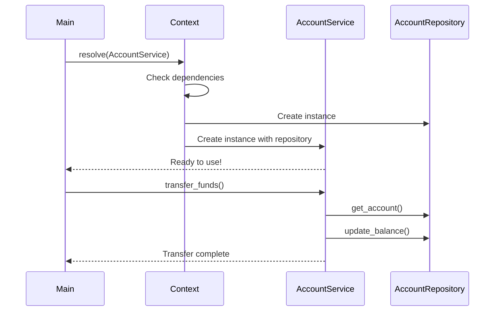

# Quick Start Guide

*Elena Korvas shows you how to get started with OpusGenie DI in under 5 minutes*

---

!!! tip "Elena's Quick Start"
    *"When I first evaluated OpusGenie DI for OgPgy Bank, I needed to see results fast. This guide will get you from zero to a working dependency injection system in minutes."*

## Installation

=== "pip"

    ```bash
    pip install opusgenie-di
    ```

=== "uv (recommended)"

    ```bash
    uv add opusgenie-di
    ```

=== "poetry"

    ```bash
    poetry add opusgenie-di
    ```

## Your First Banking Service

Let's build a simple account service that demonstrates the core concepts:

### Step 1: Create Your First Component

```python title="account_service.py"
from opusgenie_di import og_component, BaseComponent, ComponentScope

@og_component(scope=ComponentScope.SINGLETON)
class AccountRepository(BaseComponent):
    """Repository for account data - like OgPgy's customer database"""
    
    def __init__(self) -> None:
        super().__init__()
        self._accounts = {
            "maria_santos": {"balance": 1500.00, "type": "business"},
            "david_kim": {"balance": 25000.00, "type": "sme_loan"}
        }
    
    def get_account(self, customer_id: str) -> dict:
        return self._accounts.get(customer_id, {"balance": 0, "type": "new"})
    
    def update_balance(self, customer_id: str, new_balance: float) -> bool:
        if customer_id in self._accounts:
            self._accounts[customer_id]["balance"] = new_balance
            return True
        return False

@og_component(scope=ComponentScope.SINGLETON)
class AccountService(BaseComponent):
    """Main account service - handles business logic"""
    
    def __init__(self, repository: AccountRepository) -> None:
        super().__init__()
        self.repository = repository  # Dependency automatically injected!
    
    def get_balance(self, customer_id: str) -> float:
        account = self.repository.get_account(customer_id)
        return account["balance"]
    
    def transfer_funds(self, from_customer: str, to_customer: str, amount: float) -> bool:
        from_account = self.repository.get_account(from_customer)
        if from_account["balance"] >= amount:
            # Debit source account
            new_balance = from_account["balance"] - amount
            self.repository.update_balance(from_customer, new_balance)
            
            # Credit destination account
            to_account = self.repository.get_account(to_customer)
            new_balance = to_account["balance"] + amount
            self.repository.update_balance(to_customer, new_balance)
            return True
        return False
```

### Step 2: Use Your Service

```python title="main.py"
from opusgenie_di import get_global_context
from account_service import AccountService

def main():
    print("🏦 Welcome to OgPgy Bank's Account System")
    
    # Get the global context and enable auto-wiring
    context = get_global_context()
    context.enable_auto_wiring()
    
    # Resolve the service - dependencies are automatically injected
    account_service = context.resolve(AccountService)
    
    # Test Maria's account (our freelance graphic designer)
    print(f"Maria's balance: ${account_service.get_balance('maria_santos'):.2f}")
    
    # Transfer funds from David (restaurant chain) to Maria (design work)
    success = account_service.transfer_funds("david_kim", "maria_santos", 500.00)
    print(f"Transfer successful: {success}")
    
    # Check updated balances
    print(f"Maria's new balance: ${account_service.get_balance('maria_santos'):.2f}")
    print(f"David's new balance: ${account_service.get_balance('david_kim'):.2f}")

if __name__ == "__main__":
    main()
```

### Step 3: Run Your Application

```bash
python main.py
```

**Output:**
```
🏦 Welcome to OgPgy Bank's Account System
Maria's balance: $1500.00
Transfer successful: True
Maria's new balance: $2000.00
David's new balance: $24500.00
```

## What Just Happened?



1. **Automatic Dependency Resolution**: OpusGenie DI saw that `AccountService` needed `AccountRepository` and created it automatically
2. **Singleton Scope**: Both services are singletons - only one instance exists throughout your application
3. **Clean Architecture**: Your business logic (`AccountService`) is separate from data access (`AccountRepository`)
4. **Type Safety**: Full type checking ensures your dependencies are correct

## Elena's Pro Tips

!!! tip "Component Scopes"
    ```python
    # Singleton: One instance for the entire application (default)
    @og_component(scope=ComponentScope.SINGLETON)
    class DatabaseConnection: pass
    
    # Transient: New instance every time it's requested
    @og_component(scope=ComponentScope.TRANSIENT)
    class TransactionLogger: pass
    
    # Scoped: One instance per request/context scope
    @og_component(scope=ComponentScope.SCOPED)
    class UserSession: pass
    ```

!!! tip "Auto-Registration"
    ```python
    # Auto-register to global context (default: True)
    @og_component(auto_register=True)
    class GlobalService: pass
    
    # Don't auto-register (for multi-context setups)
    @og_component(auto_register=False)
    class ContextSpecificService: pass
    ```

!!! tip "Component Tags"
    ```python
    @og_component(
        tags={"layer": "infrastructure", "type": "repository"}
    )
    class CustomerRepository: pass
    ```

## Next Steps

You've just built your first dependency injection system! Here's what to explore next:

<div class="grid cards" markdown>

-   :material-school:{ .lg .middle } **Learn Core Concepts**

    ---

    Understand components, scopes, and contexts in depth

    [:octicons-arrow-right-24: Core Concepts](../core-concepts/dependency-injection.md)

-   :material-sitemap:{ .lg .middle } **Multi-Context Architecture**

    ---

    Build complex systems with isolated contexts

    [:octicons-arrow-right-24: Multi-Context Guide](../multi-context/multi-context.md)

-   :material-bank:{ .lg .middle } **Complete Banking Example**

    ---

    See how OgPgy Bank built their entire system

    [:octicons-arrow-right-24: Banking Architecture](../examples/banking-architecture.md)

-   :material-test-tube:{ .lg .middle } **Advanced Features**

    ---

    Async lifecycle, hooks, testing, and more

    [:octicons-arrow-right-24: Advanced Features](../advanced/async-lifecycle.md)

</div>

## Common Patterns

### Repository Pattern
```python
@og_component()
class CustomerRepository(BaseComponent):
    def __init__(self, db: DatabaseConnection): 
        super().__init__()
        self.db = db

@og_component()
class CustomerService(BaseComponent):
    def __init__(self, repo: CustomerRepository):
        super().__init__()
        self.repo = repo
```

### Service Layer Pattern
```python
@og_component()
class PaymentProcessor(BaseComponent):
    def __init__(self, gateway: PaymentGateway, validator: PaymentValidator):
        super().__init__()
        self.gateway = gateway
        self.validator = validator
```

### Factory Pattern
```python
@og_component()
class NotificationFactory(BaseComponent):
    def create_email_notifier(self) -> EmailNotifier:
        return context.resolve(EmailNotifier)
    
    def create_sms_notifier(self) -> SMSNotifier:
        return context.resolve(SMSNotifier)
```

---

!!! success "You're Ready!"
    You now understand the basics of OpusGenie DI. The patterns you've learned here scale from simple applications to complex banking systems like OgPgy Bank's. Ready to dive deeper?