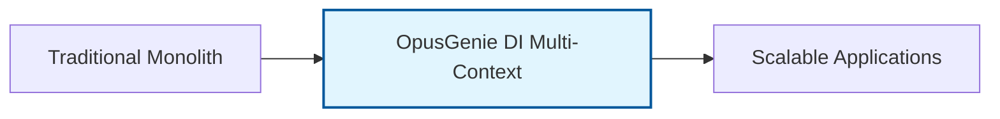
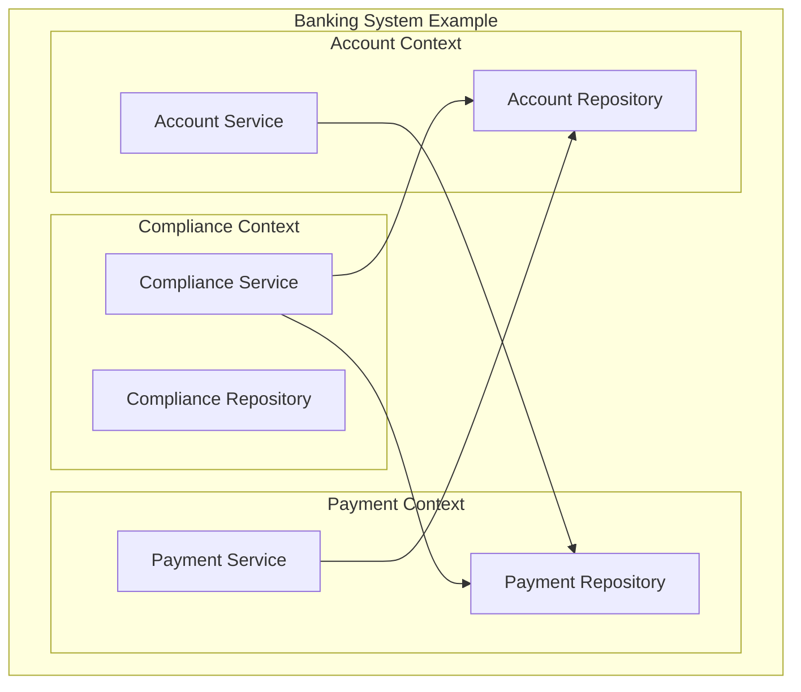
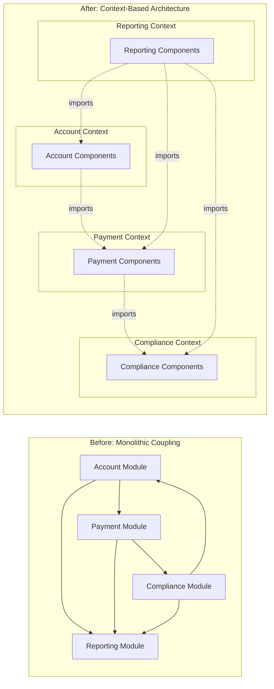
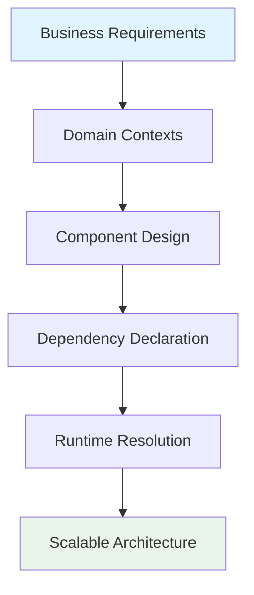

# Welcome to OpusGenie DI

**A Powerful Multi-Context Dependency Injection Framework for Python**

---

## What is OpusGenie DI?

OpusGenie DI is a **multi-context dependency injection framework** for Python 3.12+ that brings Angular-style dependency injection to the Python ecosystem. It's designed for building complex, enterprise-grade applications with clear separation of concerns, automatic dependency resolution, and comprehensive lifecycle management.

Whether you're building microservices, modular monoliths, or complex domain-driven applications, OpusGenie DI provides the foundation for clean, maintainable, and scalable Python architectures.

## Understanding Through Example: The OgPgy Bank Case Study

<div style="float: right; font-size: 4rem; margin: 0 0 1rem 1rem;">🐷💰</div>

To demonstrate how OpusGenie DI solves real-world architectural challenges, we'll use the example of **OgPgy Bank** throughout this documentation. OgPgy Bank is a fictional digital-first financial institution serving 2.3 million customers in the tropical island nation of Genai.

By exploring how a modern banking system would use OpusGenie DI, we'll illustrate key concepts like:
- **Bounded contexts** and domain separation
- **Cross-context dependencies** and component sharing
- **Lifecycle management** for critical services
- **Testing strategies** for financial systems
- **Scalable architecture** patterns

!!! info "Why Use a Banking Example?"
    Banking systems are perfect for demonstrating dependency injection because they require:
    - **Clear domain boundaries** (accounts, payments, compliance)
    - **Strict isolation** between contexts for security
    - **Shared components** across different services
    - **Complex lifecycle management** for critical resources
    - **Comprehensive testing** for financial accuracy
    
    Throughout this documentation, we'll reference the OgPgy Bank team:
    - **Elena Korvas** (CTO) - Architecting with OpusGenie DI
    - **Marcus Chen** (Domain Expert) - Modeling bounded contexts
    - **Priya Nakamura** (Lead Architect) - Implementing multi-context patterns
    - **Sofia Ramos** (Product Manager) - Driving requirements
    - **Jake Morrison** (DevOps) - Deploying OpusGenie DI applications

## Core Features of OpusGenie DI



### 🏗️ Multi-Context Architecture

OpusGenie DI's most powerful feature is its support for multiple isolated contexts that can selectively share components. Here's how it would organize a banking system:



Each context in OpusGenie DI:
- **Isolates** its internal components
- **Exports** specific components for other contexts to use
- **Imports** components it needs from other contexts
- **Maintains** its own lifecycle and scope

=== "⚡ Declarative Components"

    ```python
    from opusgenie_di import og_component, BaseComponent, ComponentScope
    
    @og_component(scope=ComponentScope.SINGLETON)
    class AccountService(BaseComponent):
        def __init__(self, account_repo: AccountRepository):
            super().__init__()
            self.account_repo = account_repo
        
        async def create_account(self, customer_id: str) -> Account:
            # Business logic here
            return await self.account_repo.save(account)
    ```
    
    Simple decorators that make components injectable and manageable.

=== "🔄 Async Lifecycle Management"

    ```python
    async def initialize(self) -> None:
        """Called when component starts up"""
        await self.connect_to_database()
        logger.info("Account service initialized")
    
    async def cleanup(self) -> None:
        """Called when component shuts down"""
        await self.close_connections()
        logger.info("Account service cleaned up")
    ```
    
    Built-in async lifecycle hooks for proper resource management.

=== "🎯 Type Safety"

    ```python
    from typing import Protocol
    
    class PaymentProcessor(Protocol):
        async def process(self, payment: Payment) -> PaymentResult: ...
    
    @og_component()
    class VelocityPayProcessor(BaseComponent):
        async def process(self, payment: Payment) -> PaymentResult:
            # Implementation
            pass
    ```
    
    Full type safety with Python protocols and type hints.

## How OpusGenie DI Solves Architectural Challenges

### The Common Challenge

Many teams face the same problem Elena Korvas encountered at OgPgy Bank: **How do you build a system that's both secure and agile?** Traditional monolithic approaches are too rigid, while microservices without proper dependency management lead to coupling nightmares.

### The OpusGenie DI Solution



OpusGenie DI provides:

- **Domain Isolation**: Separate contexts for different business domains
- **Selective Sharing**: Export/import only the components you need
- **Independent Testing**: Test each context in isolation
- **Team Scalability**: Teams can work on separate contexts without conflicts
- **Flexible Deployment**: Deploy contexts as microservices or modules

In the OgPgy Bank example, this translates to:

## Real-World Benefits of OpusGenie DI

!!! success "What OpusGenie DI Enables"
    
    Using OgPgy Bank as an example, OpusGenie DI can help achieve:
    
    - **High Availability**: Isolated contexts prevent cascading failures
    - **Performance**: Efficient dependency resolution and caching
    - **Security**: Context boundaries enforce access control
    - **Developer Productivity**: Clear interfaces and automatic wiring
    - **Compliance**: Auditable component interactions

## Practical Applications

### Example: Payment Processing

Consider Maria Santos, a freelance designer who needs instant payment transfers. With OpusGenie DI:

- The **Payment Context** handles transaction logic
- It **imports** account verification from the Account Context
- It **exports** transaction records to the Reporting Context
- Each context maintains its own security boundaries

```python
@og_context(
    name="payment_context",
    imports=[ModuleContextImport(AccountService, from_context="account_context")],
    exports=[TransactionService],
    providers=[PaymentProcessor, TransactionService]
)
class PaymentModule:
    pass
```

### Example: Business Lending

For David Kim's restaurant chain loan application, OpusGenie DI enables:

- The **Lending Context** to import customer data from Account Context
- Independent credit scoring logic without coupling
- Clean interfaces between business domains

## Getting Started

Ready to see how OpusGenie DI can transform your application architecture? Let's start with the basics:

<div class="grid cards" markdown>

-   :material-clock-fast:{ .lg .middle } **Quick Start**

    ---

    Get up and running with OpusGenie DI in under 5 minutes

    [:octicons-arrow-right-24: Quick Start](getting-started/quickstart.md)

-   :material-book-open-page-variant:{ .lg .middle } **Core Concepts**

    ---

    Learn the fundamental concepts through banking examples

    [:octicons-arrow-right-24: Learn the Basics](core-concepts/dependency-injection.md)

-   :material-api:{ .lg .middle } **API Reference**

    ---

    Complete API documentation with examples

    [:octicons-arrow-right-24: API Docs](api/core.md)

-   :material-bank:{ .lg .middle } **Banking Examples**

    ---

    Complete real-world banking implementation

    [:octicons-arrow-right-24: See Examples](examples/banking-architecture.md)

</div>

---

## Architecture Philosophy

OpusGenie DI follows the principle of **"Dependency Injection as Code"** - your architecture should be as explicit and declarative as your business logic. Every component, every dependency, and every context boundary is clearly defined in code, making your system both powerful and understandable.



Whether you're building a simple web application or a complex financial system like OgPgy Bank, OpusGenie DI provides the foundation for clean, maintainable, and scalable Python applications.

**Let's build something amazing together.**