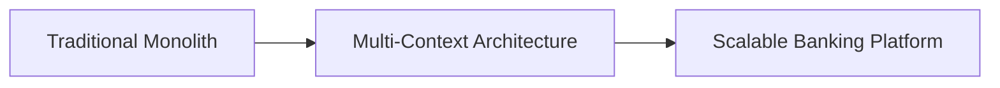
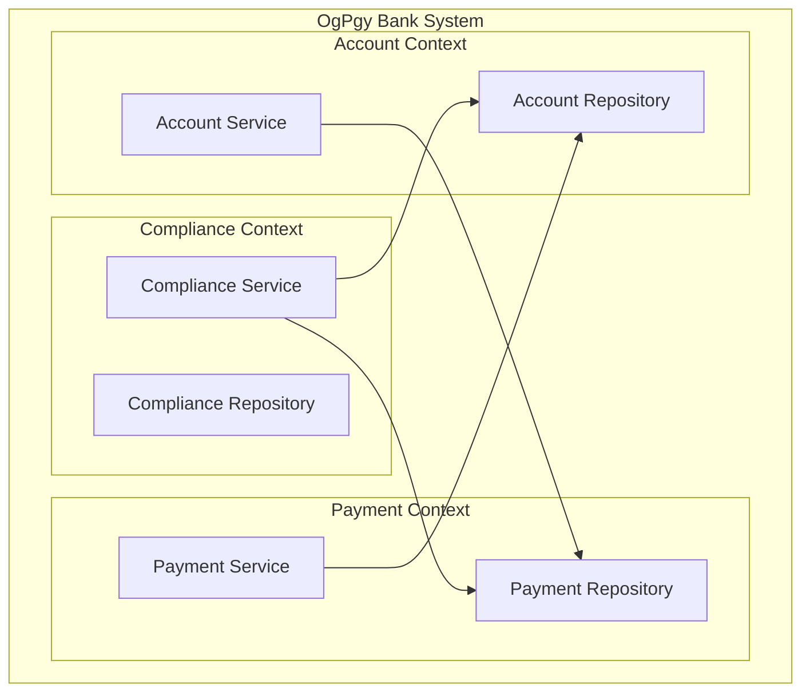
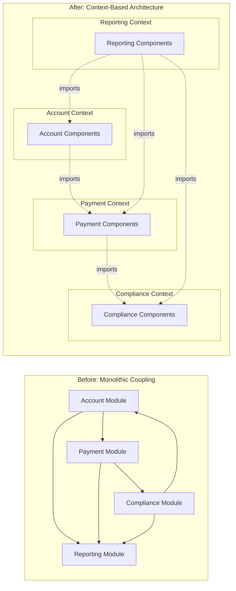
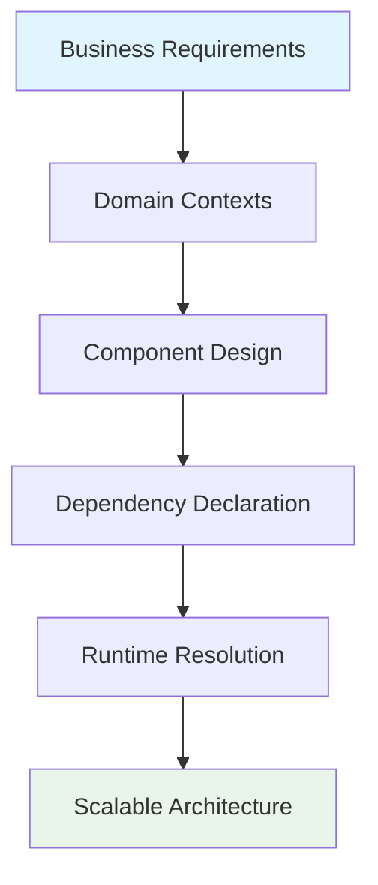

# Welcome to OpusGenie DI

<div style="float: right; font-size: 4rem; margin: 0 0 1rem 1rem;">🐷💰</div>

**Building Modern Banking Architecture with Dependency Injection**

---

## The OgPgy Bank Story

In the tropical island nation of Genai, **OgPgy Bank** serves 2.3 million customers as the country's leading digital-first financial institution. What makes OgPgy Bank special isn't just their innovative services—it's how they've architected their technology stack using **OpusGenie DI**, a powerful dependency injection framework that enables them to build scalable, maintainable, and testable banking systems.

!!! info "Meet the OgPgy Bank Team"
    
    **Elena Korvas** - *Chief Technology Officer*  
    Leading OgPgy's digital transformation with microservices and domain-driven design
    
    **Marcus Chen** - *Business Domain Expert*  
    Models complex banking domains like account management and regulatory compliance
    
    **Priya Nakamura** - *Lead Software Architect*  
    Designs multi-context architectures that scale across banking operations
    
    **Sofia Ramos** - *Product Manager*  
    Ensures customer experience drives technical decisions
    
    **Jake Morrison** - *DevOps Engineer*  
    Maintains cloud-native applications that process millions of transactions daily

## What is OpusGenie DI?

OpusGenie DI is a **multi-context dependency injection framework** for Python 3.12+ that brings Angular-style dependency injection to the Python ecosystem. It's designed for building complex, enterprise-grade applications with clear separation of concerns.



### Key Features

**🏗️ Multi-Context Architecture**



*Isolated contexts that can import and export components across domain boundaries.*

=== "⚡ Declarative Components"

    ```python
    from opusgenie_di import og_component, BaseComponent, ComponentScope
    
    @og_component(scope=ComponentScope.SINGLETON)
    class AccountService(BaseComponent):
        def __init__(self, account_repo: AccountRepository):
            super().__init__()
            self.account_repo = account_repo
        
        async def create_account(self, customer_id: str) -> Account:
            # Business logic here
            return await self.account_repo.save(account)
    ```
    
    Simple decorators that make components injectable and manageable.

=== "🔄 Async Lifecycle Management"

    ```python
    async def initialize(self) -> None:
        """Called when component starts up"""
        await self.connect_to_database()
        logger.info("Account service initialized")
    
    async def cleanup(self) -> None:
        """Called when component shuts down"""
        await self.close_connections()
        logger.info("Account service cleaned up")
    ```
    
    Built-in async lifecycle hooks for proper resource management.

=== "🎯 Type Safety"

    ```python
    from typing import Protocol
    
    class PaymentProcessor(Protocol):
        async def process(self, payment: Payment) -> PaymentResult: ...
    
    @og_component()
    class VelocityPayProcessor(BaseComponent):
        async def process(self, payment: Payment) -> PaymentResult:
            # Implementation
            pass
    ```
    
    Full type safety with Python protocols and type hints.

## Why OgPgy Bank Chose OpusGenie DI

### The Challenge

Elena Korvas faced a common problem in financial technology: **How do you build a banking system that's both secure and agile?** Traditional monolithic approaches were too rigid, but microservices without proper dependency management led to coupling nightmares.

### The Solution



OpusGenie DI enabled OgPgy Bank to:

- **Isolate business domains** in separate contexts
- **Share components** across contexts when needed
- **Test each domain** independently
- **Scale teams** around business capabilities
- **Deploy services** independently

## Real-World Impact

!!! success "OgPgy Bank Results"
    
    - **99.99% uptime** for core banking operations
    - **Sub-second response times** for 95% of API calls
    - **Zero data breaches** since implementing proper context isolation
    - **50% faster development** cycles with independent team deployments
    - **Regulatory compliance** maintained across all contexts

## Customer Stories

### Maria Santos - Freelance Graphic Designer

*"I need my banking to be as creative and flexible as my work. OgPgy's instant mobile transfers let me get paid by clients and pay suppliers without missing a beat."*

**How OpusGenie DI helps:** The payment processing context handles real-time transfers while maintaining strict isolation from account management, ensuring security without sacrificing speed.

### David Kim - Small Business Owner

*"Running a restaurant chain means dealing with complex financial flows. OgPgy's SME lending platform understood my business from day one."*

**How OpusGenie DI helps:** The loan processing context imports customer data from the account context while maintaining independent business logic for credit decisions.

## Getting Started

Ready to see how OpusGenie DI can transform your application architecture? Let's start with the basics:

<div class="grid cards" markdown>

-   :material-clock-fast:{ .lg .middle } **Quick Start**

    ---

    Get up and running with OpusGenie DI in under 5 minutes

    [:octicons-arrow-right-24: Quick Start](getting-started/quickstart.md)

-   :material-book-open-page-variant:{ .lg .middle } **Core Concepts**

    ---

    Learn the fundamental concepts through banking examples

    [:octicons-arrow-right-24: Learn the Basics](core-concepts/dependency-injection.md)

-   :material-api:{ .lg .middle } **API Reference**

    ---

    Complete API documentation with examples

    [:octicons-arrow-right-24: API Docs](api/core.md)

-   :material-bank:{ .lg .middle } **Banking Examples**

    ---

    Complete real-world banking implementation

    [:octicons-arrow-right-24: See Examples](examples/banking-architecture.md)

</div>

---

## Architecture Philosophy

OpusGenie DI follows the principle of **"Dependency Injection as Code"** - your architecture should be as explicit and declarative as your business logic. Every component, every dependency, and every context boundary is clearly defined in code, making your system both powerful and understandable.



Whether you're building a simple web application or a complex financial system like OgPgy Bank, OpusGenie DI provides the foundation for clean, maintainable, and scalable Python applications.

**Let's build something amazing together.**