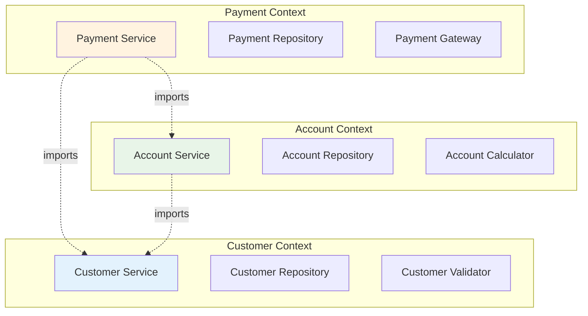
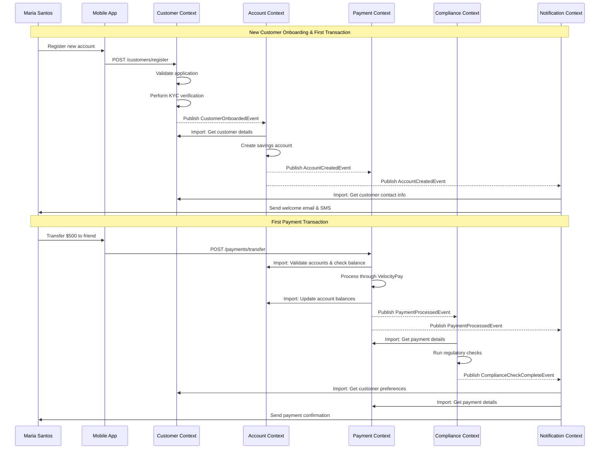

# Imports & Exports

*Priya Nakamura explains cross-context communication patterns*

---

!!! quote "Priya Nakamura - Lead Software Architect"
    *"The beauty of OpusGenie DI's import/export system is how it makes dependencies explicit. You can't accidentally create hidden coupling—every cross-context dependency is declared upfront."*

## Understanding Context Boundaries

Context boundaries are like **API contracts** between different parts of your system. Just like you wouldn't directly access another service's database, you shouldn't directly instantiate components from other contexts.



## Export Declaration

### What Should You Export?

Export components that provide **stable business capabilities** to other contexts:

```python title="Well-Designed Exports"
@og_context(
    name="customer_management",
    exports=[
        CustomerService,      # ✅ Core business service
        CustomerValidator,    # ✅ Reusable validation logic
        CustomerEvents        # ✅ Event definitions
    ],
    providers=[
        CustomerService,
        CustomerValidator,
        CustomerRepository,   # ❌ Not exported - internal implementation
        CustomerConfig,       # ❌ Not exported - configuration detail
        CustomerEvents
    ]
)
class CustomerManagementModule:
    """
    Exports:
    - CustomerService: Core customer operations
    - CustomerValidator: Validation logic for customer data
    - CustomerEvents: Event types for customer lifecycle
    
    Keeps private:
    - CustomerRepository: Database access details
    - CustomerConfig: Internal configuration
    """
    pass
```

### Export Guidelines

!!! tip "Export Interface, Not Implementation"
    ```python
    # ✅ Good - Export interface/protocol
    from typing import Protocol
    
    class PaymentProcessor(Protocol):
        async def process_payment(self, payment: Payment) -> PaymentResult: ...
    
    @og_context(exports=[PaymentProcessor])  # Export the protocol
    class PaymentModule:
        providers=[VelocityPayProcessor]     # Concrete implementation stays private
    ```

!!! tip "Version Your Exports"
    ```python
    @og_context(
        name="payment_processing",
        version="2.1.0",
        exports=[
            PaymentService,        # Stable since v1.0
            PaymentValidator,      # Added in v2.0
            # FraudDetector        # Removed in v2.1 - breaking change
        ]
    )
    class PaymentModule:
        pass
    ```

## Import Declaration

### Explicit Import Syntax

Every import must be explicitly declared with its source context:

```python title="Explicit Import Declarations"
from opusgenie_di import ModuleContextImport

@og_context(
    name="loan_processing",
    imports=[
        # Import customer service to verify borrower identity
        ModuleContextImport(
            component_type=CustomerService,
            from_context="customer_management"
        ),
        
        # Import account service to check account history
        ModuleContextImport(
            component_type=AccountService,
            from_context="account_management"  
        ),
        
        # Import payment service for loan disbursement
        ModuleContextImport(
            component_type=PaymentService,
            from_context="payment_processing"
        ),
        
        # Import infrastructure components
        ModuleContextImport(
            component_type=DatabaseConnection,
            from_context="infrastructure"
        )
    ],
    exports=[LoanService],
    providers=[
        LoanRepository,
        CreditScoreCalculator,
        LoanApprovalEngine,
        LoanService
    ]
)
class LoanProcessingModule:
    """
    Loan processing that depends on multiple other contexts
    but maintains clear boundaries
    """
    pass
```

### Using Imported Components

Once imported, components work exactly like local components:

```python title="Using Imported Services"
@og_component(auto_register=False, tags={"domain": "loan"})
class LoanService(BaseComponent):
    def __init__(
        self,
        # These are imported from other contexts
        customer_service: CustomerService,      # from customer_management
        account_service: AccountService,        # from account_management  
        payment_service: PaymentService,        # from payment_processing
        
        # These are local to this context
        loan_repo: LoanRepository,
        credit_calculator: CreditScoreCalculator,
        approval_engine: LoanApprovalEngine,
        
        # Infrastructure
        db: DatabaseConnection,                 # from infrastructure
        event_bus: EventBus                    # from infrastructure
    ) -> None:
        super().__init__()
        self.customer_service = customer_service
        self.account_service = account_service
        self.payment_service = payment_service
        self.loan_repo = loan_repo
        self.credit_calculator = credit_calculator
        self.approval_engine = approval_engine
        self.db = db
        self.event_bus = event_bus
    
    async def process_loan_application(self, application: LoanApplication) -> LoanDecision:
        """Process loan application using services from multiple contexts"""
        
        # 1. Verify customer exists and is in good standing
        customer = await self.customer_service.get_customer(application.customer_id)
        if not customer or customer.status != "active":
            return LoanDecision.reject("Customer not eligible")
        
        # 2. Check account history and current balances
        accounts = await self.account_service.get_customer_accounts(application.customer_id)
        account_score = self._calculate_account_score(accounts)
        
        # 3. Calculate credit score using local logic
        credit_score = await self.credit_calculator.calculate_score(
            customer=customer,
            accounts=accounts,
            requested_amount=application.amount
        )
        
        # 4. Make approval decision
        decision = await self.approval_engine.evaluate(
            application=application,
            credit_score=credit_score,
            account_score=account_score
        )
        
        if decision.approved:
            # 5. If approved, disburse funds using payment service
            disbursement = await self.payment_service.disburse_loan(
                to_account=application.disbursement_account,
                amount=application.amount,
                loan_id=decision.loan_id
            )
            
            decision.disbursement_reference = disbursement.transaction_id
        
        # 6. Save loan record
        loan = Loan.from_application_and_decision(application, decision)
        await self.loan_repo.save(loan)
        
        # 7. Publish event for other contexts
        await self.event_bus.publish(LoanProcessedEvent(
            loan_id=loan.id,
            customer_id=application.customer_id,
            amount=application.amount,
            approved=decision.approved
        ))
        
        return decision
```

## Real-World Example: OgPgy Bank's Cross-Context Flow

Let's trace a complete customer journey that spans multiple contexts:



### Implementation Across Contexts

Here's how this flow is implemented with clear import/export boundaries:

```python title="Customer Context - Onboarding"
@og_context(
    name="customer_management",
    imports=[
        ModuleContextImport(DatabaseConnection, from_context="infrastructure"),
        ModuleContextImport(EventBus, from_context="infrastructure")
    ],
    exports=[CustomerService],
    providers=[CustomerService, CustomerRepository, KYCService]
)
class CustomerManagementModule:
    pass

@og_component(auto_register=False)
class CustomerService(BaseComponent):
    async def onboard_customer(self, application: CustomerApplication) -> Customer:
        # Customer onboarding logic...
        customer = await self._create_customer(application)
        
        # Publish event for other contexts
        await self.event_bus.publish(CustomerOnboardedEvent(
            customer_id=customer.id,
            customer_type=customer.type,
            contact_preferences=customer.contact_preferences
        ))
        
        return customer
```

```python title="Account Context - Account Creation"
@og_context(
    name="account_management", 
    imports=[
        ModuleContextImport(DatabaseConnection, from_context="infrastructure"),
        ModuleContextImport(EventBus, from_context="infrastructure"),
        ModuleContextImport(CustomerService, from_context="customer_management")  # Import!
    ],
    exports=[AccountService],
    providers=[AccountService, AccountRepository]
)
class AccountManagementModule:
    pass

@og_component(auto_register=False)
class AccountService(BaseComponent):
    def __init__(
        self,
        customer_service: CustomerService,  # Imported from customer context
        account_repo: AccountRepository,
        event_bus: EventBus
    ):
        self.customer_service = customer_service
        # ...
    
    async def open_account(self, customer_id: str, account_type: str) -> Account:
        # Use imported customer service
        customer = await self.customer_service.get_customer(customer_id)
        
        # Create account...
        account = await self._create_account(customer, account_type)
        
        # Publish events for other contexts
        await self.event_bus.publish(AccountCreatedEvent(
            account_id=account.id,
            customer_id=customer_id,
            account_type=account_type
        ))
        
        return account
```

```python title="Payment Context - Payment Processing"
@og_context(
    name="payment_processing",
    imports=[
        ModuleContextImport(DatabaseConnection, from_context="infrastructure"),
        ModuleContextImport(EventBus, from_context="infrastructure"),
        ModuleContextImport(AccountService, from_context="account_management")  # Import!
    ],
    exports=[PaymentService],
    providers=[PaymentService, PaymentRepository, VelocityPayGateway]
)
class PaymentProcessingModule:
    pass

@og_component(auto_register=False)  
class PaymentService(BaseComponent):
    def __init__(
        self,
        account_service: AccountService,  # Imported from account context
        payment_repo: PaymentRepository,
        velocity_pay: VelocityPayGateway,
        event_bus: EventBus
    ):
        self.account_service = account_service
        # ...
    
    async def process_transfer(self, from_account_id: str, to_account_id: str, amount: float) -> Payment:
        # Use imported account service to validate and update balances
        from_account = await self.account_service.get_account(from_account_id)
        to_account = await self.account_service.get_account(to_account_id)
        
        # Process payment...
        payment = await self._process_payment(from_account, to_account, amount)
        
        # Update balances using imported service
        await self.account_service.debit_account(from_account_id, amount)
        await self.account_service.credit_account(to_account_id, amount)
        
        # Publish event for compliance and notifications
        await self.event_bus.publish(PaymentProcessedEvent(
            payment_id=payment.id,
            from_account=from_account_id,
            to_account=to_account_id,
            amount=amount,
            processed_at=datetime.utcnow()
        ))
        
        return payment
```

## Advanced Import Patterns

### Conditional Imports

Sometimes you want to import a component only if it's available:

```python title="Optional Imports"
@og_context(
    name="payment_processing",
    imports=[
        # Required imports
        ModuleContextImport(AccountService, from_context="account_management"),
        
        # Optional imports - graceful degradation if not available
        ModuleContextImport(
            component_type=FraudDetectionService,
            from_context="fraud_detection",
            required=False  # Optional import
        )
    ]
)
class PaymentProcessingModule:
    pass

@og_component(auto_register=False)
class PaymentService(BaseComponent):
    def __init__(
        self,
        account_service: AccountService,
        fraud_detector: Optional[FraudDetectionService] = None  # May be None
    ):
        self.account_service = account_service
        self.fraud_detector = fraud_detector
    
    async def process_payment(self, payment: Payment) -> PaymentResult:
        # Always validate accounts
        valid = await self.account_service.validate_accounts(payment.from_account, payment.to_account)
        
        # Use fraud detection if available
        if self.fraud_detector:
            fraud_check = await self.fraud_detector.check_payment(payment)
            if not fraud_check.approved:
                return PaymentResult.rejected("Fraud detected")
        
        # Process payment...
        return await self._process_payment_internal(payment)
```

### Aliased Imports

When you need to import similar components from different contexts:

```python title="Import Aliases"
@og_context(
    name="reconciliation",
    imports=[
        ModuleContextImport(
            component_type=PaymentRepository,
            from_context="payment_processing",
            alias="payment_repo"  # Alias to avoid naming conflicts
        ),
        ModuleContextImport(
            component_type=PaymentRepository,
            from_context="external_payment_gateway",
            alias="external_payment_repo"
        )
    ]
)
class ReconciliationModule:
    pass

@og_component(auto_register=False)
class ReconciliationService(BaseComponent):
    def __init__(
        self,
        payment_repo: PaymentRepository,      # From payment_processing
        external_payment_repo: PaymentRepository  # From external_payment_gateway
    ):
        self.internal_payments = payment_repo
        self.external_payments = external_payment_repo
```

## Import/Export Anti-Patterns

!!! danger "Don't Export Everything"
    ```python
    # ❌ Bad - Exposing internal implementation details
    @og_context(
        exports=[
            CustomerService,      # ✅ Good - core business service
            CustomerRepository,   # ❌ Bad - implementation detail
            CustomerConfig,       # ❌ Bad - configuration
            CustomerDatabase,     # ❌ Bad - infrastructure detail
            InternalValidator,    # ❌ Bad - internal helper
        ]
    )
    
    # ✅ Good - Only export stable business interfaces
    @og_context(
        exports=[
            CustomerService       # Only the core business capability
        ]
    )
    ```

!!! danger "Don't Create Circular Dependencies"
    ```python
    # ❌ Bad - Circular dependency
    @og_context(
        name="customer_management",
        imports=[ModuleContextImport(AccountService, from_context="account_management")]
    )
    class CustomerModule: pass
    
    @og_context(
        name="account_management", 
        imports=[ModuleContextImport(CustomerService, from_context="customer_management")]
    )
    class AccountModule: pass
    
    # ✅ Good - Use events to break cycles
    @og_context(
        name="customer_management",
        # No direct import of AccountService
    )
    class CustomerModule: pass
    
    @og_context(
        name="account_management",
        imports=[ModuleContextImport(CustomerService, from_context="customer_management")]
    )
    class AccountModule: pass
    ```

!!! danger "Don't Import Too Much"
    ```python
    # ❌ Bad - Too many dependencies
    @og_context(
        imports=[
            ModuleContextImport(Service1, from_context="context1"),
            ModuleContextImport(Service2, from_context="context2"),
            ModuleContextImport(Service3, from_context="context3"),
            ModuleContextImport(Service4, from_context="context4"),
            ModuleContextImport(Service5, from_context="context5"),
            # ... many more
        ]
    )
    
    # ✅ Good - Minimal, focused dependencies
    @og_context(
        imports=[
            ModuleContextImport(CustomerService, from_context="customer_management"),
            ModuleContextImport(DatabaseConnection, from_context="infrastructure")
        ]
    )
    ```

## Testing Import/Export Boundaries

```python title="Testing Context Boundaries"
import pytest
from opusgenie_di import ContextModuleBuilder
from opusgenie_di._core.exceptions import ComponentResolutionError

class TestContextBoundaries:
    """Test that context boundaries are properly enforced"""
    
    async def test_exported_components_are_accessible(self):
        """Test that exported components can be imported by other contexts"""
        builder = ContextModuleBuilder()
        contexts = await builder.build_contexts(
            CustomerManagementModule,
            AccountManagementModule
        )
        
        account_context = contexts["account_management"]
        
        # ✅ Should work - CustomerService is exported
        customer_service = account_context.resolve(CustomerService)
        assert customer_service is not None
    
    async def test_non_exported_components_are_not_accessible(self):
        """Test that non-exported components cannot be accessed from other contexts"""
        builder = ContextModuleBuilder()
        contexts = await builder.build_contexts(
            CustomerManagementModule,
            AccountManagementModule
        )
        
        account_context = contexts["account_management"]
        
        # ❌ Should fail - CustomerRepository is not exported
        with pytest.raises(ComponentResolutionError):
            customer_repo = account_context.resolve(CustomerRepository)
    
    async def test_context_isolation(self):
        """Test that contexts are properly isolated"""
        builder = ContextModuleBuilder()
        contexts = await builder.build_contexts(
            CustomerManagementModule,
            PaymentProcessingModule
        )
        
        customer_context = contexts["customer_management"]
        payment_context = contexts["payment_processing"]
        
        # Each context should have its own instance of shared dependencies
        customer_db = customer_context.resolve(DatabaseConnection)
        payment_db = payment_context.resolve(DatabaseConnection)
        
        # They should be different instances (context isolation)
        assert customer_db is not payment_db
```

## Best Practices Summary

!!! tip "Import/Export Guidelines"
    
    **Exports:**
    - Export stable business interfaces, not implementation details
    - Version your exports with semantic versioning
    - Keep export lists small and focused
    - Document what each export provides
    
    **Imports:**
    - Import only what you actually need
    - Prefer importing business services over infrastructure
    - Use optional imports for non-critical dependencies
    - Avoid circular dependencies between contexts
    
    **Communication:**
    - Use events for loose coupling between contexts
    - Use direct imports for strong consistency requirements
    - Consider the trade-offs between coupling and performance

## Next Steps

<div class="grid cards" markdown>

-   :material-cog:{ .lg .middle } **Module Builder**

    ---

    Learn how to orchestrate multiple contexts

    [:octicons-arrow-right-24: Module Builder](module-builder.md)

-   :material-test-tube:{ .lg .middle } **Testing Strategies**

    ---

    Test multi-context applications effectively

    [:octicons-arrow-right-24: Testing](../advanced/testing.md)

-   :material-bank:{ .lg .middle } **Real Examples**

    ---

    See complete banking implementations

    [:octicons-arrow-right-24: Banking Examples](../examples/banking-architecture.md)

</div>