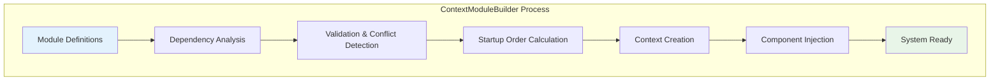
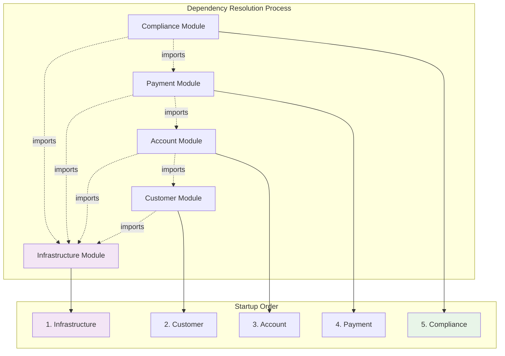

# Module Builder

*Elena Korvas shows how to orchestrate complex multi-context systems*

---

!!! quote "Elena Korvas - Chief Technology Officer"
    *"The ContextModuleBuilder is like a conductor orchestrating a symphony. It resolves dependencies, manages startup sequences, and ensures all contexts work together harmoniously."*

## What is the ContextModuleBuilder?

The `ContextModuleBuilder` is OpusGenie DI's orchestration engine that:

- **Resolves dependencies** between contexts
- **Validates** import/export compatibility  
- **Manages startup order** based on dependency graphs
- **Creates isolated contexts** with proper component injection
- **Handles graceful shutdown** in dependency order



## Basic Usage

### Simple Context Building

```python title="Building OgPgy Bank's Core System"
from opusgenie_di import ContextModuleBuilder
import asyncio

async def build_ogpgy_bank():
    """Build the core OgPgy Bank system"""
    
    # Create the builder
    builder = ContextModuleBuilder()
    
    # Build contexts from module definitions
    contexts = await builder.build_contexts(
        InfrastructureModule,     # Foundation layer
        CustomerManagementModule, # Customer domain
        AccountManagementModule,  # Account domain 
        PaymentProcessingModule   # Payment domain
    )
    
    print(f"✅ Built {len(contexts)} contexts successfully")
    
    # Access specific contexts
    customer_context = contexts["customer_management"]
    payment_context = contexts["payment_processing"]
    
    # Get services from contexts
    customer_service = customer_context.resolve(CustomerService)
    payment_service = payment_context.resolve(PaymentService)
    
    print("🚀 OgPgy Bank system ready!")
    return contexts

# Run the example
contexts = asyncio.run(build_ogpgy_bank())
```

### Advanced Configuration

```python title="Advanced Builder Configuration"
from opusgenie_di import ContextModuleBuilder, BuilderConfig

async def build_production_system():
    """Build OgPgy Bank with production configuration"""
    
    config = BuilderConfig(
        # Startup configuration
        parallel_startup=True,          # Start independent contexts in parallel
        startup_timeout=30.0,           # 30 second timeout for startup
        validate_exports=True,          # Validate all exported components exist
        
        # Error handling
        fail_fast=True,                 # Stop on first error
        collect_startup_errors=True,    # Collect all startup errors
        
        # Performance  
        cache_dependency_graph=True,    # Cache dependency resolution
        lazy_component_creation=False,  # Create all components at startup
        
        # Development features
        development_mode=False,         # Production mode
        log_dependency_resolution=True  # Log dependency resolution steps
    )
    
    builder = ContextModuleBuilder(config=config)
    
    try:
        contexts = await builder.build_contexts(
            # Core banking system
            InfrastructureModule,
            CustomerManagementModule,
            AccountManagementModule,
            PaymentProcessingModule,
            ComplianceManagementModule,
            
            # Additional features
            NotificationModule,
            ReportingModule,
            AnalyticsModule
        )
        
        print("✅ Production system built successfully")
        return contexts
        
    except Exception as e:
        print(f"❌ System startup failed: {e}")
        # Graceful error handling
        await builder.cleanup_failed_contexts()
        raise
```

## Dependency Resolution

### How Dependencies Are Resolved

The builder analyzes module definitions to create a dependency graph:



### Startup Order Calculation

```python title="Understanding Startup Order"
from opusgenie_di import ContextModuleBuilder

async def demonstrate_startup_order():
    """Show how builder calculates startup order"""
    
    builder = ContextModuleBuilder()
    
    # The builder automatically calculates the correct startup order
    # based on import dependencies
    
    contexts = await builder.build_contexts(
        # Order doesn't matter here - builder will figure it out
        PaymentProcessingModule,      # Depends on: infrastructure, account
        ComplianceManagementModule,   # Depends on: infrastructure, payment  
        InfrastructureModule,         # Depends on: nothing (base)
        AccountManagementModule,      # Depends on: infrastructure, customer
        CustomerManagementModule      # Depends on: infrastructure
    )
    
    # Actual startup order calculated by builder:
    # 1. InfrastructureModule (no dependencies)
    # 2. CustomerManagementModule (depends only on infrastructure)
    # 3. AccountManagementModule (depends on infrastructure + customer)
    # 4. PaymentProcessingModule (depends on infrastructure + account)
    # 5. ComplianceManagementModule (depends on infrastructure + payment)
    
    print("Startup order automatically calculated!")
    
    # You can inspect the dependency graph
    dependency_graph = builder.get_dependency_graph()
    for context_name, dependencies in dependency_graph.items():
        print(f"{context_name}: depends on {dependencies}")
```

### Circular Dependency Detection

```python title="Circular Dependency Detection"
# This would cause a circular dependency error
@og_context(
    name="context_a",
    imports=[ModuleContextImport(ServiceB, from_context="context_b")]
)
class ContextA:
    pass

@og_context(
    name="context_b", 
    imports=[ModuleContextImport(ServiceA, from_context="context_a")]
)
class ContextB:
    pass

async def detect_circular_dependency():
    """Builder will detect and report circular dependencies"""
    
    builder = ContextModuleBuilder()
    
    try:
        contexts = await builder.build_contexts(ContextA, ContextB)
    except CircularDependencyError as e:
        print(f"❌ Circular dependency detected: {e}")
        print(f"Dependency cycle: {e.dependency_cycle}")
        # ['context_a', 'context_b', 'context_a']
```

## Error Handling and Validation

### Comprehensive Error Detection

```python title="Builder Error Handling"
from opusgenie_di import (
    ContextModuleBuilder,
    CircularDependencyError,
    MissingDependencyError,
    ComponentResolutionError,
    ContextStartupError
)

async def robust_system_startup():
    """Handle various startup errors gracefully"""
    
    builder = ContextModuleBuilder()
    
    try:
        contexts = await builder.build_contexts(
            InfrastructureModule,
            CustomerManagementModule,
            AccountManagementModule,
            PaymentProcessingModule
        )
        
    except CircularDependencyError as e:
        print(f"❌ Circular dependency: {e.dependency_cycle}")
        # Fix: Redesign modules to break cycle
        
    except MissingDependencyError as e:
        print(f"❌ Missing dependency: {e.missing_component} from {e.source_context}")
        # Fix: Add missing import or export declaration
        
    except ComponentResolutionError as e:
        print(f"❌ Component resolution failed: {e.component_type} in {e.context_name}")
        # Fix: Check provider registration
        
    except ContextStartupError as e:
        print(f"❌ Context startup failed: {e.context_name}")
        print(f"Error details: {e.startup_error}")
        # Fix: Check component initialization logic
        
    except Exception as e:
        print(f"❌ Unexpected error: {e}")
        # Clean up any partially created contexts
        await builder.cleanup_failed_contexts()
        raise
```

### Validation and Pre-flight Checks

```python title="Pre-flight Validation"
async def validate_system_before_startup():
    """Validate system configuration before building"""
    
    builder = ContextModuleBuilder()
    
    # Perform validation without actually building contexts
    validation_result = await builder.validate_modules(
        InfrastructureModule,
        CustomerManagementModule,
        AccountManagementModule,
        PaymentProcessingModule,
        ComplianceManagementModule
    )
    
    if validation_result.is_valid:
        print("✅ All modules pass validation")
        print(f"Startup order: {validation_result.startup_order}")
        print(f"Total contexts: {len(validation_result.modules)}")
        
        # Now safe to build
        contexts = await builder.build_contexts(*validation_result.modules)
        
    else:
        print("❌ Validation failed:")
        for error in validation_result.errors:
            print(f"  - {error.error_type}: {error.message}")
            print(f"    Context: {error.context_name}")
            if error.suggestions:
                print(f"    Suggestions: {', '.join(error.suggestions)}")
```

## Lifecycle Management

### Startup Hooks

```python title="System Startup with Hooks"
class OgPgyBankSystem:
    """Complete banking system with lifecycle management"""
    
    def __init__(self):
        self.builder = ContextModuleBuilder()
        self.contexts = {}
        self.startup_time = None
    
    async def startup(self) -> None:
        """Start the complete banking system"""
        start_time = time.time()
        
        try:
            # Pre-startup validation
            print("🔍 Validating system configuration...")
            await self._validate_configuration()
            
            # Build all contexts
            print("🏗️ Building contexts...")
            self.contexts = await self.builder.build_contexts(
                InfrastructureModule,
                CustomerManagementModule,
                AccountManagementModule,
                PaymentProcessingModule,
                ComplianceManagementModule,
                NotificationModule
            )
            
            # Post-startup verification
            print("✅ Verifying system health...")
            await self._verify_system_health()
            
            self.startup_time = time.time() - start_time
            print(f"🚀 OgPgy Bank ready! Startup time: {self.startup_time:.2f}s")
            
            # Register shutdown handlers
            self._register_shutdown_handlers()
            
        except Exception as e:
            print(f"❌ Startup failed: {e}")
            await self._emergency_shutdown()
            raise
    
    async def _validate_configuration(self) -> None:
        """Validate configuration before startup"""
        # Check database connectivity
        # Validate API keys and secrets
        # Verify network connectivity
        pass
    
    async def _verify_system_health(self) -> None:
        """Verify all systems are healthy after startup"""
        health_checks = []
        
        for context_name, context in self.contexts.items():
            # Check if context started successfully
            if not context.is_initialized:
                raise ContextStartupError(f"Context {context_name} failed to initialize")
            
            # Run health checks for key services
            if context_name == "payment_processing":
                payment_service = context.resolve(PaymentService)
                health_checks.append(payment_service.health_check())
            
            elif context_name == "customer_management":
                customer_service = context.resolve(CustomerService)
                health_checks.append(customer_service.health_check())
        
        # Wait for all health checks
        results = await asyncio.gather(*health_checks, return_exceptions=True)
        
        for i, result in enumerate(results):
            if isinstance(result, Exception):
                print(f"⚠️ Health check {i} failed: {result}")
    
    async def shutdown(self) -> None:
        """Graceful shutdown of the banking system"""
        if not self.contexts:
            return
        
        print("🛑 Shutting down OgPgy Bank system...")
        
        # Shutdown in reverse dependency order
        shutdown_order = [
            "notification",
            "compliance_management",
            "payment_processing",
            "account_management",
            "customer_management",
            "infrastructure"
        ]
        
        for context_name in shutdown_order:
            if context_name in self.contexts:
                try:
                    print(f"Shutting down {context_name}...")
                    await self.contexts[context_name].shutdown()
                except Exception as e:
                    print(f"⚠️ Error shutting down {context_name}: {e}")
        
        print("✅ Shutdown complete")
```

### Hot Reloading and Updates

```python title="Hot Reloading Support"
class DevelopmentBankingSystem(OgPgyBankSystem):
    """Development version with hot reloading"""
    
    def __init__(self):
        super().__init__()
        self.file_watcher = None
        self.reload_lock = asyncio.Lock()
    
    async def enable_hot_reload(self, watch_paths: List[str]) -> None:
        """Enable hot reloading for development"""
        self.file_watcher = FileWatcher(watch_paths)
        self.file_watcher.on_change = self._handle_file_change
        await self.file_watcher.start()
        print("🔥 Hot reload enabled")
    
    async def _handle_file_change(self, file_path: str) -> None:
        """Handle file changes during development"""
        if not file_path.endswith('.py'):
            return
        
        async with self.reload_lock:
            try:
                print(f"📁 File changed: {file_path}")
                print("🔄 Reloading affected contexts...")
                
                # Determine which contexts are affected
                affected_contexts = self._analyze_file_impact(file_path)
                
                # Reload only affected contexts
                await self._reload_contexts(affected_contexts)
                
                print("✅ Hot reload complete")
                
            except Exception as e:
                print(f"❌ Hot reload failed: {e}")
    
    async def _reload_contexts(self, context_names: List[str]) -> None:
        """Reload specific contexts without full system restart"""
        
        # Stop affected contexts
        for context_name in reversed(context_names):  # Reverse dependency order
            if context_name in self.contexts:
                await self.contexts[context_name].shutdown()
                del self.contexts[context_name]
        
        # Rebuild affected contexts
        modules_to_rebuild = self._get_modules_for_contexts(context_names)
        new_contexts = await self.builder.build_contexts(*modules_to_rebuild)
        
        # Update context registry
        self.contexts.update(new_contexts)
```

## Production Deployment Patterns

### Blue-Green Deployment

```python title="Blue-Green Deployment Strategy"
class BlueGreenBankingDeployment:
    """Blue-green deployment for zero-downtime updates"""
    
    def __init__(self):
        self.blue_system = None
        self.green_system = None
        self.active_system = None
        self.load_balancer = LoadBalancer()
    
    async def deploy_new_version(self, new_modules: List[type]) -> None:
        """Deploy new version using blue-green strategy"""
        
        # Determine which system to deploy to
        target_system = "green" if self.active_system == "blue" else "blue"
        
        print(f"🚀 Deploying to {target_system} system...")
        
        # Build new system
        new_system = OgPgyBankSystem()
        await new_system.build_contexts(*new_modules)
        
        # Health check new system
        await new_system.verify_health()
        
        # Switch traffic
        if target_system == "green":
            self.green_system = new_system
        else:
            self.blue_system = new_system
        
        await self.load_balancer.switch_traffic(target_system)
        self.active_system = target_system
        
        print(f"✅ Traffic switched to {target_system}")
        
        # Gracefully shutdown old system
        old_system = self.blue_system if target_system == "green" else self.green_system
        if old_system:
            await old_system.shutdown()
        
        print("✅ Blue-green deployment complete")
```

### Canary Deployment

```python title="Canary Deployment"
class CanaryBankingDeployment:
    """Canary deployment for gradual rollouts"""
    
    async def canary_deploy(
        self,
        new_modules: List[type],
        canary_percentage: float = 5.0
    ) -> None:
        """Deploy new version to small percentage of traffic"""
        
        # Build canary system
        canary_system = OgPgyBankSystem()
        await canary_system.build_contexts(*new_modules)
        
        # Route small percentage of traffic to canary
        await self.load_balancer.route_percentage(
            canary_system, 
            percentage=canary_percentage
        )
        
        print(f"🕯️ Canary deployed with {canary_percentage}% traffic")
        
        # Monitor metrics
        metrics = await self._monitor_canary_metrics(duration=300)  # 5 minutes
        
        if metrics.error_rate < 0.01 and metrics.latency_p99 < 200:
            # Gradually increase traffic
            for percentage in [10, 25, 50, 100]:
                await self.load_balancer.route_percentage(canary_system, percentage)
                await asyncio.sleep(60)  # Wait 1 minute between increases
                
                metrics = await self._monitor_canary_metrics(duration=60)
                if metrics.error_rate > 0.01:
                    # Rollback
                    await self._rollback_canary()
                    return
            
            print("✅ Canary deployment successful")
        else:
            await self._rollback_canary()
```

## Testing and Development

### Test Context Building

```python title="Testing with ContextModuleBuilder"
import pytest
from opusgenie_di._testing import create_test_context, reset_global_state

class TestOgPgyBankSystem:
    """Test multi-context system integration"""
    
    async def test_complete_customer_journey(self):
        """Test complete customer journey across contexts"""
        
        # Build test system with test doubles
        builder = ContextModuleBuilder()
        contexts = await builder.build_contexts(
            TestInfrastructureModule,    # Mock database, cache
            CustomerManagementModule,
            AccountManagementModule,
            PaymentProcessingModule
        )
        
        # Get services
        customer_service = contexts["customer_management"].resolve(CustomerService)
        account_service = contexts["account_management"].resolve(AccountService)
        payment_service = contexts["payment_processing"].resolve(PaymentService)
        
        # Test complete flow
        customer = await customer_service.onboard_customer(test_application)
        account = await account_service.open_account(customer.id, "savings")
        payment = await payment_service.process_transfer(account.id, "test_account", 100.0)
        
        assert customer.id
        assert account.customer_id == customer.id
        assert payment.status == "completed"
    
    async def test_context_isolation(self):
        """Test that contexts are properly isolated"""
        builder = ContextModuleBuilder()
        contexts = await builder.build_contexts(
            CustomerManagementModule,
            PaymentProcessingModule
        )
        
        customer_context = contexts["customer_management"]
        payment_context = contexts["payment_processing"]
        
        # Should not be able to resolve PaymentService from customer context
        with pytest.raises(ComponentResolutionError):
            customer_context.resolve(PaymentService)
    
    async def test_startup_order(self):
        """Test that contexts start up in correct dependency order"""
        builder = ContextModuleBuilder()
        
        startup_log = []
        
        # Patch context startup to log order
        original_startup = builder._startup_context
        async def logged_startup(context_name, module):
            startup_log.append(context_name)
            return await original_startup(context_name, module)
        
        builder._startup_context = logged_startup
        
        await builder.build_contexts(
            PaymentProcessingModule,    # Should start after infrastructure and account
            InfrastructureModule,       # Should start first
            AccountManagementModule     # Should start after infrastructure
        )
        
        # Verify startup order
        assert startup_log.index("infrastructure") < startup_log.index("account_management")
        assert startup_log.index("account_management") < startup_log.index("payment_processing")
```

## Best Practices

!!! tip "Builder Best Practices"
    
    **Module Organization:**
    - Keep module definitions close to their components
    - Use clear, descriptive module names
    - Document module responsibilities and dependencies
    
    **Error Handling:**
    - Always handle builder exceptions gracefully
    - Use validation before building production systems
    - Implement proper cleanup for failed startups
    
    **Performance:**
    - Use parallel startup for independent contexts
    - Consider lazy loading for non-critical components
    - Cache dependency graphs in production
    
    **Testing:**
    - Test context boundaries and isolation
    - Verify startup order is correct
    - Use test doubles for external dependencies

## Next Steps

<div class="grid cards" markdown>

-   :material-cogs:{ .lg .middle } **Advanced Features**

    ---

    Learn async lifecycle and hooks

    [:octicons-arrow-right-24: Advanced Features](../advanced/async-lifecycle.md)

-   :material-bank:{ .lg .middle } **Real Examples**

    ---

    See complete banking implementations

    [:octicons-arrow-right-24: Banking Examples](../examples/banking-architecture.md)

-   :material-speedometer:{ .lg .middle } **Performance**

    ---

    Optimize your multi-context system

    [:octicons-arrow-right-24: Performance](../best-practices/performance.md)

</div>