# Multi-Context Architecture

*Elena Korvas explains how multi-context architecture transformed OgPgy Bank's development*

---

!!! quote "Elena Korvas - Chief Technology Officer"
    *"When I became CTO of OgPgy Bank, we had 50 developers working on a monolithic banking system. Every release was a coordination nightmare. Multi-context architecture changed that—now our teams deploy independently while maintaining system coherence."*

## The Evolution from Monolith to Multi-Context

### Before: The Monolithic Challenge

OgPgy Bank's original architecture was a classic monolith where all banking services were tightly coupled:

```mermaid
graph TB
    subgraph "OgPgy Bank Monolith (Before)"
        subgraph "Single Application"
            CS[Customer Service]
            AS[Account Service]
            PS[Payment Service]
            CoS[Compliance Service]
            RS[Reporting Service]
            
            CS --> AS
            AS --> PS
            PS --> CoS
            CoS --> RS
            RS --> CS
            AS --> CoS
            PS --> RS
        end
        
        subgraph "Shared Database"
            DB[(PostgreSQL)]
        end
        
        CS --> DB
        AS --> DB
        PS --> DB
        CoS --> DB
        RS --> DB
    end
    
    subgraph "Problems"
        P1[🚫 Single Deploy Unit]
        P2[🚫 Team Coordination Required]
        P3[🚫 Tight Coupling]
        P4[🚫 Shared Database Conflicts]
        P5[🚫 Testing Challenges]
    end
    
    style CS fill:#ffebee
    style AS fill:#ffebee
    style PS fill:#ffebee
    style CoS fill:#ffebee
    style RS fill:#ffebee
```



**Problems Elena faced:**
- **Deployment bottlenecks**: All teams had to coordinate releases
- **Testing complexity**: Changes in one area broke tests in others
- **Team dependencies**: Customer team couldn't deploy without payment team approval
- **Scaling issues**: Couldn't scale individual services based on load
- **Technology constraints**: All services had to use the same tech stack

### After: Multi-Context Architecture

Elena redesigned OgPgy Bank using OpusGenie DI's multi-context architecture:


**Benefits Elena achieved:**
- **Independent deployments**: Each context can be deployed separately
- **Team autonomy**: Teams own their contexts completely
- **Selective scaling**: Scale payment processing without affecting customer management
- **Technology diversity**: Each context can use optimal technology
- **Fault isolation**: Problems in one context don't cascade to others

## Core Principles of Multi-Context Architecture

### 1. Bounded Contexts

Each context represents a **bounded context** from Domain-Driven Design—a clear boundary around a specific business capability:

```python title="Business-Aligned Contexts"
# Each context maps to a business domain
@og_context(
    name="customer_onboarding",
    description="Everything related to bringing new customers like Maria onto the platform"
)
class CustomerOnboardingModule:
    """
    Business Capability: Customer Acquisition
    Owner: Customer Experience Team
    Responsibilities:
    - Customer registration and verification
    - KYC (Know Your Customer) processing  
    - Document validation
    - Welcome communications
    """
    pass

@og_context(
    name="loan_processing", 
    description="SME loan processing for business customers like David"
)
class LoanProcessingModule:
    """
    Business Capability: Business Lending
    Owner: Lending Team
    Responsibilities:
    - Loan application processing
    - Credit assessment
    - Underwriting decisions
    - Loan disbursement
    """
    pass

@og_context(
    name="payment_rails",
    description="Real-time payment processing through VelocityPay"
)
class PaymentRailsModule:
    """
    Business Capability: Payment Processing
    Owner: Payments Team
    Responsibilities:
    - Real-time transfers
    - VelocityPay integration
    - Transaction routing
    - Settlement processing
    """
    pass
```

### 2. Explicit Dependencies

Dependencies between contexts are **explicit and controlled**:


```python title="Explicit Import Declarations"
@og_context(
    name="payment_processing",
    imports=[
        # Explicitly declare what we need from other contexts
        ModuleContextImport(
            component_type=AccountService,
            from_context="account_management"
        ),
        ModuleContextImport(
            component_type=CustomerService, 
            from_context="customer_management"
        ),
        ModuleContextImport(
            component_type=DatabaseConnection,
            from_context="infrastructure"
        )
    ],
    exports=[
        # Explicitly declare what we provide to other contexts
        PaymentService,
        PaymentEventPublisher
    ],
    providers=[
        # Components that live in this context
        PaymentRepository,
        VelocityPayGateway,
        PaymentValidator,
        PaymentService,
        PaymentEventPublisher
    ]
)
class PaymentProcessingModule:
    pass
```

### 3. Context Isolation

Each context is **isolated** and can only access components through explicit imports:

```python title="Context Isolation in Action"
from opusgenie_di import ContextModuleBuilder

async def demonstrate_context_isolation():
    builder = ContextModuleBuilder()
    contexts = await builder.build_contexts(
        InfrastructureModule,
        CustomerModule,
        AccountModule,
        PaymentModule
    )
    
    customer_context = contexts["customer_management"]
    payment_context = contexts["payment_processing"]
    
    # ✅ This works - PaymentService is in payment context
    payment_service = payment_context.resolve(PaymentService)
    
    # ❌ This fails - PaymentService is not in customer context
    try:
        payment_service = customer_context.resolve(PaymentService)
    except ComponentResolutionError:
        print("✅ Context isolation working - PaymentService not accessible from customer context")
    
    # ✅ This works - CustomerService is imported into payment context
    customer_service = payment_context.resolve(CustomerService)  # Imported!
    
    print("Context isolation ensures clean boundaries between business domains")
```

## Real-World Example: OgPgy Bank's Complete Architecture

Let's see how Elena structured OgPgy Bank's entire system using multi-context architecture:

```python title="OgPgy Bank's Complete Multi-Context System"
from opusgenie_di import og_context, og_component, ModuleContextImport

# === INFRASTRUCTURE CONTEXT ===
# Foundation services used across all business domains

@og_component(auto_register=False, tags={"layer": "infrastructure"})
class PostgreSQLConnection(BaseComponent):
    """Main database connection for all banking data"""
    def __init__(self, config: DatabaseConfig) -> None:
        super().__init__()
        self.config = config

@og_component(auto_register=False, tags={"layer": "infrastructure"})
class RedisCache(BaseComponent):
    """Distributed cache for session and temporary data"""
    def __init__(self, config: RedisConfig) -> None:
        super().__init__()
        self.config = config

@og_component(auto_register=False, tags={"layer": "infrastructure"})
class EventBus(BaseComponent):
    """Message bus for cross-context communication"""
    def __init__(self, config: EventBusConfig) -> None:
        super().__init__()
        self.config = config

@og_context(
    name="infrastructure",
    imports=[],
    exports=[PostgreSQLConnection, RedisCache, EventBus],
    providers=[PostgreSQLConnection, RedisCache, EventBus],
    description="Shared infrastructure services",
    version="2.1.0"
)
class InfrastructureModule:
    """Foundation services - databases, caches, messaging"""
    pass

# === CUSTOMER CONTEXT ===
# Customer management domain

@og_component(auto_register=False, tags={"domain": "customer"})
class CustomerRepository(BaseComponent):
    def __init__(self, db: PostgreSQLConnection) -> None:
        super().__init__()
        self.db = db

@og_component(auto_register=False, tags={"domain": "customer"})
class KYCService(BaseComponent):
    """Know Your Customer verification service"""
    def __init__(self, external_kyc_api: ExternalKYCApi) -> None:
        super().__init__()
        self.external_kyc_api = external_kyc_api

@og_component(auto_register=False, tags={"domain": "customer"})
class CustomerService(BaseComponent):
    def __init__(
        self,
        customer_repo: CustomerRepository,
        kyc_service: KYCService,
        cache: RedisCache,
        event_bus: EventBus
    ) -> None:
        super().__init__()
        self.customer_repo = customer_repo
        self.kyc_service = kyc_service
        self.cache = cache
        self.event_bus = event_bus
    
    async def onboard_customer(self, application: CustomerApplication) -> Customer:
        """Onboard new customer like Maria Santos or David Kim"""
        # Validate application
        if not self._validate_application(application):
            raise ValidationError("Invalid customer application")
        
        # Perform KYC verification
        kyc_result = await self.kyc_service.verify_identity(
            application.identity_documents
        )
        if not kyc_result.approved:
            raise KYCFailedError("Customer failed identity verification")
        
        # Create customer record
        customer = Customer(
            id=generate_customer_id(),
            name=application.name,
            email=application.email,
            phone=application.phone,
            type=application.customer_type,  # "individual" or "business"
            kyc_status="verified"
        )
        
        # Save to database
        await self.customer_repo.save(customer)
        
        # Cache for quick access
        await self.cache.set(f"customer:{customer.id}", customer.to_dict())
        
        # Publish event for other contexts
        await self.event_bus.publish(CustomerOnboardedEvent(
            customer_id=customer.id,
            customer_type=customer.type,
            onboarded_at=datetime.utcnow()
        ))
        
        return customer

@og_context(
    name="customer_management",
    imports=[
        ModuleContextImport(PostgreSQLConnection, from_context="infrastructure"),
        ModuleContextImport(RedisCache, from_context="infrastructure"), 
        ModuleContextImport(EventBus, from_context="infrastructure")
    ],
    exports=[CustomerService],
    providers=[
        CustomerRepository,
        KYCService,
        ExternalKYCApi,
        CustomerService
    ],
    description="Customer onboarding and management",
    version="1.4.2"
)
class CustomerManagementModule:
    """Manages customer lifecycle from onboarding to offboarding"""
    pass

# === ACCOUNT CONTEXT ===
# Account and balance management

@og_component(auto_register=False, tags={"domain": "account"})
class AccountRepository(BaseComponent):
    def __init__(self, db: PostgreSQLConnection) -> None:
        super().__init__()
        self.db = db

@og_component(auto_register=False, tags={"domain": "account"})
class InterestEngine(BaseComponent):
    """Calculates interest for different account types"""
    def calculate_daily_interest(self, account: Account) -> float:
        base_rates = {
            "savings": 0.02,      # 2% APY for savings
            "business": 0.015,    # 1.5% APY for business
            "premium": 0.025      # 2.5% APY for premium customers
        }
        return account.balance * base_rates.get(account.type, 0.0) / 365

@og_component(auto_register=False, tags={"domain": "account"})
class AccountService(BaseComponent):
    def __init__(
        self,
        account_repo: AccountRepository,
        customer_service: CustomerService,  # Imported from customer context
        interest_engine: InterestEngine,
        cache: RedisCache,
        event_bus: EventBus
    ) -> None:
        super().__init__()
        self.account_repo = account_repo
        self.customer_service = customer_service
        self.interest_engine = interest_engine
        self.cache = cache
        self.event_bus = event_bus
    
    async def open_account(
        self, 
        customer_id: str, 
        account_type: str,
        initial_deposit: float = 0.0
    ) -> Account:
        """Open new account for verified customer"""
        # Verify customer exists and is verified
        customer = await self.customer_service.get_customer(customer_id)
        if not customer:
            raise CustomerNotFoundError(f"Customer {customer_id} not found")
        
        if customer.kyc_status != "verified":
            raise CustomerNotVerifiedError("Customer must complete KYC verification")
        
        # Create appropriate account type
        if customer.type == "business" and account_type in ["business", "business_premium"]:
            account = BusinessAccount(
                customer_id=customer_id,
                account_type=account_type,
                balance=initial_deposit
            )
        elif customer.type == "individual":
            account = PersonalAccount(
                customer_id=customer_id,
                account_type=account_type,
                balance=initial_deposit
            )
        else:
            raise InvalidAccountTypeError(f"Account type {account_type} not valid for customer type {customer.type}")
        
        # Save account
        await self.account_repo.save(account)
        
        # Cache account details
        await self.cache.set(f"account:{account.id}", account.to_dict())
        
        # Publish event
        await self.event_bus.publish(AccountOpenedEvent(
            account_id=account.id,
            customer_id=customer_id,
            account_type=account_type,
            initial_balance=initial_deposit
        ))
        
        return account

@og_context(
    name="account_management",
    imports=[
        ModuleContextImport(PostgreSQLConnection, from_context="infrastructure"),
        ModuleContextImport(RedisCache, from_context="infrastructure"),
        ModuleContextImport(EventBus, from_context="infrastructure"),
        ModuleContextImport(CustomerService, from_context="customer_management")
    ],
    exports=[AccountService],
    providers=[
        AccountRepository,
        InterestEngine,
        AccountService
    ],
    description="Account creation and balance management",
    version="1.2.1"
)
class AccountManagementModule:
    """Manages customer accounts and balances"""
    pass

# === PAYMENT CONTEXT ===
# Payment processing through VelocityPay

@og_component(auto_register=False, tags={"domain": "payment"})
class VelocityPayGateway(BaseComponent):
    """Integration with VelocityPay payment network"""
    def __init__(self, config: VelocityPayConfig) -> None:
        super().__init__()
        self.config = config
        self.client = None
    
    async def initialize(self) -> None:
        await super().initialize()
        self.client = VelocityPayClient(
            api_key=self.config.api_key,
            endpoint=self.config.endpoint
        )

@og_component(auto_register=False, tags={"domain": "payment"})
class FraudDetectionService(BaseComponent):
    """Real-time fraud detection for payments"""
    def __init__(self, ml_model: FraudMLModel) -> None:
        super().__init__()
        self.ml_model = ml_model
    
    async def check_payment(self, payment: Payment) -> FraudCheckResult:
        # ML-based fraud detection
        risk_score = await self.ml_model.predict_risk(payment)
        return FraudCheckResult(
            approved=risk_score < 0.7,
            risk_score=risk_score,
            reasons=[]
        )

@og_component(auto_register=False, tags={"domain": "payment"})
class PaymentService(BaseComponent):
    def __init__(
        self,
        account_service: AccountService,  # Imported from account context
        velocity_pay: VelocityPayGateway,
        fraud_detector: FraudDetectionService,
        payment_repo: PaymentRepository,
        event_bus: EventBus
    ) -> None:
        super().__init__()
        self.account_service = account_service
        self.velocity_pay = velocity_pay
        self.fraud_detector = fraud_detector
        self.payment_repo = payment_repo
        self.event_bus = event_bus
    
    async def process_transfer(
        self,
        from_account_id: str,
        to_account_id: str,
        amount: float,
        reference: str = ""
    ) -> Payment:
        """Process transfer between accounts (e.g., David paying Maria)"""
        
        # Validate accounts exist
        from_account = await self.account_service.get_account(from_account_id)
        to_account = await self.account_service.get_account(to_account_id)
        
        if not from_account or not to_account:
            raise AccountNotFoundError("Source or destination account not found")
        
        # Check sufficient funds
        if from_account.balance < amount:
            raise InsufficientFundsError(f"Account {from_account_id} has insufficient funds")
        
        # Create payment record
        payment = Payment(
            id=generate_payment_id(),
            from_account=from_account_id,
            to_account=to_account_id,
            amount=amount,
            reference=reference,
            status="pending"
        )
        
        # Fraud detection
        fraud_check = await self.fraud_detector.check_payment(payment)
        if not fraud_check.approved:
            payment.status = "rejected_fraud"
            await self.payment_repo.save(payment)
            raise FraudDetectedError(f"Payment rejected: fraud risk score {fraud_check.risk_score}")
        
        # Process through VelocityPay
        try:
            velocity_result = await self.velocity_pay.process_transfer(
                from_account_id, to_account_id, amount, reference
            )
            
            if velocity_result.success:
                payment.status = "completed"
                payment.velocity_transaction_id = velocity_result.transaction_id
                
                # Update account balances through account service
                await self.account_service.debit_account(from_account_id, amount)
                await self.account_service.credit_account(to_account_id, amount)
            else:
                payment.status = "failed"
                payment.failure_reason = velocity_result.error_message
                
        except Exception as e:
            payment.status = "failed"
            payment.failure_reason = str(e)
        
        # Save payment record
        await self.payment_repo.save(payment)
        
        # Publish payment event
        await self.event_bus.publish(PaymentProcessedEvent(
            payment_id=payment.id,
            from_account=from_account_id,
            to_account=to_account_id,
            amount=amount,
            status=payment.status,
            processed_at=datetime.utcnow()
        ))
        
        return payment

@og_context(
    name="payment_processing",
    imports=[
        ModuleContextImport(PostgreSQLConnection, from_context="infrastructure"),
        ModuleContextImport(EventBus, from_context="infrastructure"),
        ModuleContextImport(AccountService, from_context="account_management")
    ],
    exports=[PaymentService],
    providers=[
        VelocityPayGateway,
        FraudDetectionService,
        FraudMLModel,
        PaymentRepository,
        PaymentService
    ],
    description="Real-time payment processing via VelocityPay",
    version="2.0.3"
)
class PaymentProcessingModule:
    """Handles all payment operations and external payment network integration"""
    pass

# === COMPLIANCE CONTEXT ===
# Regulatory compliance and audit trails

@og_component(auto_register=False, tags={"domain": "compliance"})
class GenaiRegulatoryEngine(BaseComponent):
    """Compliance engine for Genai banking regulations"""
    def __init__(self, db: PostgreSQLConnection) -> None:
        super().__init__()
        self.db = db
        self.regulations = {}
    
    async def initialize(self) -> None:
        await super().initialize()
        # Load current Genai banking regulations
        self.regulations = await self.load_banking_regulations()

@og_component(auto_register=False, tags={"domain": "compliance"})
class ComplianceService(BaseComponent):
    def __init__(
        self,
        regulatory_engine: GenaiRegulatoryEngine,
        payment_service: PaymentService,  # Imported from payment context
        audit_repo: AuditRepository,
        event_bus: EventBus
    ) -> None:
        super().__init__()
        self.regulatory_engine = regulatory_engine
        self.payment_service = payment_service
        self.audit_repo = audit_repo
        self.event_bus = event_bus
    
    async def audit_payment(self, payment_id: str) -> ComplianceAuditResult:
        """Audit payment for Inspector Torres' regulatory compliance"""
        
        # Get payment details
        payment = await self.payment_service.get_payment(payment_id)
        if not payment:
            raise PaymentNotFoundError(f"Payment {payment_id} not found")
        
        # Run regulatory checks
        compliance_issues = []
        
        # Check transaction reporting requirements
        if payment.amount > 10000:  # Genai regulation: report large transactions
            compliance_issues.append("Large transaction requires additional reporting")
        
        # Check AML (Anti-Money Laundering) requirements
        aml_result = await self.regulatory_engine.check_aml_compliance(payment)
        if not aml_result.compliant:
            compliance_issues.extend(aml_result.issues)
        
        # Create audit record
        audit_result = ComplianceAuditResult(
            payment_id=payment_id,
            auditor="inspector_torres_automated",
            audit_date=datetime.utcnow(),
            compliant=len(compliance_issues) == 0,
            issues=compliance_issues,
            regulatory_framework="genai_banking_code_2024"
        )
        
        # Save audit record
        await self.audit_repo.save_audit_result(audit_result)
        
        # Publish compliance event
        await self.event_bus.publish(ComplianceAuditCompletedEvent(
            payment_id=payment_id,
            compliant=audit_result.compliant,
            issues_count=len(compliance_issues)
        ))
        
        return audit_result

@og_context(
    name="compliance_management",
    imports=[
        ModuleContextImport(PostgreSQLConnection, from_context="infrastructure"),
        ModuleContextImport(EventBus, from_context="infrastructure"),
        ModuleContextImport(PaymentService, from_context="payment_processing")
    ],
    exports=[ComplianceService],
    providers=[
        GenaiRegulatoryEngine,
        AuditRepository,
        ComplianceService
    ],
    description="Regulatory compliance and audit management",
    version="1.1.0"
)
class ComplianceManagementModule:
    """Ensures all operations comply with Genai banking regulations"""
    pass
```

## Building the Complete System

Elena uses the `ContextModuleBuilder` to orchestrate the entire OgPgy Bank system:

```python title="Building OgPgy Bank's Complete Multi-Context System"
from opusgenie_di import ContextModuleBuilder
import asyncio
import logging

logger = logging.getLogger(__name__)

class OgPgyBankSystem:
    """Complete OgPgy Bank multi-context system"""
    
    def __init__(self):
        self.contexts = {}
        self.is_running = False
    
    async def initialize(self) -> None:
        """Initialize the complete banking system"""
        logger.info("🏦 Initializing OgPgy Bank multi-context system...")
        
        # Build all contexts with dependency resolution
        builder = ContextModuleBuilder()
        self.contexts = await builder.build_contexts(
            InfrastructureModule,           # Base: databases, cache, messaging
            CustomerManagementModule,       # Depends on: infrastructure
            AccountManagementModule,        # Depends on: infrastructure, customer
            PaymentProcessingModule,        # Depends on: infrastructure, account
            ComplianceManagementModule      # Depends on: infrastructure, payment
        )
        
        logger.info(f"✅ Built {len(self.contexts)} contexts successfully")
        
        # Log context summary
        for name, context in self.contexts.items():
            summary = context.get_summary()
            logger.info(f"📦 {name}: {summary['component_count']} components, "
                       f"{summary['import_count']} imports")
        
        self.is_running = True
        logger.info("🚀 OgPgy Bank system ready for operation")
    
    async def shutdown(self) -> None:
        """Gracefully shutdown the banking system"""
        logger.info("🛑 Shutting down OgPgy Bank system...")
        
        # Shutdown contexts in reverse dependency order
        shutdown_order = [
            "compliance_management",
            "payment_processing", 
            "account_management",
            "customer_management",
            "infrastructure"
        ]
        
        for context_name in shutdown_order:
            if context_name in self.contexts:
                logger.info(f"Shutting down {context_name} context...")
                await self.contexts[context_name].shutdown()
        
        self.is_running = False
        logger.info("✅ OgPgy Bank system shutdown complete")
    
    def get_service(self, service_class: type, context_name: str):
        """Get a service from a specific context"""
        if not self.is_running:
            raise RuntimeError("Banking system not running")
        
        if context_name not in self.contexts:
            raise ValueError(f"Context {context_name} not found")
        
        return self.contexts[context_name].resolve(service_class)

# Usage example
async def demonstrate_ogpgy_bank_operations():
    """Demonstrate complete OgPgy Bank operations across contexts"""
    
    # Initialize the banking system
    bank = OgPgyBankSystem()
    await bank.initialize()
    
    try:
        # Get services from different contexts
        customer_service = bank.get_service(CustomerService, "customer_management")
        account_service = bank.get_service(AccountService, "account_management")
        payment_service = bank.get_service(PaymentService, "payment_processing")
        compliance_service = bank.get_service(ComplianceService, "compliance_management")
        
        # 1. Onboard Maria Santos (freelance designer)
        print("\n👩‍🎨 Onboarding Maria Santos...")
        maria_application = CustomerApplication(
            name="Maria Santos",
            email="maria@mariasdesigns.com",
            phone="+1-555-0123",
            customer_type="individual",
            identity_documents=["passport", "utility_bill"]
        )
        
        maria = await customer_service.onboard_customer(maria_application)
        print(f"✅ Maria onboarded with ID: {maria.id}")
        
        # 2. Onboard David Kim (restaurant chain owner)
        print("\n👨‍🍳 Onboarding David Kim...")
        david_application = CustomerApplication(
            name="David Kim",
            email="david@kimrestaurants.com", 
            phone="+1-555-0456",
            customer_type="business",
            identity_documents=["business_license", "tax_id", "utility_bill"]
        )
        
        david = await customer_service.onboard_customer(david_application)
        print(f"✅ David onboarded with ID: {david.id}")
        
        # 3. Open accounts for both customers
        print("\n💳 Opening accounts...")
        maria_account = await account_service.open_account(
            maria.id, "savings", initial_deposit=1000.0
        )
        david_account = await account_service.open_account(
            david.id, "business", initial_deposit=50000.0
        )
        
        print(f"✅ Maria's savings account: {maria_account.id} (${maria_account.balance})")
        print(f"✅ David's business account: {david_account.id} (${david_account.balance})")
        
        # 4. Process payment from David to Maria (design work payment)
        print("\n💰 Processing payment: David pays Maria for design work...")
        payment = await payment_service.process_transfer(
            from_account_id=david_account.id,
            to_account_id=maria_account.id,
            amount=2500.0,
            reference="Restaurant logo design - Invoice #2024-001"
        )
        
        print(f"✅ Payment processed: {payment.id} - Status: {payment.status}")
        
        # 5. Compliance audit (Inspector Torres would be happy!)
        print("\n📋 Running compliance audit...")
        audit_result = await compliance_service.audit_payment(payment.id)
        
        if audit_result.compliant:
            print("✅ Payment is compliant with Genai banking regulations")
        else:
            print(f"⚠️ Compliance issues found: {audit_result.issues}")
        
        print(f"\n🎉 Complete banking operation successful!")
        print(f"   Maria's new balance: ${maria_account.balance + 2500.0}")
        print(f"   David's new balance: ${david_account.balance - 2500.0}")
        print(f"   Transaction audited by: {audit_result.auditor}")
        
    finally:
        # Graceful shutdown
        await bank.shutdown()

if __name__ == "__main__":
    asyncio.run(demonstrate_ogpgy_bank_operations())
```

## Benefits of Multi-Context Architecture

### 1. Team Autonomy and Velocity


**Each team can work independently:**
- Customer team deploys KYC improvements without waiting for payment team
- Payment team can upgrade VelocityPay integration independently
- Compliance team can add new regulations without affecting other teams

### 2. Selective Scaling

```python title="Context-Specific Scaling Configuration"
# Production scaling configuration
CONTEXT_SCALING = {
    "infrastructure": {
        "instances": 2,        # Shared infrastructure
        "cpu": "2 cores",
        "memory": "4GB"
    },
    "customer_management": {
        "instances": 3,        # Moderate customer onboarding load
        "cpu": "1 core", 
        "memory": "2GB"
    },
    "account_management": {
        "instances": 5,        # Higher account query load
        "cpu": "2 cores",
        "memory": "4GB"
    },
    "payment_processing": {
        "instances": 10,       # Highest load - real-time payments
        "cpu": "4 cores",
        "memory": "8GB"
    },
    "compliance_management": {
        "instances": 2,        # Background processing
        "cpu": "1 core",
        "memory": "2GB"
    }
}
```

### 3. Technology Diversity

Each context can use the optimal technology stack:

```python title="Context-Specific Technology Choices"
# Customer Context - Document processing optimized
@og_context(
    name="customer_management",
    technology_stack={
        "database": "PostgreSQL",        # ACID compliance for customer data
        "cache": "Redis",               # Session management
        "ml_platform": "TensorFlow",    # KYC document processing
        "queue": "RabbitMQ"            # Document processing queue
    }
)
class CustomerManagementModule:
    pass

# Payment Context - High-throughput optimized  
@og_context(
    name="payment_processing",
    technology_stack={
        "database": "PostgreSQL + TimescaleDB",  # Time-series payment data
        "cache": "Redis Cluster",               # Distributed caching
        "stream": "Apache Kafka",               # Real-time payment streams
        "monitoring": "Prometheus + Grafana"    # Real-time monitoring
    }
)
class PaymentProcessingModule:
    pass

# Compliance Context - Analytics optimized
@og_context(
    name="compliance_management", 
    technology_stack={
        "database": "PostgreSQL + ClickHouse",  # Analytics database
        "scheduler": "Apache Airflow",          # Batch audit jobs
        "reporting": "Apache Superset",         # Compliance dashboards
        "storage": "AWS S3"                     # Long-term audit storage
    }
)
class ComplianceManagementModule:
    pass
```

### 4. Fault Isolation

Problems in one context don't cascade to others:

```python title="Circuit Breaker Pattern Between Contexts"
@og_component(auto_register=False)
class ResilientPaymentService(BaseComponent):
    """Payment service with resilience patterns"""
    
    def __init__(
        self,
        account_service: AccountService,
        velocity_pay: VelocityPayGateway
    ) -> None:
        super().__init__()
        self.account_service = account_service
        self.velocity_pay = velocity_pay
        
        # Circuit breakers for external dependencies
        self.account_circuit_breaker = CircuitBreaker(
            failure_threshold=5,
            timeout=30,
            recovery_timeout=60
        )
        self.velocity_circuit_breaker = CircuitBreaker(
            failure_threshold=3,
            timeout=60,
            recovery_timeout=120
        )
    
    async def process_transfer(self, from_account: str, to_account: str, amount: float) -> Payment:
        """Process transfer with fault isolation"""
        
        # Use circuit breaker for account service calls
        try:
            with self.account_circuit_breaker:
                accounts_valid = await self.account_service.validate_accounts(from_account, to_account)
        except CircuitBreakerOpenError:
            # Account service is down - use cached validation
            accounts_valid = await self._validate_accounts_from_cache(from_account, to_account)
        
        if not accounts_valid:
            raise AccountValidationError("Account validation failed")
        
        # Use circuit breaker for VelocityPay calls
        try:
            with self.velocity_circuit_breaker:
                result = await self.velocity_pay.process_transfer(from_account, to_account, amount)
        except CircuitBreakerOpenError:
            # VelocityPay is down - queue for later processing
            return await self._queue_for_later_processing(from_account, to_account, amount)
        
        return result
```

## Elena's Multi-Context Best Practices

!!! tip "Start with Business Domains"
    ```python
    # ✅ Good - Business domain alignment
    @og_context(name="customer_onboarding")    # Clear business purpose
    @og_context(name="loan_processing")        # Clear business purpose
    @og_context(name="fraud_detection")        # Clear business purpose
    
    # ❌ Bad - Technical grouping
    @og_context(name="repositories")           # Technical, not business
    @og_context(name="services")              # Technical, not business
    @og_context(name="controllers")           # Technical, not business
    ```

!!! tip "Minimize Cross-Context Dependencies"
    ```python
    # ✅ Good - Minimal, well-defined dependencies
    imports=[
        ModuleContextImport(CustomerService, from_context="customer_management")
    ]
    
    # ❌ Bad - Too many dependencies
    imports=[
        ModuleContextImport(Service1, from_context="context1"),
        ModuleContextImport(Service2, from_context="context2"),
        ModuleContextImport(Service3, from_context="context3"),
        # Many more...
    ]
    ```

!!! tip "Use Events for Loose Coupling"
    ```python
    # ✅ Good - Event-driven communication
    await self.event_bus.publish(CustomerOnboardedEvent(customer_id=customer.id))
    
    # ❌ Bad - Direct synchronous dependencies
    await other_context_service.handle_customer_onboarded(customer)
    ```

!!! tip "Version Your Context Interfaces"
    ```python
    @og_context(
        name="payment_processing",
        version="2.1.0",  # Semantic versioning
        description="Added fraud detection v2",
        exports=[PaymentService]  # Stable interface
    )
    class PaymentProcessingModule:
        pass
    ```

## Next Steps

Now that you understand multi-context architecture, let's dive deeper into specific aspects:

<div class="grid cards" markdown>

-   :material-import:{ .lg .middle } **Imports & Exports**

    ---

    Master cross-context communication patterns

    [:octicons-arrow-right-24: Imports & Exports](imports-exports.md)

-   :material-cog:{ .lg .middle } **Module Builder**

    ---

    Learn advanced module building techniques

    [:octicons-arrow-right-24: Module Builder](module-builder.md)

-   :material-bank:{ .lg .middle } **Complete Examples**

    ---

    See full implementations at OgPgy Bank

    [:octicons-arrow-right-24: Banking Architecture](../examples/banking-architecture.md)

</div>

---

!!! success "Multi-Context Mastery"
    
    You now understand how to design and implement multi-context architectures that align with your business domains, enable team autonomy, and provide fault isolation. This is the foundation for building truly scalable systems!